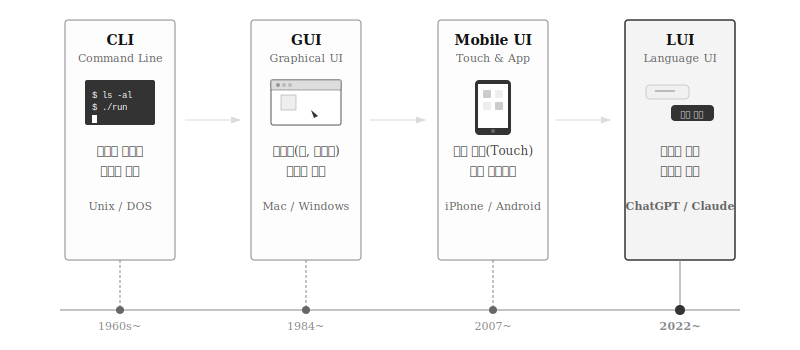
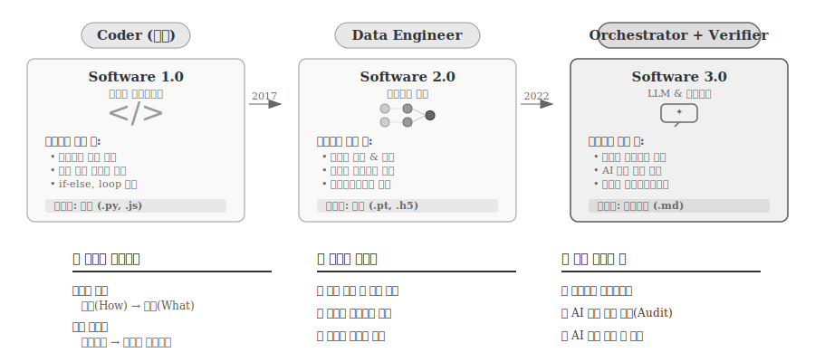
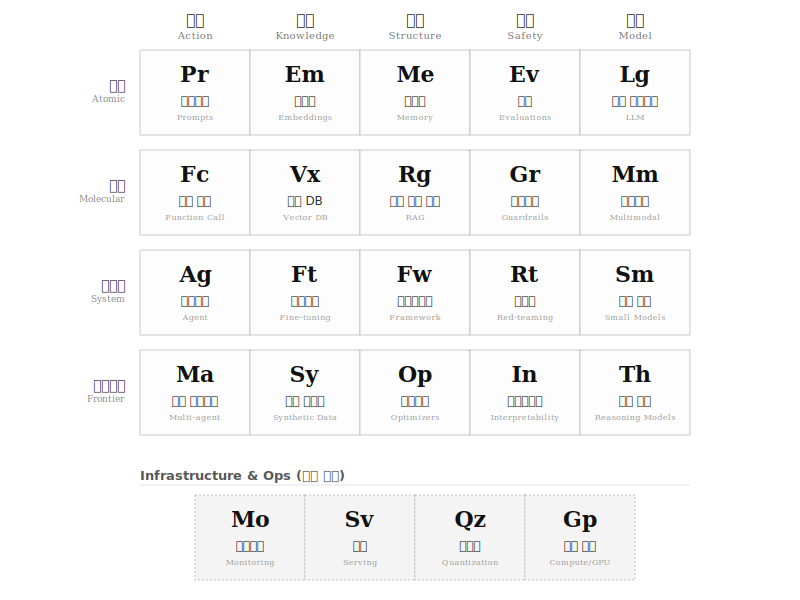
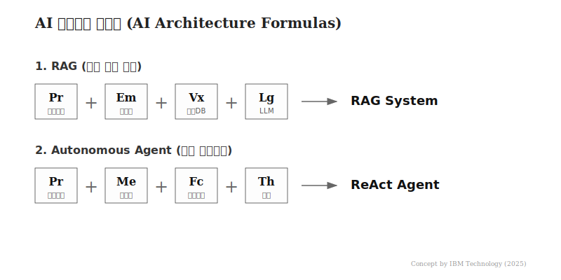
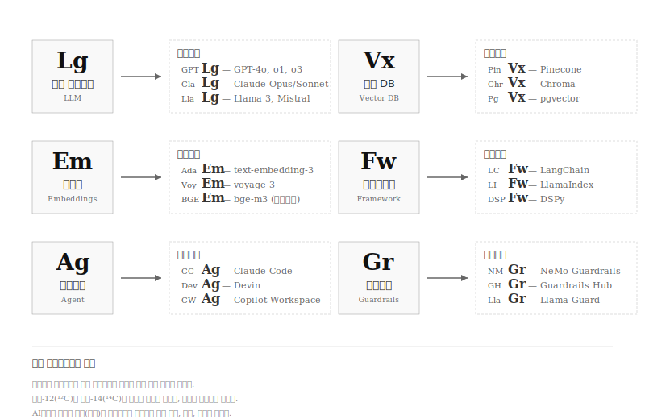

# 소프트웨어 3.0 시대 {#sec-gpt-coding}

\index{챗GPT} \index{언어모델} \index{LLM} \index{소프트웨어 3.0}

## 패러다임의 대전환 {#sec-gpt-paradigm}

\index{User Inferface!CLI}\index{User Inferface!GUI}\index{User Inferface!MUI}\index{User Inferface!LUI}\index{사용자 인터페이스}

컴퓨터와 인간의 상호작용 방식은 지난 70년간 일관된 방향으로 진화해왔다.
1950년대 명령줄 인터페이스(CLI)에서 시작해, 1984년 매킨토시의 그래픽 사용자 인터페이스(GUI), 2007년 아이폰의 모바일 인터페이스(MUI)를 거쳐, 2022년 챗GPT와 함께 언어 사용자 인터페이스(LUI) 시대가 열렸다.
CLI에서 GUI로의 전환이 "기계어"에서 "시각 요소"로의 이동이었다면, LUI는 "인간의 언어"로 컴퓨터를 제어하는 단계에 도달했음을 의미한다.

{#fig-ui-evolution}

\index{Software 1.0} \index{Software 2.0} \index{Software 3.0}

안드레이 카파시(Andrej Karpathy)가 2017년 제안한 "소프트웨어 2.0" 개념은 프로그래밍 패러다임의 근본적 전환을 설명한다.
**소프트웨어 1.0**에서 개발자는 정렬, 검색, 데이터 처리 등 모든 로직을 명시적으로 코딩했다.
프로그램 = 코드였다.
**소프트웨어 2.0**은 기계학습과 함께 시작되었다.
개발자는 로직을 직접 코딩하는 대신 데이터를 수집하고 신경망을 학습시킨다.
프로그램의 본질이 "코드"에서 "가중치(weight)"로 이동했다.
2022년 챗GPT의 등장으로 **소프트웨어 3.0** 시대가 열렸다.
대규모 언어모델(LLM)은 자연어 프롬프트를 입력받아 코드를 생성한다.
"프롬프트"가 새로운 형태의 프로그램이 되었고, 개발자의 역할은 "로직 설계자"에서 "의도 명확화 전문가"로 전환되고 있다.

{#fig-software-evolution}

세 패러다임은 상호 배타적이지 않다.
웹 애플리케이션의 백엔드 로직은 1.0 방식으로, 추천 시스템은 2.0 방식의 모델로, 반복적인 코드 생성이나 문서화는 3.0 방식의 LLM으로 처리하는 식이다.

## AI 기술 주기율표 {#sec-ai-periodic-table}

\index{AI 주기율표} \index{프롬프트} \index{임베딩} \index{RAG} \index{에이전트} \index{멀티모달}

프롬프트, 임베딩, RAG, 에이전트, 파인튜닝, 가드레일...
AI 기술의 급격한 발전으로 수많은 개념이 쏟아지면서 전체 그림을 파악하기 어려워졌다.
화학의 주기율표가 118개 원소를 체계적으로 분류하듯, **AI 기술 주기율표**[@IBMTech2025AIPeriodicTable]는 AI 시스템의 구성 요소를 역할과 복잡도에 따라 분류한다.
AI 기술 주기율표도 동일한 원리를 따른다.
**5개 족(Groups)**은 AI 요소 역할을, **4개 주기(Periods)**는 복잡도를 나타낸다.

{#fig-ai-periodic-table}

::: {.callout-tip}
## 화학 주기율표란?

1869년 멘델레예프(Dmitri Mendeleev)가 고안한 화학 주기율표는 118개 원소를 **족(Groups, 세로)**과 **주기(Periods, 가로)**로 배열한다.
**족**은 비슷한 화학적 성질을 가진 원소들의 모임이다.
1족 알칼리 금속(리튬, 나트륨, 칼륨)은 모두 물과 격렬히 반응하고, 18족 비활성 기체(헬륨, 네온, 아르곤)는 다른 원소와 거의 반응하지 않는다.
**주기**는 전자 껍질의 수를 나타내며, 아래로 갈수록 원자가 커지고 복잡해진다.
주기율표의 위치만 알면 원소의 성질을 예측할 수 있다는 점이 핵심이다.
:::

### 족(Groups): 역할별 분류

족은 AI 요소가 시스템 내에서 수행하는 **역할**을 기준으로 분류한다.
화학에서 같은 족 원소들이 유사한 화학적 성질을 공유하듯, AI 주기율표에서도 같은 족에 속한 요소들은 공통된 기능적 특성을 갖는다.
실행 족은 "행동"을, 지식 족은 "기억"을, 구조 족은 "조율"을, 안전 족은 "검증"을, 모델 족은 "추론"을 담당한다.
새로운 AI 기술을 접했을 때 "이 기술은 어떤 족에 속하는가?"라는 질문을 던지면 그 역할과 용도를 빠르게 파악할 수 있다.

첫 번째 족인 **실행(Action)**은 AI가 외부 세계와 상호작용하는 능력을 담당한다.
가장 기초적인 프롬프트(Pr)에서 시작해, 외부 API를 호출하는 함수 호출(Fc), 자율적으로 작업을 수행하는 에이전트(Ag), 여러 에이전트가 협력하는 멀티 에이전트(Ma)로 발전한다.
화학의 1족 알칼리 금속이 모두 "반응성이 높다"는 공통점을 갖듯, 실행 족의 요소들은 모두 "행동을 취한다"는 공통점을 갖는다.

두 번째 족인 **지식(Knowledge)**은 데이터를 저장하고 검색하는 방식을 다룬다.
텍스트를 벡터로 변환하는 임베딩(Em), 벡터를 저장하고 유사도 검색을 수행하는 벡터 DB(Vx), 모델 자체에 지식을 주입하는 파인튜닝(Ft), 학습 데이터를 인공적으로 생성하는 합성 데이터(Sy)가 여기에 속한다.

세 번째 족인 **구조(Structure)**는 복잡한 작업을 조율하는 오케스트레이션을 담당한다.
대화 맥락을 유지하는 메모리(Me), 외부 지식을 검색해 답변을 보강하는 RAG(Rg), 여러 구성 요소를 통합하는 프레임워크(Fw), 자동으로 프롬프트를 개선하는 최적화기(Op)가 핵심이다.

네 번째 족인 **안전(Safety)**은 시스템을 검증하고 통제하는 기술이다.
모델 성능을 측정하는 평가(Ev), 유해한 출력을 차단하는 가드레일(Gr), 취약점을 찾아내는 레드팀(Rt), 모델의 내부 작동을 이해하는 해석가능성(In)이 포함된다.

다섯 번째 족인 **모델(Model)**은 AI 시스템의 핵심 엔진이다.
텍스트를 처리하는 대규모 언어모델 LLM(Lg)에서 시작해, 이미지와 음성까지 다루는 멀티모달(Mm), 경량화된 소형 모델(Sm), 단계별 추론을 수행하는 추론 모델(Th)로 확장된다.

### 주기(Periods): 복잡도별 분류

주기는 AI 요소의 **복잡도**와 **성숙도**를 기준으로 분류한다.
화학에서 주기가 증가하면 전자 껍질이 늘어나 원자가 커지고 복잡해지듯, AI 주기율표에서도 아래로 내려갈수록 더 많은 구성 요소가 결합하고 더 복잡한 기능을 수행한다.
원자 수준의 단순한 프롬프트에서 시작해, 여러 원자가 결합한 분자 수준의 RAG, 실제 운영 환경의 시스템 수준 에이전트, 아직 연구 중인 프런티어 수준의 멀티 에이전트로 진화한다.
"이 기술은 어떤 주기에 속하는가?"라는 질문은 해당 기술의 성숙도와 도입 난이도를 가늠하는 데 도움이 된다.

첫 번째 주기인 **원자(Atomic)**는 더 이상 분해할 수 없는 가장 기초적인 단위다.
프롬프트, 임베딩, 메모리, 평가, LLM이 여기에 속한다.
화학에서 수소(H)나 산소(O)가 원자인 것처럼, 프롬프트나 LLM은 AI 시스템의 원자다.

두 번째 주기인 **분자(Molecular)**는 원자들이 결합하여 만들어진 응용 기술이다.
함수 호출은 프롬프트와 외부 API의 결합이고, RAG는 임베딩, 벡터 DB, LLM의 결합이다.
물($H_2O$)이 수소와 산소의 결합인 것처럼, RAG는 여러 AI 원자의 결합이다.

세 번째 주기인 **시스템(System)**은 실제 배포 및 운영 단계의 기술이다.
에이전트, 파인튜닝, 프레임워크, 레드팀, 소형 모델이 해당한다.
프로덕션 환경에서 안정적으로 동작해야 하는 성숙한 기술들이다.

네 번째 주기인 **프런티어(Frontier)**는 현재 연구가 활발한 최전선 기술이다.
멀티 에이전트, 합성 데이터, 최적화기, 해석가능성, 추론 모델이 포함된다.
아직 표준화되지 않았지만 빠르게 발전 중인 영역이다.

## AI 아키텍처 화학식 {#sec-ai-formulas}

\index{AI 아키텍처} \index{화학식} \index{RAG} \index{에이전트}

화학 원소들이 결합하여 물($H_2O$)이나 소금($NaCl$) 같은 화합물을 만들듯, AI 원소들을 결합하면 실제 동작하는 시스템이 된다.
물 분자가 산소 1개와 수소 2개로 구성되듯, RAG 시스템도 프롬프트, 임베딩, 벡터 DB, LLM이라는 4개 원소의 결합으로 탄생한다.
화학 반응에 촉매나 온도 조건이 영향을 주듯, AI 시스템도 컴퓨팅 자원, 프롬프트 품질, 데이터 양에 따라 성능이 달라진다.
화학자가 주기율표를 보고 화합물을 설계하듯, AI 아키텍트도 AI 주기율표를 보고 시스템을 설계할 수 있다.

{#fig-ai-formulas}

### 기본 화학식 {#sec-ai-basic-formulas}

가장 널리 사용되는 두 가지 AI 아키텍처 패턴을 화학식으로 표현한다.

**RAG (검색 증강 생성)**

$$ Pr + Em + Vx + Lg \rightarrow \text{RAG} $$

프롬프트($Pr$)를 통해 질문을 받고, 이를 임베딩($Em$)하여 벡터 DB($Vx$)에서 관련 지식을 찾은 뒤, LLM($Lg$)이 답변을 생성한다.
LLM 단독으로는 학습 데이터 마감 이후의 정보나 기업 내부 문서를 알 수 없다.
RAG는 이 한계를 외부 지식 주입으로 극복한다.
기업용 챗봇, 문서 QA 시스템, 법률·의료 상담 서비스가 이 아키텍처를 채택한다.

**자율 에이전트(Autonomous Agent)**

$$ Pr + Me + Fc + Th \rightarrow \text{Agent} $$

에이전트는 프롬프트($Pr$)로 지시를 받고, 메모리($Me$)에 맥락을 저장하며, 추론($Th$)을 통해 계획을 세우고, 함수 호출($Fc$)로 도구를 사용하여 문제를 해결한다.
RAG가 "질문-답변"의 단발성 상호작용이라면, 에이전트는 "목표 설정-계획-실행-검증"의 연속적 과정이다.
Claude Code, Devin, GitHub Copilot Workspace가 이 패턴을 따른다.

**안전한 RAG (Safe RAG)**

$$ Pr + Em + Vx + Lg + Gr \rightarrow \text{Safe RAG} $$

프로덕션 환경에서는 기본 RAG에 가드레일($Gr$)을 추가한다.
가드레일은 유해 콘텐츠 필터링, 프롬프트 인젝션 방어, 개인정보 마스킹, 출력 검증을 담당한다.
금융, 의료, 법률 등 규제 산업에서는 가드레일 없는 RAG 배포가 불가능하다.

**코딩 어시스턴트 (Coding Assistant)**

$$ Pr + Me + Fc + Lg + Ev \rightarrow \text{Coding Assistant} $$

코딩 어시스턴트는 프롬프트($Pr$)로 코드 작성 요청을 받고, 메모리($Me$)로 파일 구조와 대화 맥락을 유지하며, 함수 호출($Fc$)로 파일 읽기/쓰기와 터미널 명령을 실행하고, LLM($Lg$)이 코드를 생성한다.
여기에 평가($Ev$)가 추가되어 린트 검사, 테스트 실행, 빌드 확인 등 자동 검증이 이루어진다.
GitHub Copilot, Cursor, Claude Code가 이 패턴의 대표 사례다.

### 동위원소: 원소의 다양한 구현체 {#sec-ai-isotopes}

\index{동위원소} \index{Pinecone} \index{Chroma} \index{LangChain}

화학에서 **동위원소(Isotope)**는 같은 원소이지만 중성자 수가 달라 질량이 다른 변종이다.
탄소-12($^{12}C$)와 탄소-14($^{14}C$)는 둘 다 탄소로서 같은 화학적 성질을 갖지만, 질량과 안정성이 다르다.
탄소-14는 방사성 붕괴로 연대 측정에 사용되고, 탄소-12는 표준 탄소로 쓰인다.

AI 주기율표에서도 동일한 개념이 적용된다.
LLM($Lg$)이라는 원소는 하나지만, 실제 구현체는 GPT-4o, Claude, Llama 등 여러 "동위원소"로 존재한다.
모두 "대규모 언어모델"이라는 같은 역할을 수행하지만, 성능, 비용, 라이선스, 특화 분야가 다르다.

{#fig-ai-isotopes}

**LLM(Lg)의 동위원소**

- $^{GPT}Lg$: OpenAI의 GPT-4o, o1, o3 시리즈. 가장 넓은 생태계와 API 안정성.
- $^{Cla}Lg$: Anthropic의 Claude Opus/Sonnet. 긴 컨텍스트와 코딩 특화.
- $^{Lla}Lg$: Meta의 Llama 3, Mistral 등 오픈소스. 온프레미스 배포 가능.

동위원소 선택은 프로젝트 요구사항에 따라 달라진다.
규제 산업에서 데이터가 외부로 나갈 수 없다면 $^{Lla}Lg$가 유일한 선택이다.
최고 성능이 필요하면 $^{GPT}Lg$나 $^{Cla}Lg$를 비교 검토한다.

**벡터 DB(Vx)의 동위원소**

- $^{Pin}Vx$: Pinecone. 완전 관리형 SaaS, 빠른 시작.
- $^{Chr}Vx$: Chroma. 오픈소스, 로컬 개발에 적합.
- $^{Pg}Vx$: pgvector. PostgreSQL 확장, 기존 인프라 활용.

RAG 시스템 설계 시 "Vx를 사용한다"는 것은 추상적 결정이고, 실제로는 Pinecone이냐 Chroma냐 pgvector냐를 선택해야 한다.
화학 실험에서 "탄소를 사용한다"와 "다이아몬드를 사용한다"가 다르듯, 동위원소 선택이 시스템 특성을 결정한다.

### 반응 조건과 촉매 {#sec-ai-catalysts}

\index{촉매} \index{GPU} \index{컨텍스트 윈도우}

화학 반응은 원소들의 단순 결합이 아니다.
온도, 압력, 촉매의 존재 여부에 따라 반응 속도와 결과물이 달라진다.
수소와 산소를 섞어도 상온에서는 물이 되지 않는다.
불꽃이라는 활성화 에너지가 필요하다.

AI 아키텍처도 마찬가지다.
RAG 화학식 $Pr + Em + Vx + Lg \rightarrow \text{RAG}$는 이상적인 조건을 가정한다.
실제로는 **반응 조건**에 따라 성능이 크게 달라진다.

**컴퓨팅 자원 (온도)**

GPU 메모리와 연산 능력은 화학의 "온도"에 해당한다.
온도가 높을수록 반응이 활발해지듯, 컴퓨팅 자원이 충분할수록 더 큰 모델, 더 긴 컨텍스트, 더 빠른 응답이 가능하다.
$^{Lla}Lg$(오픈소스 LLM)를 로컬에서 돌리려면 최소 16GB VRAM이 필요하고, 양자화 없이 70B 모델을 돌리려면 140GB 이상이 필요하다.

**데이터 품질 (순도)**

화학에서 원료의 순도가 낮으면 불순물이 반응을 방해한다.
AI에서도 임베딩할 문서의 품질이 낮거나, 학습 데이터에 오류가 많으면 시스템 성능이 저하된다.
RAG 시스템에서 벡터 DB에 쓰레기 데이터가 들어가면, 검색 결과도 쓰레기가 된다.
"Garbage In, Garbage Out"은 AI 시대에도 유효한 원칙이다.

**프롬프트 엔지니어링 (촉매)**

촉매는 반응에 직접 참여하지 않으면서 반응 속도를 높이는 물질이다.
좋은 프롬프트는 AI 시스템의 촉매 역할을 한다.
동일한 LLM, 동일한 데이터를 사용해도 프롬프트에 따라 출력 품질이 극적으로 달라진다.
체인 오브 쏘트(Chain of Thought), 퓨샷 러닝(Few-shot Learning) 같은 프롬프트 기법은 "촉매 설계"에 해당한다.

**컨텍스트 윈도우 (반응 용기)**

화학 반응에서 용기 크기가 반응 규모를 제한하듯, 컨텍스트 윈도우가 한 번에 처리할 수 있는 정보량을 제한한다.
4K 토큰 윈도우에서는 간단한 질문만 처리 가능하지만, 128K 토큰 윈도우에서는 전체 코드베이스를 한 번에 분석할 수 있다.
Claude의 200K 토큰 윈도우는 "대형 반응 용기"에 해당하며, 이것이 긴 문서 분석과 코딩 작업에서 강점이 되는 이유다.

::: {.callout-tip}
## 반응 조건 체크리스트

새로운 AI 시스템을 설계할 때 다음을 점검한다:

1. **컴퓨팅 예산**: GPU/TPU 사용량과 API 비용 한도는?
2. **데이터 품질**: 임베딩할 문서가 정제되어 있는가?
3. **프롬프트 전략**: 시스템 프롬프트와 퓨샷 예제는 준비되었는가?
4. **컨텍스트 제약**: 처리해야 할 입력 크기 대비 모델 윈도우는 충분한가?
5. **지연 시간 요구**: 실시간 응답이 필요한가, 배치 처리가 가능한가?
:::

AI 개발은 더 이상 블랙박스 모델을 훈련시키는 것만이 아니다.
적절한 "원소"들을 선택하고, 올바른 "동위원소"를 고르며, 최적의 "반응 조건"을 설정하여 목적에 맞는 "화합물(시스템)"을 설계하는 과정으로 진화하고 있다.

::: {.callout-note}
## LLM의 본질: 웹의 흐릿한 JPEG {#sec-llm-fundamentals}

\index{LLM} \index{손실 압축} \index{JPEG}

챗GPT[@wu2023brief]를 이해하는 데 유용한 비유가 있다.
테드 창(Ted Chiang)은 LLM을 **"웹의 흐릿한 JPEG"**[@chiang2023chatgpt]에 비유했다.
JPEG는 손실 압축 기술이다.
원본 이미지를 완벽히 복원하지 못하지만 파일 크기를 획기적으로 줄인다.
LLM도 마찬가지로 인터넷의 방대한 텍스트를 압축한 결과물이다.

압축 과정에서 일부 정보는 손실된다.
LLM이 사실과 다른 내용을 생성하거나(환각), 최신 정보를 모르는 이유가 여기에 있다.
무손실 압축인 PNG와 달리, LLM은 패턴과 확률에 기반한 "그럴듯한" 출력을 생성한다.

그러나 손실 압축의 장점도 분명하다.
일반화 능력이 뛰어나 학습 데이터에 없던 질문에도 합리적인 답변을 생성할 수 있고, 코드 생성, 번역, 요약 등 다양한 작업에 범용적으로 적용된다.
완벽하지 않지만 충분히 유용한 도구라는 점을 인식하고 활용하는 것이 중요하다.
:::

## 한계와 주의사항 {#sec-limitations}

\index{환각} \index{hallucination} \index{작화} \index{confabulation}

LLM 기반 코딩에는 명확한 한계가 존재한다.

**환각(Hallucination)**: LLM은 존재하지 않는 함수나 라이브러리를 "지어내기도" 한다.
생성된 코드가 실제로 동작하는지 반드시 확인해야 한다.

::: {.callout-note}
## 환각(Hallucination) vs 작화(Confabulation)

AI 분야에서 "hallucination"은 통상 **환각**으로 번역된다.
그러나 의학·심리학에서는 **작화(作話, confabulation)**라는 더 정확한 용어가 있다.

- **환각(hallucination)**: 감각적 착각 (시각, 청각 등)
- **작화(confabulation)**: 없는 기억이나 정보를 무의식적으로 만들어내는 현상

LLM이 학습하지 않은 정보를 "그럴듯하게" 생성하는 행위는 작화에 더 가깝다.
다만 AI 커뮤니티에서 hallucination이 일반적 용어로 굳어졌으므로, 이 책에서는 환각을 주로 사용하되 작화 개념도 함께 소개한다.
:::

**최신 정보 부재**: 학습 데이터 마감 시점 이후에 등장한 라이브러리, API 변경사항은 반영되지 않는다.

**맥락 길이 제한**: 매우 긴 코드베이스나 복잡한 시스템 전체를 한 번에 처리하기 어렵다.
문제를 작은 단위로 분해하여 접근해야 한다.

**보안 취약점**: LLM이 생성한 코드에 SQL 인젝션, XSS 등 보안 취약점이 포함될 수 있다.
보안 검토는 개발자의 책임이다.

**저작권 이슈**: 학습 데이터에 포함된 코드와 유사한 출력이 생성될 수 있다.
라이선스 준수 여부를 확인해야 한다.

## 8부 로드맵 {#sec-roadmap}

이번 부에서는 AI 시대 프로그래밍의 핵심 주제를 다룬다.

**72장 "재사용에서 재생성으로"**: 소프트웨어 공학의 근본 원칙 변화를 살펴본다.
Disposable Code와 Vibe Coding 개념을 통해 코드 생산 비용 붕괴가 가져온 패러다임 전환을 이해한다.

**73장 "프롬프트에서 컨텍스트로"**: AI와 효과적으로 소통하는 기술을 배운다.
프롬프트 공학 기초부터 컨텍스트 공학으로의 진화, MCP 활용까지 실무 기술을 익힌다.

**74장 "AI 코딩 실전 워크플로우"**: 실제 개발 프로세스를 단계별로 학습한다.
테스트 기반 명세부터 코드 생성, 검증, 반복 개선까지 전체 워크플로우를 실습한다.

**75장 "코드 리뷰와 품질 관리"**: AI 생성 코드를 검증하는 전문 기술을 다룬다.
보안 감사, 품질 기준, 정적 분석 도구 활용법을 익혀 45% 취약점 문제에 대응한다.

**76장 "AI 도구 생태계"**: 실전 도구 선택과 활용을 배운다.
GitHub Copilot, ChatGPT, Claude Code, Cursor 등 각 도구의 강점을 이해하고 상황에 맞게 선택한다.

**77장 "개발자의 미래"**: 역할 변화와 필요한 역량을 성찰한다.
Coder에서 Orchestrator + Verifier로의 전환, 경력 경로, 학습 로드맵을 통해 미래를 준비한다.

::: {.content-visible when-format="pdf"}
\faLightbulb\ 생각해볼 점
:::

::: {.content-visible when-format="html"}
## 생각해볼 점 {.unnumbered}
:::

인터페이스 진화의 역사는 명확한 방향을 가리킨다.
CLI에서 GUI로, 다시 LUI로의 전환은 컴퓨터가 인간에게 맞춰오는 과정이다.
과거에는 개발자가 기계어, 어셈블리, C, 파이썬으로 "하향 번역"했다면, 이제 LLM이 자연어를 코드로 "상향 번역"한다.
안드레이 카파시의 표현처럼 **"영어가 가장 뜨거운 프로그래밍 언어"**가 된 셈이다.

AI 주기율표는 새로운 기술이나 제품을 접할 때 유용한 프레임워크가 된다.
"이 도구는 주기율표의 어디에 위치하는가?"라는 질문을 던지면, 그 역할과 한계를 빠르게 파악할 수 있다.
RAG는 지식(Knowledge) 족의 분자(Molecular) 수준이고, Claude Code는 실행(Action) 족의 시스템(System) 수준이다.

Vibe Coding과 Disposable Code 개념은 재사용 명령(Reusability Imperative)의 약화를 상징한다.
코드 생성 비용이 0에 수렴하면서, 과거의 패턴과 프레임워크가 담당하던 "재사용" 기능이 "재생성"으로 대체되고 있다.
그러나 45%라는 보안 취약점 비율은 Vibe Coding의 한계를 명확히 보여준다.
프로토타이핑에서 프로덕션으로 전환할 때, 인간 검증이라는 관문은 여전히 필수다.

Software 1.0, 2.0, 3.0은 대체 관계가 아니라 **보완 관계**다.
시스템 프로그래밍, 실시간 처리, 안전 필수 소프트웨어는 여전히 명시적 코딩이 필수다.
이미지 인식, 자연어 처리는 기계학습 모델이 우위에 있다.
LLM은 프로토타이핑, 반복 작업 자동화, 탐색적 코딩에서 강점을 보인다.
개발자의 역할은 "코드 작성"에서 "의도 명세와 결과 검증"으로 이동했다.
Coder에서 Orchestrator + Verifier로의 전환이 진행 중이다.
