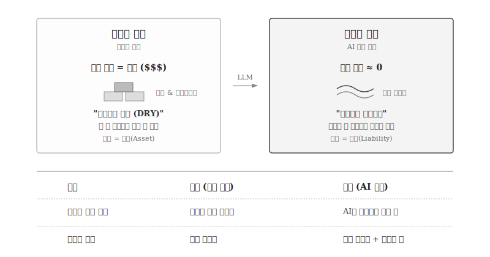
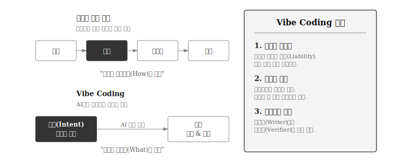

---
execute:
  eval: false
---

# 재사용에서 재생성으로 {#sec-paradigm-shift}

\index{재사용} \index{Reusability Imperative} \index{Disposable Code} \index{DRY 원칙} \index{Vibe Coding}

**72장 "재사용에서 재생성으로"**에서는 소프트웨어 공학의 근본 원칙이 어떻게 변화하는지 살펴본다.
Disposable Code와 Vibe Coding 개념을 통해 코드 생산 비용 붕괴가 가져온 패러다임 전환을 이해한다.

**73장 "프롬프트에서 컨텍스트로"**에서는 AI와 효과적으로 소통하는 기술을 배운다.
프롬프트 공학 기초부터 컨텍스트 공학으로의 진화, MCP 활용까지 실무 기술을 익힌다.

**74장 "AI 코딩 실전 워크플로우"**에서는 실제 개발 프로세스를 단계별로 학습한다.
테스트 기반 명세부터 코드 생성, 검증, 반복 개선까지 전체 워크플로우를 실습한다.

**75장 "코드 리뷰와 품질 관리"**에서는 AI 생성 코드를 검증하는 전문 기술을 다룬다.
보안 감사, 품질 기준, 정적 분석 도구 활용법을 익혀 45% 취약점 문제에 대응한다.

**76장 "AI 도구 생태계"**에서는 실전 도구 선택과 활용을 배운다.
GitHub Copilot, ChatGPT, Claude Code, Cursor 등 각 도구의 강점을 이해하고 상황에 맞게 선택한다.

**77장 "개발자의 미래"**에서는 역할 변화와 필요한 역량을 성찰한다.
Coder에서 Orchestrator + Verifier로의 전환, 경력 경로, 학습 로드맵을 통해 미래를 준비한다.

## 한계와 주의사항 {#sec-limitations}
코드 작성 비용이 높았기 때문이다.
숙련된 개발자가 수 시간에서 수일을 투자해야 제대로 작동하는 코드가 나왔고, 디버깅과 테스트에 더 많은 시간이 들었다.
"한 번 작성하고 여러 번 사용하라(Write Once, Use Many)"는 당연한 경제적 선택이었다.

{#fig-reuse-to-regenerate}

재사용을 위해 등장한 해법들은 소프트웨어 공학의 핵심 개념이 되었다.

**디자인 패턴**: GoF(Gang of Four)가 1994년 정리한 23개 패턴은 "검증된 해법의 재사용"이었다[@Gamma1994].
Factory, Observer, Strategy 패턴을 알면 매번 처음부터 설계할 필요가 없었다.

**프레임워크**: Django, React, Spring은 "구조의 재사용"이다.
개발자는 프레임워크가 제공하는 뼈대 위에 비즈니스 로직만 채우면 되었다.
수천 시간의 개발 노력이 응축된 코드를 무료로 사용할 수 있었다.

**아키텍처 패턴**: MVC, 계층형 아키텍처, 마이크로서비스는 "설계 원칙의 재사용"이다.
시스템을 어떻게 구조화할지 매번 고민할 필요 없이, 검증된 청사진을 따르면 되었다.

**SaaS/플랫폼**: Salesforce, AWS, Notion은 "전체 시스템의 재사용"이다.
코드를 작성하지 않고 설정만으로 기능을 사용한다.
재사용의 극단적 형태다.

DRY(Don't Repeat Yourself) 원칙, 모듈화, 컴포넌트 기반 개발, 라이브러리 생태계—모두 **재사용 명령(Reusability Imperative)**에서 비롯된 것이다.

### 패러다임 전환: 코드 생성 비용 → 0

2025년, 상황이 근본적으로 변했다.
AI가 수백 줄의 코드를 수 초 만에 생성한다.
Intuit의 Alex Worden은 이를 **Disposable Code(일회용 코드)** 패러다임이라 명명했다[@MITTR2025DisposableCode].

> "코드 재사용은 개발자의 시간을 절약해주었다. 하지만 AI가 수백 줄의 코드를 수 초 만에 생산하는 세상에서, **그 당위성은 사라졌다**."
> — Alex Worden, Intuit

재사용 대신 재생성(Regenerate)이 가능해졌다.
각 컴포넌트를 AI가 독립적으로 생성하고, API로 연결하며, 필요시 언제든 교체한다.
패턴이나 컨벤션을 엄격히 따를 필요도 줄어든다—AI가 일관성을 유지해주기 때문이다.

Y Combinator 2025년 겨울 배치에서 25%의 스타트업이 95% 이상 AI 생성 코드베이스를 보유하고 있다는 보고[@IBM2025VibeCoding]는 이 전환이 이미 진행 중임을 보여준다.

### Vibe Coding: 코드를 잊고 의도에 집중

DRY(Don't Repeat Yourself) 원칙, 모듈화, 컴포넌트 기반 개발, 라이브러리 생태계—모두 **재사용 명령(Reusability Imperative)**에서 비롯된 것이다.

### 패러다임 전환: 코드 생성 비용 → 0

2025년, 상황이 근본적으로 변했다.
AI가 수백 줄의 코드를 수 초 만에 생성한다.
Intuit의 Alex Worden은 이를 **Disposable Code(일회용 코드)** 패러다임이라 명명했다[@MITTR2025DisposableCode].

> "코드 재사용은 개발자의 시간을 절약해주었다. 하지만 AI가 수백 줄의 코드를 수 초 만에 생산하는 세상에서, **그 당위성은 사라졌다**."
> — Alex Worden, Intuit

재사용 대신 재생성(Regenerate)이 가능해졌다.
각 컴포넌트를 AI가 독립적으로 생성하고, API로 연결하며, 필요시 언제든 교체한다.
패턴이나 컨벤션을 엄격히 따를 필요도 줄어든다—AI가 일관성을 유지해주기 때문이다.

Y Combinator 2025년 겨울 배치에서 25%의 스타트업이 95% 이상 AI 생성 코드베이스를 보유하고 있다는 보고[@IBM2025VibeCoding]는 이 전환이 이미 진행 중임을 보여준다.

### Vibe Coding: 코드를 잊고 의도에 집중

\index{Vibe Coding}

2025년 2월, 안드레이 카파시는 "Vibe Coding"이라는 개념을 제안했다[@Karpathy2025VibeCoding].
"완전히 분위기에 몸을 맡기고, 기하급수적 성장을 받아들이며, 코드가 존재한다는 것조차 잊어라"라는 선언은 프로그래밍 패러다임의 급진적 전환을 상징한다.
Collins Dictionary는 "vibe coding"을 2025년 올해의 단어로 선정했다[@CollinsDictionary2025].

{#fig-vibe-coding}

Vibe Coding의 핵심은 코드 자체보다 결과에 집중하는 것이다.
개발자는 "이런 기능이 필요해"라고 의도를 설명하고, AI가 작동하는 코드를 생성한다.
전통적 개발에서 요구사항 분석, 설계, 코딩, 테스트, 디버깅을 순차적으로 거쳤다면, Vibe Coding에서는 의도 설명과 결과 확인만 남는다.
Microsoft CTO는 2030년까지 95%의 코드가 AI에 의해 생성될 것으로 예측했다.

그러나 Vibe Coding에는 명확한 한계가 있다.
Veracode의 2025년 연구에 따르면, AI 생성 코드의 45%에 보안 취약점이 포함되어 있다.
"Vibe Coding Hangover"라는 표현이 등장할 정도로, 시니어 개발자들 사이에서 검증되지 않은 AI 코드로 인한 "개발 지옥" 보고가 이어지고 있다.
Vibe Coding은 프로토타이핑과 탐색적 개발에 강점을 보이지만, 프로덕션 환경에서는 여전히 인간의 검증이 필수다.

::: {.content-visible when-format="pdf"}
\faLightbulb\ 생각해볼 점
:::

::: {.content-visible when-format="html"}
## 생각해볼 점 {.unnumbered}
:::

재사용 명령(Reusability Imperative)은 코드 작성 비용이 높았던 시대의 합리적 선택이었다.
디자인 패턴, 프레임워크, 아키텍처 패턴은 모두 "한 번 작성하고 여러 번 사용"하기 위한 해법이었다.

코드 생성 비용이 0에 수렴하면서, 재사용보다 재생성이 합리적인 선택이 되었다.
Disposable Code 패러다임은 AI가 필요할 때마다 코드를 생성하고, 불필요해지면 폐기하는 방식이다.
Vibe Coding은 이를 극단화하여 "코드 존재 자체를 잊고 의도에만 집중"하라고 제안한다.

그러나 45%라는 보안 취약점 비율은 이 패러다임의 한계를 분명히 보여준다.
프로토타이핑과 탐색적 개발에서는 강력하지만, 프로덕션 환경에서는 여전히 인간의 검증이 필수다.
"Vibe Coding Hangover"라는 표현이 등장할 정도로, 검증 없는 빠른 개발은 기술 부채를 양산한다.

패턴과 아키텍처 지식의 역할도 변화했다.
구현 스킬에서 AI와 소통하는 어휘로, 검증 기준으로, 시스템 설계의 근거로 전환되었다.
재사용 명령이 약화되었다고 지식이 무용해진 것은 아니다.
사용 방식이 달라졌을 뿐이다.

\index{재사용}
\index{재생성}
\index{Disposable Code}
\index{Vibe Coding}

## 프로젝트 {.unnumbered}

\index{프로젝트}

1. Vibe Coding 방식으로 간단한 웹 스크래퍼를 만들어보라. 의도만 설명하고 AI가 생성한 코드를 실행해본다.
2. 생성된 코드의 보안 취약점을 찾아보라. SQL 인젝션, XSS 등이 있는가?
3. 동일한 기능을 전통적 재사용 패턴(디자인 패턴 활용)과 재생성 패턴(AI 즉시 생성)으로 각각 구현하고 비교해보라.
4. 어떤 상황에서 재사용이 여전히 유효하고, 어떤 상황에서 재생성이 더 적합한지 정리해보라.
