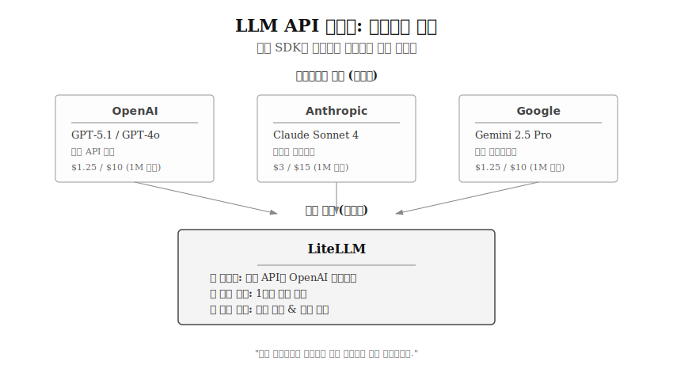
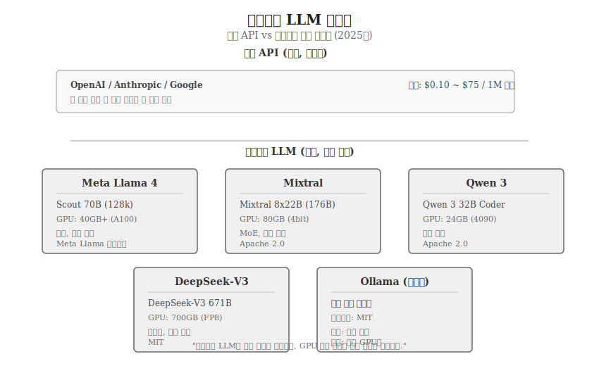
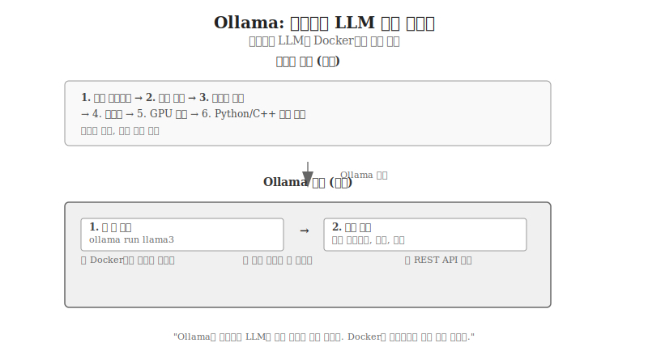
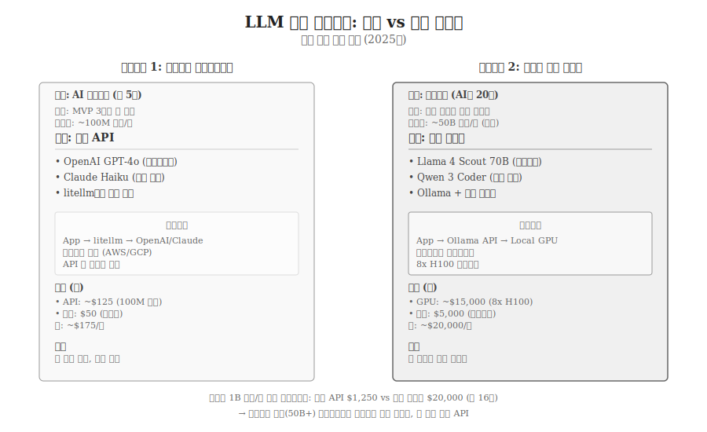
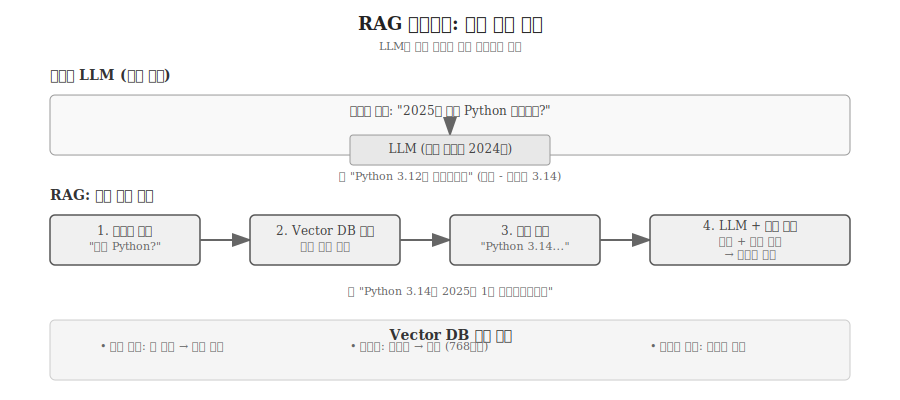
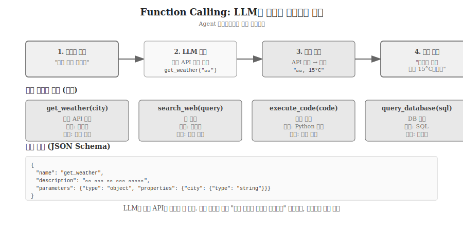
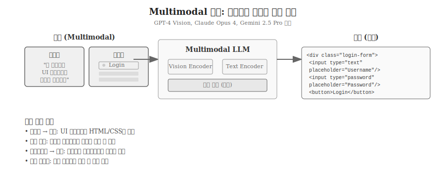

---
execute:
  eval: true
---

# AI 코딩 실전 워크플로우 {#sec-workflow}

\index{코딩 워크플로우} \index{테스트 주도 개발} \index{TDD} \index{Context Engineering}

AI 시대 코딩은 크게 세 가지 수준으로 나뉜다.
첫째, **인터랙티브 코딩**(IDE/Chat)은 개발자가 AI와 대화하며 코드를 만드는 과정이다.
둘째, **프로그래매틱 코딩**(API/SDK)은 코드로 코드를 자동 생성하는 과정이다.
셋째, **고급 패턴**(RAG, Agent, Multimodal)은 LLM의 한계를 극복하는 실전 기술이다.

이 장에서는 세 수준을 모두 다룬다.
먼저 인간-AI 협업의 6단계 워크플로우를 살펴보고, 이어서 LLM API 활용법, 마지막으로 RAG와 Agent 같은 고급 패턴을 익힌다.

## Part A: 인터랙티브 코딩 - 인간-AI 협업

### 6단계 워크플로우 {#sec-workflow-steps}

::: {.callout-tip}
## AI TDD: 테스트 먼저, 코드는 나중에

AI 시대의 TDD(Test-Driven Development)는 더욱 강력하다.
**테스트 코드를 먼저 작성**하고, 이를 AI에게 명세서(Spec)로 제공하면 테스트를 통과하는 코드를 생성한다.
이는 가장 효율적인 AI 코딩 패턴이다.

```python
# 1. 테스트부터 작성 (명세서)
def test_reverse_string():
    assert reverse("hello") == "olleh"
    assert reverse("") == ""
    assert reverse("a") == "a"

# 2. AI에게 "위 테스트를 통과하는 reverse 함수 작성" 요청
# 3. 생성된 코드를 즉시 검증
```
:::

**1단계: 목표 정의 및 테스트 작성**

작성할 코드의 기능과 요구사항을 명확히 한다.
입력 데이터의 형태, 예상 출력, 예외 상황, 성능 요구사항 등을 정리한다.

**가능하면 테스트 코드를 먼저 작성한다.**
테스트는 AI에게 의도를 전달하는 가장 명확한 명세서가 된다.
명확한 목표 없이 프롬프트를 작성하면 원하는 결과를 얻기 어렵다.

**2단계: 컨텍스트 설계 (Context Engineering)**

2025년의 AI 코딩은 단순한 프롬프트 작성이 아니라 **컨텍스트 공학**이다.
시스템 프롬프트(.cursorrules, CLAUDE.md), 동적 맥락(현재 파일, 관련 코드), 명세(테스트 코드)를 통합하여 AI에게 제공한다.

**IDE에서 실행** (Cursor, Claude Code, GitHub Copilot):
- Chat 패널이나 Composer 기능 사용
- 관련 파일을 컨텍스트에 추가 (`@파일명`)
- 시스템 규칙이 자동 적용됨

**제공할 컨텍스트**:
- 역할 지정: "당신은 시니어 파이썬 개발자"
- 프로젝트 규칙: .cursorrules 파일의 코딩 스타일
- 관련 코드: 기존 함수, 클래스 구조
- 명세: 테스트 코드, 입출력 예시

**3단계: 코드 생성**

LLM에 프롬프트를 입력하고 코드를 생성받는다.
필요시 후속 질문이나 수정 요청을 통해 코드를 개선한다.

**4단계: 검토 및 수정 (보안 필수!)**

생성된 코드를 주의 깊게 검토한다.
**AI 생성 코드의 45%에 보안 취약점이 포함**되어 있다는 Veracode 연구를 명심해야 한다.

**검토 체크리스트**:
- 로직 정확성: 의도대로 동작하는가?
- **보안 취약점**: SQL 인젝션, XSS, 하드코딩된 시크릿 등
- 예외 처리: 엣지 케이스가 빠지지 않았는가?
- 성능: 비효율적인 알고리즘 사용은 없는가?
- 스타일: 프로젝트 컨벤션을 따르는가?

LLM이 생성한 코드를 무비판적으로 사용하면 안 된다.
"AI가 짠 코드는 기본적으로 보안에 취약하다"는 가정하에 검증해야 한다.

**5단계: 테스트 및 디버깅**

다양한 입력 값으로 코드를 실행하고 출력을 검증한다.
발견된 오류는 직접 수정하거나, 오류 메시지를 LLM에 전달하여 수정안을 받는다.

**6단계: 반복 개선**

테스트 결과를 바탕으로 프롬프트를 개선한다.
부족했던 요구사항을 추가하거나, 더 명확한 표현으로 수정한다.
이 과정을 반복하여 코드 품질을 높인다.

```{python}
#| label: workflow-example
#| eval: false

# 예시: 단어 빈도수 계산 코드
# LLM에게 "텍스트에서 가장 빈도 높은 단어 5개 추출" 요청 후 생성된 코드

from collections import Counter

text = """But soft what light through yonder window breaks
It is the east and Juliet is the sun
Arise fair sun and kill the envious moon
Who is already sick and pale with grief"""

# 텍스트를 소문자로 변환하고 단어로 분리
words = text.lower().split()

# 단어 빈도수 계산
word_counts = Counter(words)

# 상위 5개 단어 출력
for word, count in word_counts.most_common(5):
    print(f"{word}: {count}")
```

위 코드는 LLM이 생성한 결과물이다.
간단한 요구사항이었기에 한 번의 프롬프트로 동작하는 코드를 얻었다.
복잡한 요구사항일수록 여러 번의 반복이 필요하다.

이 6단계 워크플로우는 IDE의 Chat 패널(Cursor, Claude Code)이나 Composer 기능(Cursor)을 통해 수행된다.
Vibe Coding 다이어그램의 "의도 → AI 즉시 생성 → 검증" 흐름과 본질적으로 동일하다.
차이는 실전에서는 한 번이 아니라 여러 번 반복한다는 점이다.

## Part B: 프로그래매틱 코딩 - API 자동화

### Python LLM API 프로그래밍 {#sec-llm-api}

\index{OpenAI API} \index{Anthropic API} \index{LLM API} \index{litellm}

AI 도구(ChatGPT, Claude Code)를 사용하는 것과 별개로, 프로그램에서 직접 LLM API를 호출하여 자동화할 수도 있다.
반복 작업, 배치 코드 생성, 테스트 데이터 생성 등에 유용하다.

{#fig-llm-api-comparison}

### 주요 Python LLM SDK 및 모델 비교

**2025년 LLM 모델은 크게 고급 모델(flagship)과 빠른 모델(fast)로 구분된다.**

```{r}
#| label: tbl-llm-models
#| tbl-cap: "LLM 모델 계층별 비교 (2025년, 비용은 1M 토큰 기준)"
#| eval: false
#| echo: false
#| warning: false
#| message: false

library(gt)
library(tibble)

# 데이터 준비
models_df <- tribble(
  ~프로바이더, ~SDK, ~모델, ~계층, ~입력비용, ~출력비용, ~특징,
  "OpenAI", "openai", "GPT-5", "고급", "$1.25", "$10", "최신, 고성능",
  "OpenAI", "openai", "GPT-4o", "고급", "$2.50", "$10", "범용",
  "OpenAI", "openai", "GPT-4o-mini", "빠름", "$0.15", "$0.60", "가장 저렴",
  "Anthropic", "anthropic", "Claude Opus 4.1", "고급", "$15", "$75", "최고 품질",
  "Anthropic", "anthropic", "Claude Sonnet 4", "고급", "$3", "$15", "균형",
  "Anthropic", "anthropic", "Claude Haiku 4.5", "빠름", "$1", "$5", "초고속",
  "Google", "google-generativeai", "Gemini 2.5 Pro", "고급", "$1.25", "$10", "멀티모달",
  "Google", "google-generativeai", "Gemini 2.5 Flash", "빠름", "$0.30", "$2.50", "빠르고 저렴",
  "Google", "google-generativeai", "Gemini Flash-Lite", "빠름", "$0.10", "$0.40", "경량"
)

# gt 표 생성 (row_group으로 프로바이더별 그룹화)
models_df |>
  gt(groupname_col = "프로바이더") |>
  tab_header(
    title = "Python LLM 모델 계층별 비교",
    subtitle = "고급 모델 vs 빠른 모델 (2025년)"
  ) |>
  tab_spanner(
    label = "비용 (1M 토큰)",
    columns = c(입력비용, 출력비용)
  ) |>
  tab_style(
    style = cell_fill(color = "#f9f9f9"),
    locations = cells_body(rows = 계층 == "고급")
  ) |>
  tab_style(
    style = list(
      cell_fill(color = "#e8e8e8"),
      cell_text(weight = "bold")
    ),
    locations = cells_body(rows = 계층 == "빠름")
  ) |>
  cols_label(
    SDK = "SDK 패키지",
    모델 = "모델명",
    계층 = "계층",
    입력비용 = "입력",
    출력비용 = "출력",
    특징 = "특징"
  )
```

**핵심 인사이트**:
- **고급 모델**: GPT-5, Claude Opus, Gemini Pro - 복잡한 추론, 높은 품질
- **빠른 모델**: GPT-4o-mini, Claude Haiku, Gemini Flash - 간단한 작업, 저비용
- **비용 차이**: 고급 모델은 빠른 모델 대비 10-50배 비쌈
- **선택 기준**: 작업 복잡도와 예산에 따라 적절한 계층 선택

**통합 라이브러리**:
- `litellm`: 100개 이상 LLM API 통일 (OpenAI, Anthropic, Google, Azure 등)
- R의 `ellmer`와 유사한 역할
- 프로바이더 전환이 쉬움

### Context Window: 얼마나 많은 코드를 기억하나? {#sec-context-window}

\index{Context Window} \index{컨텍스트 윈도우}

LLM의 **Context Window**는 한 번에 처리할 수 있는 입력+출력 토큰의 최대 크기다.
코딩 실무에서 "프로젝트 전체를 한 번에 이해할 수 있는가"를 결정하는 핵심 지표다.

**2025년 주요 모델 Context Window (직관적 비유)**:

| 모델 | Context Window | 토큰 → 단어 환산 | 책/코드 비유 |
|------|---------------|-----------------|-------------|
| **Claude Opus 4.5** | 1M 토큰 | ~750,000 단어 | 소설 3권, 중형 프로젝트 전체 |
| **Gemini 2.5 Pro** | 1M 토큰 | ~750,000 단어 | 해리포터 4권, 대형 코드베이스 |
| **GPT-5** | 200k 토큰 | ~150,000 단어 | 소설 0.6권, 중소형 프로젝트 |
| **Claude Haiku 4.5** | 200k 토큰 | ~150,000 단어 | 중편 소설, 5-10개 파일 |
| **Llama 4 Scout** | 128k 토큰 | ~96,000 단어 | 단편 소설, 3-5개 파일 |

: LLM Context Window 비교 (2025년, 코드 분량 기준) {#tbl-context-window}

**실전 코드 분량 환산**:

```python
# 1 토큰 ≈ 0.75 단어 ≈ 4자 (영어 기준)
# Python 코드: 1 토큰 ≈ 1.5자 (공백, 구두점 포함)

# 예시: 1M 토큰으로 처리 가능한 코드
- Python 파일 100개 (각 10,000자 = ~6,700 토큰)
- React 프로젝트 전체 (src/ 전체 + node_modules 제외)
- 중형 Django 프로젝트 (models, views, templates 전체)
```

**실사용 시나리오**:

**시나리오 1: 소형 프로젝트 (GPT-5, 200k 토큰)**
```python
# 처리 가능: 5-10개 Python 파일 (총 ~30,000 줄)
# 예: Flask 마이크로서비스
# - app.py (500줄)
# - models.py (300줄)
# - routes.py (400줄)
# - utils.py (200줄)
# - tests/ (1,000줄)
# → 총 ~2,400줄 = ~120k 토큰 (여유 있음)
```

**시나리오 2: 대형 프로젝트 (Claude Opus 4.5, 1M 토큰)**
```python
# 처리 가능: 중형 Django 프로젝트 전체 (~150,000 줄)
# 예: 전자상거래 플랫폼
# - models/ (30개 파일, 5,000줄)
# - views/ (50개 파일, 8,000줄)
# - templates/ (100개 파일, 10,000줄)
# - tests/ (3,000줄)
# - API/ (20개 파일, 4,000줄)
# → 총 ~30,000줄 = ~600k 토큰 (충분히 여유)
```

**왜 Context Window가 중요한가?**:
- **작은 윈도우 (GPT-4, 8k)**: 한 번에 1-2개 파일만 처리, 파일 간 관계 이해 부족
- **중간 윈도우 (200k)**: 5-10개 파일, 모듈 단위 이해 가능
- **큰 윈도우 (1M)**: 프로젝트 전체, 아키텍처 수준 이해 가능

Cursor Composer, Claude Code 같은 Agent가 강력한 이유는 1M 토큰 윈도우 덕분이다.
프로젝트 전체를 한 번에 로드하여 파일 간 관계를 이해하고 일관된 수정을 할 수 있다.

::: {.callout-tip}
## 프롬프트 캐싱으로 비용 90% 절감

2025년 주요 프로바이더(Anthropic, Google)는 **프롬프트 캐싱**을 지원한다.
긴 컨텍스트(예: 프로젝트 전체 코드, 책 한 권)를 매번 보내지 않고 캐시하여 비용을 최대 90% 절감한다.

```python
# Anthropic 프롬프트 캐싱 예시
from anthropic import Anthropic

client = Anthropic()

# 긴 시스템 프롬프트를 캐싱
message = client.messages.create(
    model="claude-sonnet-4",
    system=[
        {
            "type": "text",
            "text": "매우 긴 프로젝트 컨텍스트...",  # 캐시됨
            "cache_control": {"type": "ephemeral"}
        }
    ],
    messages=[{"role": "user", "content": "이 프로젝트에서 X 기능 추가"}]
)
# 이후 요청은 캐시 사용, 비용 90% 감소
```
:::

## 오픈소스 LLM {#sec-opensource-llm}

\index{오픈소스 LLM} \index{Llama} \index{Mistral} \index{Qwen} \index{DeepSeek} \index{Ollama}

상용 API 외에 **오픈소스 LLM**을 자체 호스팅하여 사용할 수도 있다.
모델 자체는 무료지만 GPU 운영 비용과 관리 노력이 필요하다.

{#fig-opensource-llm}

### 주요 오픈소스 LLM (2025년)

| 모델 | 최신 버전 | 라이선스 | 파라미터 | 필요 GPU (VRAM) | 특징 |
|------|----------|---------|---------|----------------|------|
| **Meta Llama** | Llama 4 Scout | Meta Llama | 70B | 40GB+ (A100) | 범용, 128k 컨텍스트 |
| **Mistral** | Mixtral 8x22B | Apache 2.0 | 176B | 80GB (4bit 양자화) | MoE, 유럽 기반 |
| **Qwen** | Qwen 3 32B | Apache 2.0 | 32B | 24GB (RTX 4090) | 코딩 특화 |
| **DeepSeek** | DeepSeek-V3 | MIT | 671B | 700GB (FP8) | 추론 특화, 초대형 |

: 주요 오픈소스 LLM (2025년) {#tbl-opensource-llm}

### Ollama: 오픈소스 LLM의 Docker

\index{Ollama}

오픈소스 LLM을 로컬에서 실행하려면 전통적으로 복잡한 과정을 거쳐야 했다.
모델 다운로드, Python/C++ 환경 설정, GPU 드라이버 설치, 양자화 설정 등 전문 지식이 필요했다.
**Ollama**는 이 모든 과정을 단일 명령어로 단순화한다.

{#fig-ollama-architecture}

Ollama는 Docker가 컨테이너 실행을 간편하게 만든 것처럼, LLM 실행의 진입 장벽을 대폭 낮췄다.
`ollama run llama3`라는 한 줄 명령만으로 Llama 3 모델이 자동으로 다운로드되고, 적절히 양자화되며, 로컬에서 실행된다.
모델은 로컬 스토리지에 캐시되어 다음 실행 시 즉시 사용 가능하다.

**Ollama 설치 및 사용**:
```bash
# Ollama 설치 (macOS/Linux)
curl -fsSL https://ollama.com/install.sh | sh

# 모델 한 줄 실행
ollama run llama3.3          # Llama 3.3 70B
ollama run deepseek-r1       # DeepSeek-R1
ollama run qwen2.5-coder     # Qwen 2.5 Coder
ollama run mixtral           # Mixtral 8x7B

# REST API 서버로 실행
ollama serve                 # localhost:11434에서 API 제공
```

**GPU 선택 가이드** (4bit 양자화 기준):

| GPU | VRAM | 메모리 대역폭 | 실행 가능 모델 | 특징 |
|-----|------|-------------|--------------|------|
| **소비자급** | | | | |
| RTX 3090/4090 | 24GB | ~1TB/s | ~30B | 개인 개발, 실험 |
| RTX 6000 Ada | 48GB | ~960GB/s | ~70B | 워크스테이션 |
| **Apple Silicon** | | | | |
| MacBook M3 Max | 128GB | ~400GB/s | ~70B | Unified Memory, 로컬 개발 |
| Mac Studio M2 Ultra | 192GB | ~800GB/s | ~176B | 워크스테이션, 고성능 |
| **데이터센터 (Hopper)** | | | | |
| A100 | 40-80GB | 2TB/s | ~70-176B | 범용, 검증된 선택 |
| H100 | 80GB | 3.35TB/s | ~176B | 고성능, 2023년 |
| H200 | 141GB | 4.8TB/s | ~300B+ | H100 대비 2x 속도 |
| **데이터센터 (Blackwell)** | | | | |
| B200 | 192GB | 8TB/s | ~400B+ | H100 대비 15x 추론 |
| GB200 | 384GB | 16TB/s | 671B+ | 2x B200, 최고급 |
| 8x B200 | 1.5TB | - | 초대형 모델 | DeepSeek-V3 등 |

: GPU별 실행 가능 모델 크기 (2025년, 4bit 양자화 기준) {#tbl-gpu-vram}

::: {.callout-warning}
## GPU 비용 고려사항

**클라우드 GPU 시간당 비용 (2025년)**:

| GPU | VRAM | 시간당 비용 | 비고 |
|-----|------|-----------|------|
| RTX 4090 | 24GB | $1-2 | 개인 개발 |
| A100 40GB | 40GB | $3-4 | 범용 |
| A100 80GB | 80GB | $5-7 | 표준 |
| H100 | 80GB | $8-12 | 고성능 |
| H200 | 141GB | $15-20 | 대형 모델 |
| B200 | 192GB | $25-35 (예상) | 2025년 최신 |

대량 처리 시 오픈소스가 유리하지만, 소규모 사용은 상용 API가 더 저렴할 수 있다.

**손익분기점 예시**:
- GPT-4o-mini API: $0.15/1M 토큰
- A100 클라우드: $5/시간 (약 200M 토큰 생성 가능)
- 손익분기: 600M 토큰/일 이상 처리 시 오픈소스 유리
:::
```

Ollama의 또 다른 장점은 REST API를 제공한다는 점이다.
`ollama serve` 명령으로 로컬 API 서버를 띄우면, OpenAI API와 유사한 인터페이스로 오픈소스 LLM을 호출할 수 있다.
이를 통해 상용 API 코드를 거의 수정 없이 오픈소스 모델로 전환 가능하다.

**Python에서 Ollama 사용**:
```{python}
#| eval: false

import ollama

# 로컬 Llama 3 호출 (Ollama SDK)
response = ollama.chat(
    model='llama3',
    messages=[
        {'role': 'user', 'content': '리스트 역순 정렬 함수 작성'}
    ]
)

print(response['message']['content'])

# 또는 REST API 직접 호출 (OpenAI 호환)
from openai import OpenAI

client = OpenAI(
    base_url='http://localhost:11434/v1',
    api_key='ollama'  # Ollama는 인증 불필요
)

response = client.chat.completions.create(
    model='llama3',
    messages=[{'role': 'user', 'content': '함수 작성'}]
)

print(response.choices[0].message.content)
```

Ollama는 모델 관리도 단순화한다.
`ollama list`로 설치된 모델 목록을 확인하고, `ollama pull`로 새 모델을 다운로드하며, `ollama rm`으로 불필요한 모델을 삭제한다.
모든 것이 명령줄에서 직관적으로 관리된다.

### 실사용 시나리오: 상용 API vs 자체 호스팅

상용 API와 오픈소스 LLM 중 어느 것을 선택할지는 사용량, 예산, 프라이버시 요구사항에 따라 달라진다.
실제 기업의 두 가지 시나리오를 통해 선택 기준을 살펴본다.

{#fig-deployment-scenarios}

**시나리오 1: AI 스타트업 (5명 팀, MVP 출시)**

소규모 스타트업이 3개월 내 MVP를 출시하려 한다.
월 사용량은 약 100M 토큰이다.
상용 API를 선택했다.

OpenAI GPT-4o로 프로토타입을 빠르게 만들고, 대량 처리가 필요한 부분은 Claude Haiku로 전환한다.
litellm을 사용하여 프로바이더를 쉽게 바꿀 수 있다.
아키텍처는 단순하다: 앱 → litellm → OpenAI/Claude.
클라우드 서버(AWS/GCP)에서 실행하며 API 키 관리만 하면 된다.

월 비용은 API 사용료 $125 (100M 토큰 × $1.25 평균) + 서버 $50로 총 $175다.
장점은 명확하다: 즉시 시작, 제로 설정, 팀 전원이 바로 사용 가능.
개발자는 코드 작성에만 집중하고 인프라 걱정은 없다.

**시나리오 2: 금융기관 (AI팀 20명, 고객 데이터 분석)**

대형 금융사가 고객 데이터 분석을 자동화하려 한다.
월 사용량은 50B 토큰(대량)이며, 민감한 금융 데이터는 외부 전송이 불가능하다.
자체 호스팅을 선택했다.

Llama 4 Scout 70B를 자사 데이터로 파인튜닝하고, Qwen 3 Coder로 SQL 쿼리를 자동 생성한다.
Ollama로 모델을 관리하고 REST API를 제공한다.
아키텍처는: 앱 → Ollama API → 8x H100 GPU 클러스터.
온프레미스 데이터센터에서 운영하며 모든 데이터가 내부에 머문다.

월 비용은 GPU $15,000 (8x H100 클라우드) + 운영 엔지니어 $5,000로 총 $20,000이다.
상용 API로 50B 토큰을 처리하면 $62,500 (50B × $1.25)이므로, 자체 호스팅이 68% 저렴하다.
또한 금융 데이터 외부 전송 금지 규정을 준수할 수 있다.
장점은 데이터 프라이버시 보장, 파인튜닝 자유, 대량 처리 시 경제적.

**손익분기점 분석**:
- 1B 토큰/월: 상용 $1,250 vs 자체 $20,000 → 상용 유리
- 10B 토큰/월: 상용 $12,500 vs 자체 $20,000 → 상용 유리
- 50B 토큰/월: 상용 $62,500 vs 자체 $20,000 → 자체 유리
- **손익분기: 약 16B 토큰/월**

프라이버시나 파인튜닝이 필수가 아니라면, 대부분의 경우 상용 API가 경제적이고 관리도 쉽다.
그러나 금융, 의료, 국방 등 민감한 데이터를 다루거나 월 수십억 토큰을 처리하는 경우 자체 호스팅이 필수다.

### 상용 vs 오픈소스 비교

| 구분 | 상용 API | 오픈소스 LLM |
|------|---------|------------|
| **비용** | 토큰당 과금 ($0.10~$75/1M) | GPU 운영비 (고정) |
| **관리** | 제로 관리 | 직접 관리 필요 |
| **성능** | 최고급 모델 사용 가능 | 상용보다 다소 낮음 |
| **프라이버시** | 데이터 외부 전송 | 내부 데이터 보호 |
| **커스터마이징** | 제한적 | 완전한 통제 |
| **적합 상황** | 프로토타이핑, 저사용량 | 대량 처리, 민감 데이터 |

: 상용 API vs 오픈소스 LLM 비교 {#tbl-api-vs-opensource}

::: {.callout-note}
## 언제 오픈소스 LLM을 선택할까?

**오픈소스 선택이 유리한 경우**:
- 대량의 토큰 처리 (상용 API 비용 부담)
- 민감한 데이터 (외부 전송 불가)
- 특정 도메인 파인튜닝 필요
- 완전한 통제권 원함

**상용 API가 유리한 경우**:
- 프로토타이핑, 빠른 실험
- 관리 리소스 부족
- 최신 모델 필요
- 사용량이 적음
:::

### OpenAI API 예시

```{python}
#| eval: false

from openai import OpenAI

client = OpenAI(api_key="YOUR_API_KEY")

response = client.chat.completions.create(
    model="gpt-5.1",
    messages=[
        {"role": "system", "content": "당신은 파이썬 전문가입니다."},
        {"role": "user", "content": "리스트를 역순으로 정렬하는 함수를 작성해주세요."}
    ]
)

print(response.choices[0].message.content)
```

### Anthropic API 예시

```{python}
#| eval: false

from anthropic import Anthropic

client = Anthropic(api_key="YOUR_API_KEY")

message = client.messages.create(
    model="claude-sonnet-4-20250514",
    max_tokens=1024,
    messages=[
        {"role": "user", "content": "리스트를 역순으로 정렬하는 함수를 작성해주세요."}
    ]
)

print(message.content[0].text)
```

### litellm 통합 라이브러리

```{python}
#| eval: false

from litellm import completion

# OpenAI
response = completion(
    model="gpt-5.1",
    messages=[{"role": "user", "content": "함수 작성"}]
)

# Anthropic (동일한 인터페이스)
response = completion(
    model="claude-sonnet-4",
    messages=[{"role": "user", "content": "함수 작성"}]
)

# Google Gemini (동일한 인터페이스)
response = completion(
    model="gemini/gemini-2.5-pro",
    messages=[{"role": "user", "content": "함수 작성"}]
)

print(response.choices[0].message.content)
```

### 실전 활용 사례

**반복 작업 자동화**:
```{python}
#| eval: false

# 여러 함수를 배치로 생성
functions = ["add", "subtract", "multiply", "divide"]

for func_name in functions:
    prompt = f"{func_name} 함수를 작성하고 docstring과 타입 힌트를 포함해주세요."
    response = completion(model="gpt-5.1",
                         messages=[{"role": "user", "content": prompt}])
    
    # 생성된 코드 저장
    with open(f"{func_name}.py", "w") as f:
        f.write(response.choices[0].message.content)
```

**테스트 데이터 생성**:
```{python}
#| eval: false

prompt = """
사용자 정보 테스트 데이터 10개를 JSON 형식으로 생성해주세요.
각 항목은 name, email, age를 포함해야 합니다.
"""

response = completion(model="claude-sonnet-4",
                     messages=[{"role": "user", "content": prompt}])

import json
test_data = json.loads(response.choices[0].message.content)
```

::: {.callout-note}
## R과 Python LLM SDK 비교

**R: ellmer**
- tidyverse 스타일 파이프 지원
- 여러 프로바이더 통합

**Python: litellm**
- OpenAI 형식으로 통일
- 100개 이상 프로바이더 지원
- 비용 추적, 로드밸런싱 기능

두 라이브러리 모두 "프로바이더 독립적인 코드 작성"이 목표다.
:::

## Part C: 고급 AI 코딩 패턴

### RAG: 검색 증강 생성 {#sec-rag}

\index{RAG} \index{Retrieval-Augmented Generation} \index{Vector Database}

LLM의 가장 큰 문제는 **환각**과 **지식 단절**이다.
학습 데이터 이후의 정보를 모르고, 없는 정보를 "그럴듯하게" 지어내기도 한다.
**RAG(Retrieval-Augmented Generation)**는 이를 해결하는 핵심 기법이다.

{#fig-rag-architecture}

RAG의 작동 원리는 단순하다.
사용자 질문이 들어오면, 먼저 **Vector Database**에서 관련 문서를 검색한다.
검색된 문서를 프롬프트에 추가하여 LLM에 전달하면, LLM은 이 참조 문서를 바탕으로 답변을 생성한다.
환각 없이 팩트 기반으로 응답할 수 있다.

**Python RAG 구현 (LangChain)**:
```{python}
#| eval: false

from langchain.vectorstores import Chroma
from langchain.embeddings import OpenAIEmbeddings
from langchain.chains import RetrievalQA
from langchain.llms import OpenAI

# 1. Vector DB 준비 (문서 임베딩)
embeddings = OpenAIEmbeddings()
vectordb = Chroma.from_documents(
    documents=docs,  # 회사 내부 문서, 최신 뉴스 등
    embedding=embeddings
)

# 2. RAG 체인 구성
qa_chain = RetrievalQA.from_chain_type(
    llm=OpenAI(model="gpt-4o"),
    chain_type="stuff",
    retriever=vectordb.as_retriever(search_kwargs={"k": 3})  # 상위 3개 문서
)

# 3. 질문 → 검색 → 증강 → 답변
result = qa_chain.run("2025년 회사 실적은?")
# LLM이 내부 문서를 참조하여 정확한 답변 생성
```

**RAG의 3단계**:
1. **문서 인덱싱**: 문서를 작은 청크로 나누고 임베딩하여 Vector DB 저장
2. **검색(Retrieval)**: 질문과 유사한 문서 청크 검색 (코사인 유사도)
3. **증강 생성(Augmented Generation)**: 검색 결과를 프롬프트에 추가하여 LLM 호출

**활용 사례**:
- 사내 문서 Q&A (회사 규정, 기술 문서)
- 최신 뉴스 요약 (지식 단절 해결)
- 코드베이스 이해 (Cursor, Claude Code가 사용)
- 법률/의료 자문 (전문 지식 참조)

### Agent & Tool Use: 도구를 사용하는 LLM {#sec-agent-tool-use}

\index{Agent} \index{Function Calling} \index{Tool Use}

LLM 단독으로는 할 수 없는 작업이 많다.
최신 정보 검색, 계산, API 호출, 파일 읽기/쓰기 등은 외부 도구가 필요하다.
**Function Calling**(도구 사용)은 LLM이 이런 도구를 호출하게 하는 기법이다.

{#fig-function-calling}

LLM은 직접 도구를 실행할 수 없다.
대신 "어떤 도구를 어떤 인자로 호출해야 하는지" 결정하면, 개발자가 실제로 실행한다.
결과를 LLM에 다시 전달하면, LLM이 이를 바탕으로 최종 답변을 생성한다.

**OpenAI Function Calling 예시**:
```{python}
#| eval: false

from openai import OpenAI

client = OpenAI()

# 1. 도구 정의
tools = [{
    "type": "function",
    "function": {
        "name": "get_weather",
        "description": "특정 도시의 현재 날씨를 가져옵니다",
        "parameters": {
            "type": "object",
            "properties": {
                "city": {"type": "string", "description": "도시 이름"}
            },
            "required": ["city"]
        }
    }
}]

# 2. LLM 호출 (도구 제공)
response = client.chat.completions.create(
    model="gpt-4o",
    messages=[{"role": "user", "content": "서울 날씨 알려줘"}],
    tools=tools
)

# 3. LLM이 도구 호출 결정
tool_call = response.choices[0].message.tool_calls[0]
# tool_call.function.name == "get_weather"
# tool_call.function.arguments == '{"city": "서울"}'

# 4. 실제 도구 실행 (개발자가 수행)
import json
args = json.loads(tool_call.function.arguments)
weather_result = get_weather(args["city"])  # 실제 API 호출

# 5. 결과를 LLM에 전달하여 최종 답변 생성
final_response = client.chat.completions.create(
    model="gpt-4o",
    messages=[
        {"role": "user", "content": "서울 날씨 알려줘"},
        response.choices[0].message,
        {"role": "tool", "tool_call_id": tool_call.id, "content": weather_result}
    ]
)
print(final_response.choices[0].message.content)
# "서울은 맑고 기온은 15°C입니다"
```

**Anthropic Function Calling 예시 (Claude)**:
```{python}
#| eval: false

from anthropic import Anthropic

client = Anthropic()

# 도구 정의 (Claude는 tools 파라미터 사용)
tools = [{
    "name": "get_stock_price",
    "description": "특정 주식의 현재 가격을 가져옵니다",
    "input_schema": {
        "type": "object",
        "properties": {
            "ticker": {"type": "string", "description": "주식 티커 (예: AAPL, GOOGL)"}
        },
        "required": ["ticker"]
    }
}]

message = client.messages.create(
    model="claude-sonnet-4",
    max_tokens=1024,
    tools=tools,
    messages=[{"role": "user", "content": "Apple 주식 가격 알려줘"}]
)

# Claude가 도구 호출 결정
if message.stop_reason == "tool_use":
    tool_use = message.content[1]  # tool_use block
    ticker = tool_use.input["ticker"]  # "AAPL"

    # 실제 API 호출
    price = get_stock_price(ticker)

    # 결과 반환
    final = client.messages.create(
        model="claude-sonnet-4",
        max_tokens=1024,
        tools=tools,
        messages=[
            {"role": "user", "content": "Apple 주식 가격 알려줘"},
            {"role": "assistant", "content": message.content},
            {"role": "user", "content": [{"type": "tool_result", "tool_use_id": tool_use.id, "content": str(price)}]}
        ]
    )
    print(final.content[0].text)
```

**다중 도구 호출 (Sequential Tool Use)**:

LLM은 한 번의 응답에서 여러 도구를 순차적으로 호출할 수 있다.

```{python}
#| eval: false

# 복잡한 질문: "뉴욕 날씨 확인하고, 맑으면 항공편 검색해줘"

tools = [
    {"type": "function", "function": {"name": "get_weather", ...}},
    {"type": "function", "function": {"name": "search_flights", ...}}
]

# 1차 호출: LLM이 먼저 날씨 확인 결정
response1 = client.chat.completions.create(
    model="gpt-4o",
    messages=[{"role": "user", "content": "뉴욕 날씨 확인하고, 맑으면 항공편 검색해줘"}],
    tools=tools
)
# → get_weather("뉴욕") 호출

weather_result = "맑음, 15°C"

# 2차 호출: 날씨 결과를 바탕으로 LLM이 항공편 검색 결정
response2 = client.chat.completions.create(
    model="gpt-4o",
    messages=[
        {"role": "user", "content": "뉴욕 날씨 확인하고, 맑으면 항공편 검색해줘"},
        response1.choices[0].message,
        {"role": "tool", "content": weather_result, "tool_call_id": ...}
    ],
    tools=tools
)
# → search_flights("뉴욕") 호출
```

**Parallel Tool Use (병렬 호출)**:

독립적인 여러 도구를 동시에 호출할 수 있다.

```{python}
#| eval: false

# 질문: "서울과 부산의 날씨를 비교해줘"

# LLM이 동시에 2개 도구 호출 결정
response = client.chat.completions.create(
    model="gpt-4o",
    messages=[{"role": "user", "content": "서울과 부산의 날씨를 비교해줘"}],
    tools=[{"type": "function", "function": {"name": "get_weather", ...}}]
)

# tool_calls에 2개 호출이 담김
for tool_call in response.choices[0].message.tool_calls:
    city = json.loads(tool_call.function.arguments)["city"]
    # get_weather("서울"), get_weather("부산") 병렬 실행
```

**실전 활용: 코드 실행 도구**:

```{python}
#| eval: false

def execute_python_code(code: str) -> str:
    """Python 코드를 실행하고 결과 반환"""
    import subprocess
    result = subprocess.run(
        ["python", "-c", code],
        capture_output=True,
        text=True,
        timeout=5
    )
    return result.stdout if result.returncode == 0 else result.stderr

tools = [{
    "type": "function",
    "function": {
        "name": "execute_python_code",
        "description": "Python 코드를 실행하고 결과를 반환합니다",
        "parameters": {
            "type": "object",
            "properties": {
                "code": {"type": "string", "description": "실행할 Python 코드"}
            },
            "required": ["code"]
        }
    }
}]

# 사용 예시
response = client.chat.completions.create(
    model="gpt-4o",
    messages=[{"role": "user", "content": "피보나치 10번째 수를 계산해줘"}],
    tools=tools
)

# LLM이 Python 코드 작성 → execute_python_code 호출 → 결과 반환
```

**주의사항**:

::: {.callout-warning}
## Function Calling 보안 이슈

도구 실행은 잠재적 보안 위험이 있다.

**위험 요소**:
- **코드 실행**: `execute_code` 도구는 임의 코드 실행 가능
- **파일 접근**: 읽기/쓰기 권한 남용
- **API 호출**: 비용 발생, 데이터 유출
- **SQL 인젝션**: LLM이 생성한 SQL 쿼리 검증 필수

**안전 조치**:
- 도구 실행 전 **사용자 승인** 요청
- 샌드박스 환경에서 코드 실행 (Docker, VM)
- 파일 접근 경로 제한 (화이트리스트)
- API 호출 비용 상한 설정
- SQL 쿼리 파라미터 바인딩 사용
:::

**Agent 프레임워크**:
- **LangChain**: 가장 인기, Python/JS 지원, 100+ 도구 내장
- **LlamaIndex**: 문서 중심 RAG 특화, 데이터 커넥터
- **AutoGPT**: 완전 자율 실행 Agent, 장기 목표 추구
- **LangGraph**: 복잡한 Agent 워크플로우 (그래프 기반, 조건 분기)
- **Semantic Kernel**: Microsoft의 Agent 프레임워크 (C#/Python)

**LangChain Agent 예시 (고급)**:

```{python}
#| eval: false

from langchain.agents import initialize_agent, Tool
from langchain.llms import OpenAI
from langchain.utilities import SerpAPIWrapper

# 도구 정의
search = SerpAPIWrapper()
tools = [
    Tool(
        name="Search",
        func=search.run,
        description="최신 정보 검색에 유용. 질문을 입력하면 웹 검색 결과 반환"
    ),
    Tool(
        name="Calculator",
        func=lambda x: eval(x),
        description="수학 계산. Python 표현식을 입력"
    )
]

# Agent 초기화 (ReAct 패턴)
agent = initialize_agent(
    tools=tools,
    llm=OpenAI(model="gpt-4o", temperature=0),
    agent="zero-shot-react-description",
    verbose=True
)

# 복잡한 작업 실행
result = agent.run("2025년 Apple 주가를 검색하고, 2024년 대비 증감률을 계산해줘")

# Agent가 자동으로:
# 1. Search("Apple stock price 2025") → $180
# 2. Search("Apple stock price 2024") → $150
# 3. Calculator("(180-150)/150*100") → 20%
# 4. "Apple 주가는 2024년 대비 20% 상승했습니다" 응답
```

### Multimodal: 이미지 처리 {#sec-multimodal}

\index{Multimodal} \index{Vision} \index{GPT-4 Vision}

2023년 이후 주요 LLM은 **Multimodal** 능력을 갖췄다.
텍스트뿐 아니라 이미지, 오디오를 입력으로 받아 처리한다.
코딩 실무에서 특히 유용한 것은 **Vision**(이미지 인식) 능력이다.

{#fig-multimodal-vision}

**GPT-4 Vision 예시 (UI → 코드)**:
```{python}
#| eval: false

from openai import OpenAI
import base64

client = OpenAI()

# 이미지 파일을 base64로 인코딩
with open("ui-screenshot.png", "rb") as f:
    image_data = base64.b64encode(f.read()).decode()

response = client.chat.completions.create(
    model="gpt-4o",
    messages=[{
        "role": "user",
        "content": [
            {"type": "text", "text": "이 UI를 React 컴포넌트로 작성해줘"},
            {"type": "image_url", "image_url": {"url": f"data:image/png;base64,{image_data}"}}
        ]
    }]
)

print(response.choices[0].message.content)
# React 컴포넌트 코드 생성
```

**Claude Opus 4 Vision 예시 (차트 분석)**:
```{python}
#| eval: false

from anthropic import Anthropic

client = Anthropic()

message = client.messages.create(
    model="claude-opus-4",
    max_tokens=1024,
    messages=[{
        "role": "user",
        "content": [
            {"type": "text", "text": "이 차트의 데이터를 Python 코드로 추출해줘"},
            {"type": "image", "source": {"type": "base64", "media_type": "image/png", "data": image_base64}}
        ]
    }]
)

print(message.content[0].text)
# 차트 데이터 추출 코드 생성
```

**실전 활용**:
- **디자인 → 코드**: Figma/Sketch 스크린샷을 HTML/CSS/React로 변환
- **에러 디버깅**: 에러 스크린샷 분석 및 수정 제안
- **문서 이해**: PDF/이미지 문서를 읽고 코드 생성
- **다이어그램 → 구현**: 아키텍처 다이어그램을 실제 코드로 변환

::: {.callout-tip}
## Google Antigravity: Agent 우선 개발 플랫폼

\index{Google Antigravity} \index{Gemini 3} \index{Agent-First IDE}

**Google Antigravity**는 2025년 11월 18일 Gemini 3와 함께 발표된 Google의 AI Agent 우선 IDE다.

**핵심 개념**: "중력(Gravity)을 거스른다" = 반복 작업, 환경 설정, 디버깅의 무거운 짐을 제거

**주요 특징**:
- **Agent-First 아키텍처**: 개발자는 작업(Task) 수준에서 지시, Agent가 자율 실행
- **Gemini 3 통합**: Pro, Deep Think, Flash 모델 사용
- **비동기 워크플로우**: 에디터, 터미널, 브라우저를 넘나들며 복잡한 작업 수행
- **무료 제공**: Windows, macOS, Linux 지원

```bash
# Antigravity 사용 예시
"사용자 인증 기능을 추가하고 테스트까지 작성해줘"

# Antigravity Agent가 자동으로:
# 1. 프로젝트 구조 분석
# 2. 인증 로직 작성 (auth.py)
# 3. 라우트 추가 (routes.py)
# 4. 테스트 코드 생성 (test_auth.py)
# 5. 통합 테스트 실행
# 6. 문서화
```

**비전**: "아이디어만 있으면 누구나 소프트웨어를 만들 수 있게"

Google은 Antigravity를 "에이전트 시대의 소프트웨어 개발 본거지"로 만들려 한다.
Cursor Composer, Claude Code와 경쟁하는 Google의 답변이다.

**참고**: Python의 `import antigravity` (XKCD #353 이스터 에그)와 이름만 같고 완전히 다른 제품이다.
:::

### CoT: 단계적 사고 프롬프트 {#sec-cot}

\index{Chain-of-Thought} \index{CoT} \index{Reasoning}

복잡한 문제는 한 번에 풀기 어렵다.
**Chain-of-Thought(CoT)** 프롬프트는 LLM에게 "단계적으로 생각하라"고 지시하여 추론 능력을 향상시킨다.

**기본 프롬프트 (오류 발생)**:
```python
# 질문: "57 × 23은?"
# LLM 답변: "1,300" (틀림, 정답: 1,311)
```

**CoT 프롬프트 (정확)**:
```python
# 질문: "57 × 23은? 단계별로 계산해줘"
# LLM 답변:
# "단계 1: 57 × 20 = 1,140
#  단계 2: 57 × 3 = 171
#  단계 3: 1,140 + 171 = 1,311
#  답: 1,311"
```

**코딩에 CoT 적용**:
```{python}
#| eval: false

prompt = """
복잡한 데이터 변환 함수를 작성해야 합니다.

작업을 단계별로 나눠서 생각해주세요:
1. 입력 데이터 검증
2. 중간 데이터 구조 설계
3. 변환 로직 구현
4. 출력 포맷 정리
5. 예외 처리

각 단계마다 코드를 작성하고 설명해주세요.
"""

response = completion(model="claude-sonnet-4", messages=[{"role": "user", "content": prompt}])
```

**CoT의 효과**:
- 복잡한 논리 문제 정확도 향상
- 중간 단계 추적 가능 (디버깅 용이)
- 오류 발견 시 어느 단계에서 틀렸는지 파악

::: {.content-visible when-format="pdf"}
\faLightbulb\ 생각해볼 점
:::

::: {.content-visible when-format="html"}
## 생각해볼 점 {.unnumbered}
:::

AI 코딩 워크플로우의 핵심은 반복적 개선이다.
첫 번째 시도에서 완벽한 코드를 얻기는 어렵다.
목표 정의 → 프롬프트 작성 → 생성 → 검토 → 테스트 → 반복의 6단계를 거치면서 점진적으로 품질을 높인다.

전통적 개발과 가장 큰 차이는 "코드 작성" 단계가 AI로 대체되었다는 점이다.
개발자는 구현보다 명세와 검증에 집중한다.
테스트 코드는 더 이상 사후 검증 도구가 아니라, AI에게 의도를 전달하는 명세서가 된다.

LLM API 프로그래밍은 대화형 도구 사용을 넘어 자동화의 영역이다.
반복 작업, 배치 생성, 테스트 데이터 생성을 코드로 자동화할 수 있다.
비용을 고려하여 적절한 모델을 선택하고(GPT-4.5 vs Claude vs Gemini), litellm 같은 통합 라이브러리로 프로바이더 독립적인 코드를 작성하는 것이 효율적이다.

워크플로우를 효과적으로 운영하려면 두 가지가 필수다.
첫째, 명확한 목표 정의 능력. 원하는 것을 구체적으로 표현할 수 없으면 AI도 도울 수 없다.
둘째, 빠른 코드 리뷰 능력. 생성된 코드를 읽고 문제를 빠르게 파악해야 반복 주기가 짧아진다.

고급 패턴(RAG, Agent, Multimodal, CoT)은 LLM의 한계를 극복하는 실전 기술이다.
환각 문제는 RAG로, 추론 한계는 CoT로, 도구 접근은 Function Calling으로 해결한다.
Multimodal은 텍스트를 넘어 이미지, 오디오까지 처리 범위를 확장한다.
이 패턴들은 독립적이 아니라 조합하여 사용한다.
RAG + Function Calling + CoT를 결합하면 "내부 문서를 참조하여 계산하고 단계별로 설명하는" 복잡한 Agent를 만들 수 있다.

\index{워크플로우}
\index{반복 개선}
\index{LLM API}
\index{RAG}
\index{Agent}

## 프로젝트 {.unnumbered}

\index{프로젝트}

**기본 워크플로우**:
1. 간단한 기능(예: 문자열 역순 함수)을 테스트부터 작성하고, AI에게 테스트를 통과하는 코드를 요청하라.
2. 생성된 코드를 검토하여 최소 3가지 개선점을 찾아라. 성능, 가독성, 예외 처리 등을 살펴본다.

**API 프로그래밍**:
3. litellm을 설치하고, 동일한 프롬프트를 GPT-5.1, Claude Sonnet 4, Gemini 2.5 Pro에 각각 보내라. 결과를 비교하고 비용도 계산하라.
4. 10개의 유틸 함수를 배치로 생성하는 스크립트를 작성하라. LLM API를 반복 호출하여 코드를 자동 생성하고 파일로 저장한다.

**고급 패턴**:
5. 간단한 RAG 시스템을 만들어라. 3-5개의 텍스트 문서를 Vector DB에 저장하고, 질문에 대해 참조 기반 답변을 생성하라.
6. Function Calling을 구현하라. "현재 시간", "날씨 조회" 같은 도구를 정의하고, LLM이 이를 호출하게 하라.
7. Multimodal 코딩을 실습하라. UI 스크린샷을 GPT-4 Vision에 전달하여 HTML/CSS 코드를 생성하라.
8. CoT 프롬프트로 복잡한 알고리즘(예: 퀵소트)을 단계별로 생성하라. 각 단계의 정확성을 검증하라.
