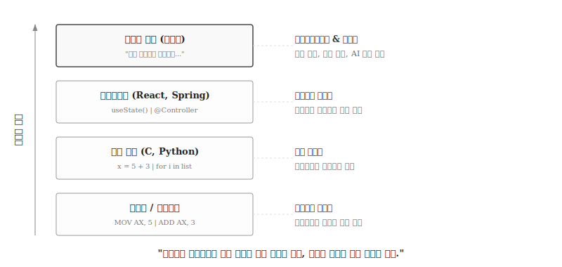
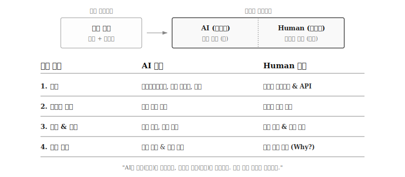

---
execute:
  eval: false
---

# 개발자의 미래 {#sec-developer-future}

\index{추상화} \index{오케스트레이터} \index{Orchestrator} \index{Verifier}

테스트 결과를 바탕으로 프롬프트를 개선한다.
부족했던 요구사항을 추가하거나, 더 명확한 표현으로 수정한다.
이 과정을 반복하여 코드 품질을 높인다.

```{python}
#| label: workflow-example
#| eval: true

# 예시: 단어 빈도수 계산 코드
# LLM에게 "텍스트에서 가장 빈도 높은 단어 5개 추출" 요청 후 생성된 코드

from collections import Counter

text = """But soft what light through yonder window breaks
It is the east and Juliet is the sun
Arise fair sun and kill the envious moon
Who is already sick and pale with grief"""

# 텍스트를 소문자로 변환하고 단어로 분리
words = text.lower().split()

# 단어 빈도수 계산
word_counts = Counter(words)

# 상위 5개 단어 출력
for word, count in word_counts.most_common(5):
    print(f"{word}: {count}")
```

위 코드는 LLM이 생성한 결과물이다.
간단한 요구사항이었기에 한 번의 프롬프트로 동작하는 코드를 얻었다.
복잡한 요구사항일수록 여러 번의 반복이 필요하다.

## 개발자 역량과 역할의 재정의 {#sec-developer-role}

\index{추상화} \index{오케스트레이터} \index{Orchestrator} \index{Verifier}

AI 시대에 개발자의 역할은 근본적으로 변화했다.
과거 **Coder(코드 작성자)**가 "어떻게(How)"를 담당했다면, 현재는 **Orchestrator(오케스트레이터) + Verifier(검증자)**로서 "무엇을(What)"과 "왜(Why)"를 담당한다.

{#fig-abstraction-layers}

프로그래밍 언어의 역사는 추상화 계층의 상승이었다.
기계어에서 어셈블리, C, Python으로 이어지는 흐름은 "사람의 사고방식에 가까운 표현"을 찾아가는 여정이다.
바이브 코딩은 그 연장선으로, 코드 문법조차 건너뛰고 자연어 의도만으로 시스템을 만드는 단계에 도달했다.

어셈블리 시대에 성능 필수 구간만 직접 코딩하고 나머지는 컴파일러에 맡겼듯, AI 시대에는 CRUD 로직과 보일러플레이트를 LLM에 맡기고 도메인 모델링, 아키텍처 결정, 보안 경계에서 인간이 개입한다.
"무엇이 중요한가"를 판단하고, 어디까지 자동화를 믿고 어디서 검증해야 하는지 아는 감각이 핵심이다.

### Coder에서 Orchestrator + Verifier로

{#fig-human-ai-roles}

역할 분담은 다음과 같이 정리된다.

**코드 생성**: AI가 보일러플레이트, CRUD, 테스트 코드, 문서화 등 반복 작업을 담당한다.
인간은 아키텍처 결정, 컴포넌트 경계, API 설계 등 구조적 판단을 내린다.

**패턴 활용**: AI가 "Observer 패턴으로 구현해"라는 지시에 따라 패턴을 구현한다.
인간은 문제 상황에 어떤 패턴이 적합한지 판단하고 선택한다.
디자인 패턴 지식은 더 이상 "구현 스킬"이 아니라 "의사소통 어휘"로 기능한다.

**품질 관리**: AI가 코드 리뷰 초안, 정적 분석, 린팅을 수행한다.
인간은 보안, 정확성, 비즈니스 로직의 최종 검증을 담당한다.
45%의 취약점 비율을 고려하면, 인간 검증은 선택이 아닌 필수다.

**디버깅**: AI가 오류 메시지를 분석하고 수정안을 제안한다.
인간은 시스템 수준에서 근본 원인을 파악한다.

### 필요한 핵심 역량


## 경력 경로와 학습 로드맵 {#sec-career-path}

\index{경력 경로} \index{학습 로드맵}

**주니어 개발자**
- 기초 프로그래밍 개념 이해 (1부 내용)
- AI 도구 활용 능력 (Copilot, ChatGPT)
- 코드 읽기와 디버깅
- 테스트 작성

**시니어 개발자**
- 시스템 아키텍처 설계
- 컨텍스트 공학 (MCP, RAG)
- 보안 감사와 품질 관리
- 팀 오케스트레이션

**전환기 개발자를 위한 조언**
- 코딩 속도보다 검증 속도를 높여라
- 패턴 구현보다 패턴 선택 능력을 키워라
- "어떻게"보다 "무엇을"과 "왜"에 집중하라
- AI를 동료로 받아들여라. 경쟁자가 아니다.

## 미래 전망 {#sec-future-outlook}

2030년까지 95%의 코드가 AI에 의해 생성될 것으로 예측된다.
그러나 개발자가 사라지는 것은 아니다.
역할이 변화할 뿐이다.

**2030년 개발자의 모습**:
- 자연어로 시스템을 설계한다
- AI 도구를 오케스트레이션한다
- 생성된 코드의 품질과 보안을 검증한다
- 비즈니스 가치와 기술을 연결한다

**준비해야 할 것**:
- 의도를 명확히 표현하는 커뮤니케이션 능력
- 시스템 전체를 조망하는 아키텍처 사고
- 빠르게 학습하고 적응하는 유연성
- 기초 CS 지식 (알고리즘, 네트워크, 보안)

바이브 코딩 시대는 위기일 수도, 기회일 수도 있다.
단순히 코드를 빠르게 치는 능력만으로는 더 이상 충분하지 않다.
하지만 시스템을 이해하고, 의도를 명확히 표현하고, 전체를 조율하고, 중요한 순간에 정확히 개입할 줄 아는 사람에게는 엄청난 레버리지다.

도구는 바뀌지만, 본질은 여전히 같다.
무엇을 만들고, 왜 만들며, 어떻게 만들지 아는 것.

::: {.content-visible when-format="pdf"}
\faLightbulb\ 생각해볼 점
:::

::: {.content-visible when-format="html"}
## 생각해볼 점 {.unnumbered}
:::

Coder에서 Orchestrator + Verifier로의 전환은 프로그래밍 역사의 자연스러운 연장선이다.
기계어에서 어셈블리, C, Python으로 이어지는 추상화 계층의 상승은 "기계에 가까운 표현"에서 "인간에 가까운 표현"으로의 이동이었다.
바이브 코딩은 코드 문법조차 건너뛰고 자연어 의도만으로 시스템을 만드는 단계에 도달했다.

패턴과 아키텍처 지식의 역할이 변화했다.
구현 스킬에서 의사소통 어휘로, 코드 작성 도구에서 검증 기준으로 전환되었다.
"Observer 패턴을 안다"는 것의 의미가 "직접 구현할 수 있다"에서 "AI에게 설명하고 결과를 평가할 수 있다"로 바뀌었다.

필요한 핵심 역량은 6가지다.
의도 명세, 우선순위 판단, 코드 리뷰 속도, 시스템 사고, 신뢰 경계 설정, 기초 이해력.
이 중 "코드 작성" 능력은 없다.
대신 "무엇을 만들지 정의"하고 "결과를 검증"하는 능력이 핵심이 되었다.

Software 1.0, 2.0, 3.0은 대체 관계가 아니라 보완 관계다.
시스템 프로그래밍은 여전히 명시적 코딩이 필수하고, 이미지 인식은 기계학습 모델이 우위에 있으며, LLM은 프로토타이핑과 반복 작업 자동화에서 강점을 보인다.
세 패러다임의 적절한 조합이 미래 개발의 핵심 역량이다.

\index{오케스트레이터}
\index{검증자}
\index{미래 전망}

## 프로젝트 {.unnumbered}

\index{프로젝트}

1. 자신의 현재 역량을 6가지 핵심 역량(의도 명세, 우선순위 판단, 코드 리뷰, 시스템 사고, 신뢰 경계, 기초 이해력)으로 평가하라. 가장 약한 부분은 무엇인가?
2. 한 달간 AI 도구를 활용하여 프로젝트를 진행하고, 어떤 역량이 가장 중요했는지 기록하라.
3. "맨손 코딩"과 "AI 협업 코딩"으로 동일한 기능을 각각 구현하고 시간과 품질을 비교하라.
4. 2030년 자신이 어떤 개발자가 되고 싶은지, 그를 위해 지금부터 무엇을 준비해야 하는지 계획을 작성하라.
