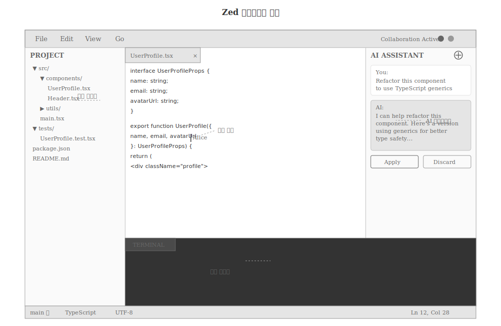
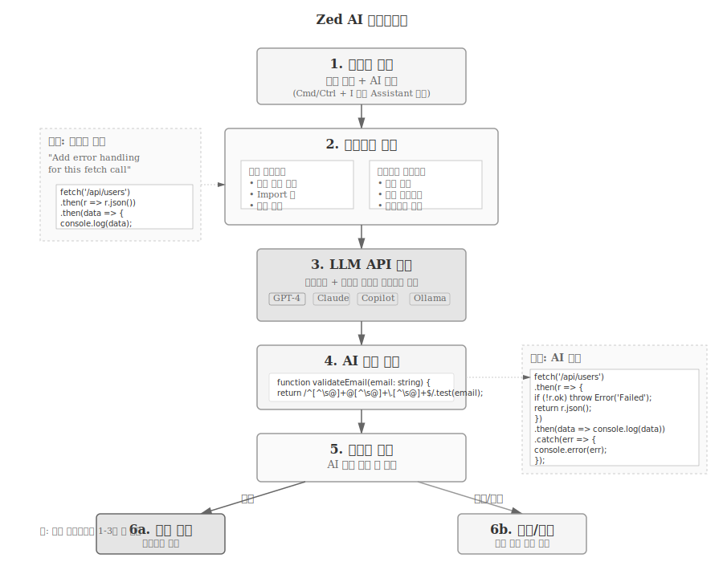

# Zed {#ide-zed}

[Zed](https://zed.dev/)는 Atom 에디터의 공동 창업자 Nathan Sobo가 2022년 공개한 차세대 코드 에디터다. Rust로 작성되어 탁월한 성능을 자랑하며, 실시간 협업과 AI 통합을 처음부터 염두에 두고 설계되었다.

### 개발 배경과 철학

Atom 에디터의 교훈을 바탕으로 Zed 개발팀은 다음 원칙을 세웠다:

- **성능 우선**: Electron이 아닌 네이티브 기술 스택
- **협업 중심**: 실시간 멀티플레이어 편집 기본 탑재
- **AI 네이티브**: LLM 통합을 핵심 기능으로 설계
- **미니멀리즘**: 불필요한 복잡성 제거

VS Code의 풍부한 생태계와 Vim의 가벼움, Atom의 협업 비전을 결합한 에디터를 목표로 한다.

### 핵심 차별점

**극한의 성능**
- GPU 가속 렌더링으로 60fps 유지
- 수백 MB 파일도 즉시 열림
- 키 입력 지연 1ms 이하

**진정한 실시간 협업**
- Google Docs처럼 자연스러운 공동 편집
- 음성/채팅 통합
- 화면 공유 불필요

**네이티브 AI 통합**
- GPT-4, Claude, Copilot 등 다양한 LLM 지원
- 컨텍스트 인식 코드 생성
- 자연어 명령으로 코드 수정

::: {#fig-zed-interface}


Zed 인터페이스 구조
:::

## 설치 방법

::: {.panel-tabset}

### macOS

**공식 다운로드 (권장)**

Zed 웹사이트에서 dmg 파일을 다운로드한다:

```bash
# 브라우저에서 다운로드
open https://zed.dev/download

# 설치 후 실행
open -a Zed
```

**Homebrew 설치**

```bash
brew install zed
```

**빌드 버전 (개발자용)**

최신 기능을 먼저 사용하려면 nightly 빌드를 설치한다:

```bash
brew install zed@nightly
```

### Linux

**공식 설치 스크립트**

```bash
# 설치 스크립트 다운로드 및 실행
curl https://zed.dev/install.sh | sh
```

**수동 다운로드**

```bash
# .tar.gz 파일 다운로드
wget https://zed.dev/download/linux

# 압축 해제
tar -xzf zed-linux-x86_64.tar.gz

# 실행
./zed
```

**주요 리눅스 배포판**

Ubuntu/Debian:
```bash
sudo apt update
sudo apt install libssl-dev pkg-config
curl https://zed.dev/install.sh | sh
```

Arch Linux:
```bash
# AUR 패키지 사용
yay -S zed-git
```

Fedora:
```bash
sudo dnf install openssl-devel
curl https://zed.dev/install.sh | sh
```

### Windows

::: {.callout-note}
Windows 버전은 2024년 말부터 프리뷰 상태로 제공된다. 안정성이 macOS/Linux에 비해 낮을 수 있다.
:::

**Windows 프리뷰 설치**

1. [Zed 다운로드 페이지](https://zed.dev/download)에서 Windows installer 다운로드
2. `.exe` 파일 실행
3. 설치 마법사 따라 진행

**명령줄 설치 (winget)**

```powershell
winget install zed
```

### 설치 확인

터미널에서 Zed를 실행할 수 있는지 확인한다:

```bash
# CLI에서 현재 디렉토리 열기
zed .

# 특정 파일 열기
zed README.md

# 버전 확인
zed --version
```

:::

## 초기 설정

### 첫 실행 및 기본 설정

Zed를 처음 실행하면 간단한 환경설정 화면이 나타난다.

**테마 선택**

Zed는 기본적으로 라이트/다크 테마를 제공한다:

- `Cmd/Ctrl + K` → `Cmd/Ctrl + T`: 테마 선택기 열기
- One Dark, Solarized, Gruvbox 등 인기 테마 기본 포함

**키맵 설정**

다른 에디터에서 전환하는 경우 익숙한 키바인딩을 사용할 수 있다:

- VS Code 키맵
- Vim 키맵
- Emacs 키맵
- Sublime Text 키맵

설정 방법:
1. `Cmd/Ctrl + ,` (설정 열기)
2. "Keymap" 검색
3. 선호하는 키맵 선택

**폰트 설정**

`settings.json` 파일에서 폰트를 설정한다:

```json
{
  "buffer_font_family": "JetBrains Mono",
  "buffer_font_size": 14,
  "ui_font_family": "Inter",
  "ui_font_size": 13
}
```

### Language Server 설정

Zed는 Language Server Protocol (LSP)을 기본 지원한다. 주요 언어의 LSP는 자동으로 설치된다.

::: {.panel-tabset}

#### Python

Python 파일을 열면 자동으로 pyright 설치를 제안한다:

```bash
# 수동 설치
npm install -g pyright
```

#### TypeScript/JavaScript

별도 설치 불필요. Zed 내장 TypeScript 지원.

#### Rust

```bash
rustup component add rust-analyzer
```

#### Go

```bash
go install golang.org/x/tools/gopls@latest
```

:::

## 주요 기능

### 파일 탐색 및 검색

**퍼지 파인더 (Fuzzy Finder)**

`Cmd/Ctrl + P`로 프로젝트 내 파일을 빠르게 찾는다:

- 파일명 일부만 입력해도 검색
- 타이핑과 동시에 결과 표시 (지연 없음)

**심볼 검색**

`Cmd/Ctrl + Shift + O`: 현재 파일의 함수, 클래스 등 심볼 검색

`Cmd/Ctrl + T`: 프로젝트 전체 심볼 검색

**텍스트 검색**

`Cmd/Ctrl + Shift + F`: 프로젝트 전체 텍스트 검색

- 정규식 지원
- 대소문자 구분/무시
- 특정 파일 타입만 검색

### 멀티 커서 및 편집

**멀티 커서 생성**

- `Cmd/Ctrl + Click`: 클릭한 위치에 커서 추가
- `Cmd/Ctrl + D`: 현재 선택 단어와 동일한 다음 단어 선택
- `Cmd/Ctrl + Shift + L`: 선택한 모든 라인에 커서 추가

**칼럼 선택**

`Alt + Shift + 드래그`: 세로 방향 블록 선택

### 분할 편집

**화면 분할**

- `Cmd/Ctrl + K` → `↑↓←→`: 현재 에디터를 지정 방향으로 분할
- 최대 4개까지 분할 가능
- 드래그로 레이아웃 조정

**포커스 이동**

`Cmd/Ctrl + K` → `Cmd/Ctrl + ↑↓←→`: 분할된 창 사이 이동

## AI 통합 및 활용

Zed의 가장 강력한 기능은 네이티브 AI 통합이다. 별도 플러그인 없이 바로 LLM을 활용할 수 있다.

### AI 어시스턴트 설정

**API 키 설정**

1. `Cmd/Ctrl + ,` (설정 열기)
2. "AI" 검색
3. 사용할 LLM 제공자 선택

::: {.panel-tabset}

#### OpenAI

GPT-4, GPT-4 Turbo, GPT-3.5 모델을 지원한다.

```json
{
  "assistant": {
    "default_model": {
      "provider": "openai",
      "model": "gpt-4-turbo"
    },
    "version": "2"
  },
  "openai_api_key": "sk-..."
}
```

#### Anthropic

Claude 3.5 Sonnet, Claude 3 Opus 등을 지원한다.

```json
{
  "assistant": {
    "default_model": {
      "provider": "anthropic",
      "model": "claude-3-5-sonnet-20241022"
    },
    "version": "2"
  },
  "anthropic_api_key": "sk-ant-..."
}
```

#### GitHub Copilot

GitHub Copilot 구독이 있으면 바로 사용 가능하다.

```json
{
  "assistant": {
    "default_model": {
      "provider": "copilot",
      "model": "gpt-4"
    },
    "version": "2"
  }
}
```

#### Ollama (로컬)

로컬에서 LLM을 실행하려면 Ollama를 사용한다:

```bash
# Ollama 설치 (macOS)
brew install ollama

# 모델 다운로드
ollama pull codellama
ollama pull mistral
```

Zed 설정:

```json
{
  "assistant": {
    "default_model": {
      "provider": "ollama",
      "model": "codellama"
    }
  }
}
```

:::

### AI 어시스턴트 사용법

**어시스턴트 패널 열기**

`Cmd/Ctrl + ?` 또는 우측 상단 AI 아이콘 클릭

**기본 사용 패턴**

1. **코드 설명 요청**
   - 코드 블록 선택
   - 어시스턴트 패널에서 "Explain this code" 입력
   - LLM이 선택한 코드를 분석하여 설명

2. **코드 생성**
   - 어시스턴트 패널에서 자연어로 요청
   - "Create a function that validates email addresses"
   - 생성된 코드를 에디터에 삽입

3. **리팩토링 제안**
   - 코드 선택 후 "Refactor this to use async/await"
   - LLM이 개선된 코드 제시

4. **버그 찾기**
   - 문제가 있는 함수 선택
   - "Find bugs in this code"
   - LLM이 잠재적 문제점 지적

::: {#fig-zed-ai-workflow}


Zed AI 워크플로우
:::

### 인라인 AI 어시스트

**Inline Assist 활성화**

코드 작성 중 `Cmd/Ctrl + I`를 누르면 인라인 AI 입력창이 나타난다.

**사용 예시**

```python
# 커서를 함수 위에 두고 Cmd/Ctrl + I
def calculate_total
# 입력: "calculate total price with tax and discount"

# AI가 자동 완성:
def calculate_total(price, tax_rate, discount):
    """Calculate total price with tax and discount applied."""
    subtotal = price * (1 - discount)
    total = subtotal * (1 + tax_rate)
    return total
```

**컨텍스트 인식 생성**

Zed AI는 프로젝트 전체 컨텍스트를 이해한다:

- 현재 파일의 import 문
- 프로젝트 구조
- 다른 파일의 함수/클래스 정의
- 주석과 독스트링

예시:

```typescript
// 프로젝트에 User 타입이 이미 정의되어 있음
// Cmd/Ctrl + I: "create a function to validate user data"

// AI가 기존 타입을 참조하여 생성:
function validateUser(user: User): boolean {
  return (
    user.email.includes('@') &&
    user.name.length > 0 &&
    user.age >= 0
  );
}
```

### AI 기반 코드 리뷰

**변경사항 분석**

Git 통합과 함께 AI를 사용하여 코드 리뷰를 받을 수 있다:

1. `Cmd/Ctrl + Shift + G`: Git 패널 열기
2. 변경된 파일 확인
3. AI 어시스턴트에 "Review my changes" 요청
4. LLM이 변경사항을 분석하여 피드백 제공

**리뷰 항목**

- 잠재적 버그
- 성능 이슈
- 코드 스타일 개선점
- 테스트 누락 부분

## 협업 기능

### 실시간 멀티플레이어 편집

**협업 세션 시작**

1. `Cmd/Ctrl + Shift + P` (커맨드 팔레트)
2. "Share project" 입력
3. 생성된 링크를 동료에게 공유

**참여자 관리**

- 각 참여자는 고유 색상 커서로 표시
- 실시간으로 타이핑 확인
- 동시에 여러 파일 편집 가능

**음성 채팅**

협업 세션 중 음성 채팅을 바로 시작할 수 있다:

- 세션 참여자 목록에서 음성 아이콘 클릭
- WebRTC 기반 P2P 연결
- 별도 화상회의 도구 불필요

### 팀 협업 워크플로우

**페어 프로그래밍**

1. 드라이버(Driver): 코드 작성
2. 내비게이터(Navigator): AI 어시스턴트로 제안사항 생성
3. 실시간으로 AI 제안을 함께 검토하며 코딩

**코드 리뷰**

- Pull Request 전에 Zed에서 먼저 리뷰
- AI가 1차 리뷰 수행
- 팀원과 함께 AI 피드백 논의

## 확장 및 커스터마이징

### 테마 설치

**커뮤니티 테마**

`Cmd/Ctrl + K` → `Cmd/Ctrl + T`에서 테마 브라우저 열기:

- One Dark Pro
- Dracula
- Nord
- Tokyo Night
- Catppuccin

**커스텀 테마 만들기**

`~/.config/zed/themes/` 디렉토리에 JSON 파일 생성:

```json
{
  "name": "My Custom Theme",
  "author": "Your Name",
  "themes": [
    {
      "name": "My Custom Dark",
      "appearance": "dark",
      "style": {
        "background": "#1e1e1e",
        "foreground": "#d4d4d4",
        "cursor": "#aeafad",
        "selection": "#264f78"
      }
    }
  ]
}
```

### 키바인딩 커스터마이징

`~/.config/zed/keymap.json`에서 키바인딩을 재정의한다:

```json
[
  {
    "context": "Editor",
    "bindings": {
      "cmd-/": "editor::ToggleComments",
      "cmd-shift-f": "workspace::NewSearch"
    }
  },
  {
    "context": "Terminal",
    "bindings": {
      "cmd-t": "terminal::Copy"
    }
  }
]
```

### 언어별 설정

특정 언어에 대해 다른 설정을 적용할 수 있다:

```json
{
  "languages": {
    "Python": {
      "tab_size": 4,
      "format_on_save": "on",
      "formatter": "language_server"
    },
    "JavaScript": {
      "tab_size": 2,
      "preferred_line_length": 100
    },
    "Rust": {
      "tab_size": 4,
      "hard_tabs": false
    }
  }
}
```

## 실전 워크플로우

::: {.panel-tabset}

### Python 데이터 분석

**프로젝트 설정**

```bash
# 프로젝트 디렉토리 생성
mkdir data-analysis && cd data-analysis

# 가상환경 생성
python -m venv venv
source venv/bin/activate

# Zed로 프로젝트 열기
zed .
```

**AI 활용 워크플로우**

1. **스켈레톤 코드 생성**
   - AI 어시스턴트: "Create a Python script to load CSV and perform basic EDA"
   - 기본 구조 생성됨

2. **데이터 로딩 함수 작성**
   - Inline Assist: "add error handling for file not found"
   - 예외 처리 코드 자동 추가

3. **시각화 코드**
   - 선택 후 AI: "create matplotlib visualizations for this dataframe"
   - 차트 생성 코드 제공

4. **리팩토링**
   - AI: "extract repeated code into helper functions"
   - 코드 구조 개선

### TypeScript 웹앱

**React 컴포넌트 개발**

```typescript
// AI에게 요청: "Create a user profile card component with avatar"

interface UserProfileProps {
  name: string;
  email: string;
  avatarUrl: string;
}

export function UserProfile({ name, email, avatarUrl }: UserProfileProps) {
  return (
    <div className="user-profile">
      
      <div className="info">
        <h3>{name}</h3>
        <p>{email}</p>
      </div>
    </div>
  );
}
```

**AI 기반 테스트 작성**

컴포넌트 선택 후 AI에게 요청: "Write Jest tests for this component"

```typescript
// AI가 자동 생성:
import { render, screen } from '@testing-library/react';
import { UserProfile } from './UserProfile';

describe('UserProfile', () => {
  it('renders user information correctly', () => {
    render(
      <UserProfile
        name="John Doe"
        email="john@example.com"
        avatarUrl="/avatar.jpg"
      />
    );

    expect(screen.getByText('John Doe')).toBeInTheDocument();
    expect(screen.getByText('john@example.com')).toBeInTheDocument();
  });
});
```

### 팀 협업

**원격 페어 프로그래밍**

1. **세션 시작**: 시니어 개발자가 협업 세션 생성
2. **주니어 참여**: 링크로 접속하여 실시간 편집
3. **AI 활용**:
   - 주니어: 코드 작성
   - AI: 베스트 프랙티스 제안
   - 시니어: AI 제안 검토 및 추가 멘토링
4. **실시간 피드백**: 음성 채팅으로 즉각 소통

**코드 리뷰 워크플로우**

1. 개발자: 기능 구현 완료
2. AI 리뷰: "Review this code for security issues"
3. AI가 SQL injection, XSS 등 보안 문제 지적
4. 수정 후 팀원과 협업 세션으로 2차 리뷰
5. 승인 후 PR 생성

:::

## VS Code와 비교

### 성능

| 항목 | Zed | VS Code |
|------|-----|---------|
| 시작 시간 | 0.1초 | 1-2초 |
| 대용량 파일 | 100MB+ 즉시 | 10MB 이상 느림 |
| 메모리 사용량 | 50-100MB | 200-500MB |
| 키 입력 지연 | <1ms | 5-10ms |

### 기능

**Zed의 장점**
- 실시간 협업 기본 내장
- AI 통합 네이티브 지원
- 극한의 성능
- 미니멀한 UI

**VS Code의 장점**
- 방대한 확장 생태계
- 디버거 통합
- 더 많은 언어 지원
- 성숙한 플랫폼

### 선택 기준

**Zed를 선택하는 경우**
- 성능이 최우선
- 팀 협업이 빈번함
- AI 기반 개발 중시
- 미니멀리즘 선호

**VS Code를 유지하는 경우**
- 특정 확장 프로그램 의존
- 복잡한 디버깅 필요
- Java, C# 등 엔터프라이즈 언어
- 안정성 최우선

## 한계와 대안

### 현재 한계점

**생태계**
- 확장 프로그램이 VS Code에 비해 적음
- 일부 언어 LSP 지원 미흡
- 플랫폼별 기능 차이 (Windows 미성숙)

**기능**
- 내장 디버거 없음 (LSP 디버깅만 지원)
- 노트북 지원 없음 (Jupyter 등)
- Git UI가 기본적 수준

**AI 비용**
- GPT-4, Claude 등 API 비용 발생
- 로컬 LLM(Ollama)은 품질 낮음

### 대안 및 보완

**Zed + VS Code 병행**

주 에디터로 Zed 사용, 특정 작업은 VS Code:

- 일상적 코딩: Zed (빠름, AI 활용)
- 디버깅/테스팅: VS Code
- Jupyter 노트북: VS Code

**다른 AI 에디터와 비교**

- **Cursor**: VS Code 기반, AI 특화
- **Windsurf**: Codeium 제작, AI 네이티브
- **GitHub Copilot**: VS Code 확장

Zed는 성능과 협업에 강점, Cursor는 AI 기능이 더 풍부함.

## 결론

Zed는 차세대 코드 에디터의 방향성을 제시한다. Rust 기반의 극한 성능, 실시간 협업, AI 네이티브 통합은 현대 개발자의 요구를 정확히 반영한다.

아직 생태계가 VS Code만큼 성숙하지 않지만, 빠른 발전 속도를 보이고 있다. 특히 성능과 협업을 중시하는 팀, AI 기반 개발을 적극 활용하는 개발자에게 강력히 추천한다.

프로그래밍 도구는 개인의 워크플로우와 선호도에 따라 달라진다. Zed를 직접 사용해보고, 자신의 개발 스타일에 맞는지 평가해보는 것이 가장 좋은 선택 방법이다.
