# 문서 복잡성 {#sec-complexity}

\index{문서 복잡도} \index{복잡도 스펙트럼} \index{래칫 효과} \index{도구-복잡도 매칭}

모든 문서에는 복잡도가 있다.
카카오톡 메시지와 국제 항공 정비 매뉴얼(S1000D)은 같은 "문서"지만, 필요한 도구와 프로세스는 전혀 다르다.
복잡도를 모르면 도구 선택은 직감에 의존하고, 직감은 대개 "지금 쓰고 있는 것"을 반복하는 방향으로 작동한다.
"복잡도를 알면 도구가 보인다" — 문서 복잡도 프레임워크는 도구 선택의 과학적 근거를 제공한다.

## 메모가 괴물이 되기까지 {#sec-complexity-story}

\index{김대리 사례}

김대리의 6개월을 따라가면 문서 복잡도의 본질이 드러난다.

1월, 김대리는 팀장에게 보낼 메모 한 장을 작성했다.
독자는 한 명, 수명은 하루, 재현성은 불필요, 자동화는 불필요 — Lv.0 메모다.
HWP로 충분했다.

3월, 보고서에 데이터 표와 차트가 추가되었다.
독자가 팀 전체로 확대되었고, 월간 반복 보고가 시작되었다.
매달 엑셀에서 숫자를 복사하여 HWP에 붙여넣는 작업이 반복되었다.

6월, 감사팀의 규제 요구가 들어왔고, 3개 부서 양식을 통합해야 했으며, HTML과 PDF 두 가지 형식으로 출력해야 했다.
메모 한 장이 다중 출력 월간 보고서(Lv.3)로 변했다.
도구는 여전히 HWP였다.

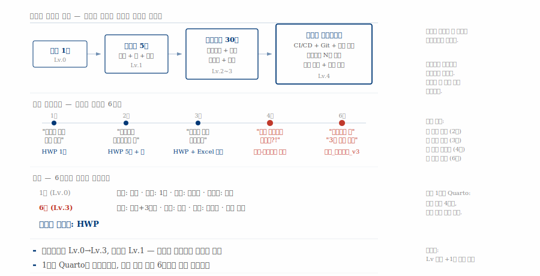{#fig-pressure-visual}

김대리는 아무것도 잘못하지 않았다.
복잡도를 올린 것은 외부 압력이다.
독자 확대, 재현 요구, 다중 출력, 규제 추가, 반복 자동화, 협업 확대 — 여섯 가지 압력이 6개월에 걸쳐 순차적으로 적용되었다.

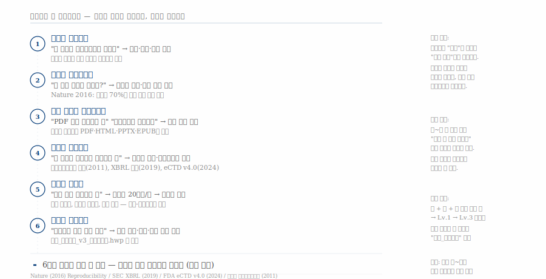{#fig-root-causes}

## 래칫 효과 — 복잡도는 되돌아가지 않는다 {#sec-complexity-ratchet}

\index{래칫 효과} \index{최종_진짜최종}

문서 복잡도는 톱니바퀴(ratchet)처럼 한 방향으로만 움직인다.
한번 독자가 팀 전체로 확대되면 "이제 나만 보면 됩니다"라고 말하는 사람은 없다.
한번 감사 추적이 요구되면 "이제 감사 안 합니다"라고 말하는 기관은 없다.

"최종_진짜최종_v3.hwp"는 Lv.1 도구(HWP)로 Lv.3 문서를 쓰는 불일치의 증상이다.
파일명으로 버전을 관리하고, 수작업으로 서식을 맞추며, 매번 복사-붙여넣기로 데이터를 갱신하는 것은 도구가 복잡도를 따라가지 못할 때 나타나는 전형적인 패턴이다.

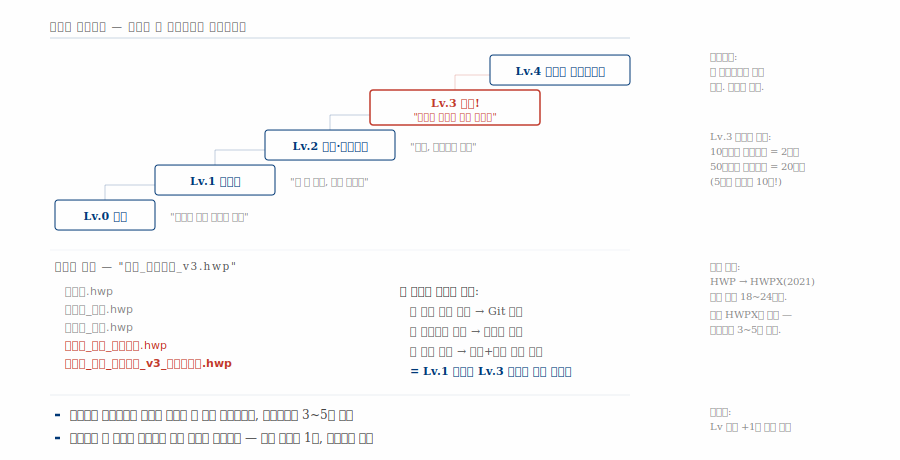{#fig-ratchet}

**황금률**: 복잡해질 것 같으면 처음부터 상위 도구로 시작한다.
진입 비용은 1회(4시간)이지만, 수작업 비용은 매월(20시간) 반복된다.

## 5단계 복잡도 스펙트럼 {#sec-complexity-spectrum}

\index{복잡도 스펙트럼} \index{Lv.0} \index{Lv.1} \index{Lv.2} \index{Lv.3} \index{Lv.4}

문서 복잡도는 독자 범위, 수명, 재현성, 자동화 네 가지 축으로 결정된다.
네 축의 조합에 따라 Lv.0에서 Lv.4까지 다섯 단계로 분류된다.

| 레벨 | 이름 | 독자 | 수명 | 재현 | 자동화 | 권장 도구 |
|------|------|------|------|------|--------|-----------|
| Lv.0 | 메모 | 본인·지인 | 일회성 | 불필요 | 수동 | 메모앱, 카카오톡 |
| Lv.1 | 보고서 | 상급자·기관 | 분기~연 | 낮음 | 수동 | Word, HWP, Google Docs |
| Lv.2 | 논문·기술문서 | 전문가 집단 | 영구 | 코드 포함 | 반자동 | LaTeX, Markdown, Quarto |
| Lv.3 | 분석보고서 | 개발자·분석가 | 영구 | 완전 재현 | 스크립트 | Quarto + R/Python |
| Lv.4 | 자동화 파이프라인 | 시스템·CI | 영구 | 완전 재현+감사 | CI/CD | Quarto + GitHub Actions |

: 문서 복잡도 5단계 스펙트럼 {#tbl-complexity-spectrum .striped}

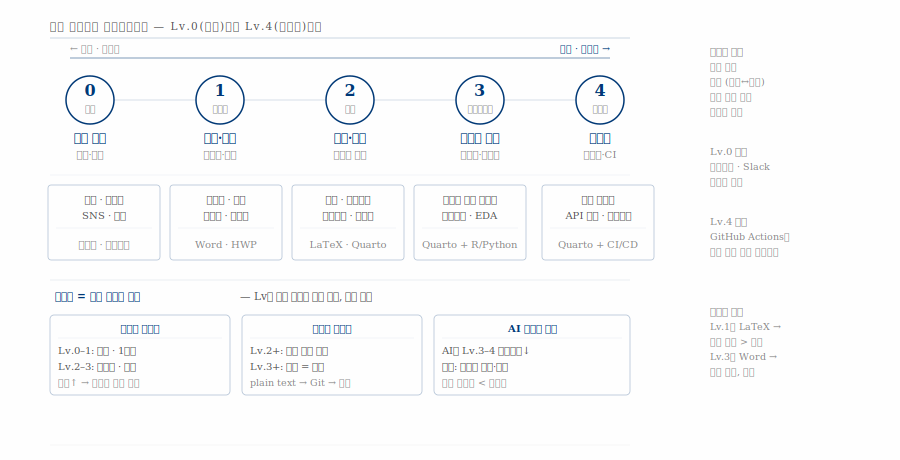{#fig-complexity-model}

도구를 먼저 고르지 말고 Lv을 먼저 파악한다.
김대리의 경험을 프레임워크에 대입하면 명확해진다 — 1월은 Lv.0, 6월은 Lv.3이지만 도구는 Lv.1에 머물러 있었다.

## 복잡도의 10가지 차원 {#sec-complexity-10axes}

\index{지배 차원} \index{Glushko} \index{ISO 15489}

핵심 4차원(독자·수명·재현·자동화)은 학술 문헌에서 도출된 것이다[@Glushko2005].
Nature는 2016년 재현성 위기를 보고하며 코드와 데이터의 동봉을 권고했고[@Baker2016], ISO 15489는 기록 관리의 국제 표준으로 문서 수명과 보존을 체계화했다.

실무에서는 핵심 4차원만으로 도구를 선택하면 오류가 발생한다.
정부 보고서는 자동화 수준이 낮지만 규제 준수가 높아 XML+PKI가 필수다.
대시보드는 재현성보다 인터랙티브가 지배 차원이다.
실무 차원 여섯 가지를 추가하면 문서의 지배 차원을 정확하게 진단할 수 있다.

| 구분 | 차원 | 범위 |
|------|------|------|
| 학술 근거 | ① 독자 범위 | 본인 → 팀 → 기관 → 글로벌 |
| 학술 근거 | ② 수명 | 일회성 → 연간 → 영구 보존 |
| 학술 근거 | ③ 재현성 | 불필요 → 코드 포함 → 완전 재현+감사 |
| 학술 근거 | ④ 자동화 | 수동 → 스크립트 → CI/CD 파이프라인 |
| 실무 차원 | ⑤ 인터랙티브 | 정적 PDF → 실시간 대시보드 |
| 실무 차원 | ⑥ 다중 출력 | 단일 포맷 → HTML+PDF+PPTX |
| 실무 차원 | ⑦ 협업 규모 | 혼자 → 팀 → 오픈소스 |
| 실무 차원 | ⑧ 데이터 의존 | 없음 → 정적 → 스트리밍 API |
| 실무 차원 | ⑨ 규제 준수 | 없음 → 법적 의무+감사 |
| 실무 차원 | ⑩ 접근성 | 없음 → WCAG 인증 |

: 문서 복잡도의 10가지 차원 {#tbl-10axes .striped}

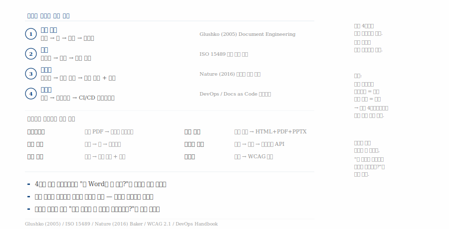{#fig-10axes}

핵심 질문은 "어떤 차원이 이 문서를 **지배**하는가?"다.
같은 "문서"라도 지배 차원이 다르면 필요한 도구가 완전히 다르다.

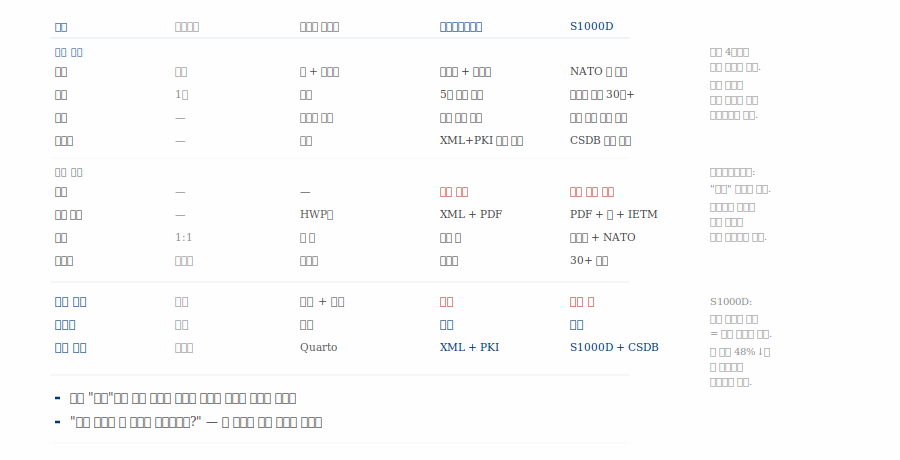{#fig-10axes-applied}

카카오톡 메시지는 지배 차원이 없어 메모앱이면 충분하다.
김대리 보고서는 독자와 반복이 지배하므로 Quarto가 적합하다.
전자세금계산서는 자동화 수준과 무관하게 규제가 지배하므로 XML+PKI가 필수다.
S1000D 항공 정비 매뉴얼은 모든 차원이 높아 전용 시스템이 필요하다.

## 복잡도의 충돌 — 경계를 넘을 때마다 곱셈 {#sec-complexity-collision}

\index{복잡도 충돌} \index{OSMU}

개인 수준에서 문서 복잡도는 덧셈으로 증가한다 — 독자+수명+재현.
경계를 넘는 순간 곱셈으로 전환된다.

**조직 내 충돌**: 김대리 보고서(Lv.2)가 감사팀 규제, 3부서 양식 통합, 외부 API 연동을 만나면 서식×승인×규제로 Lv.4+가 된다.

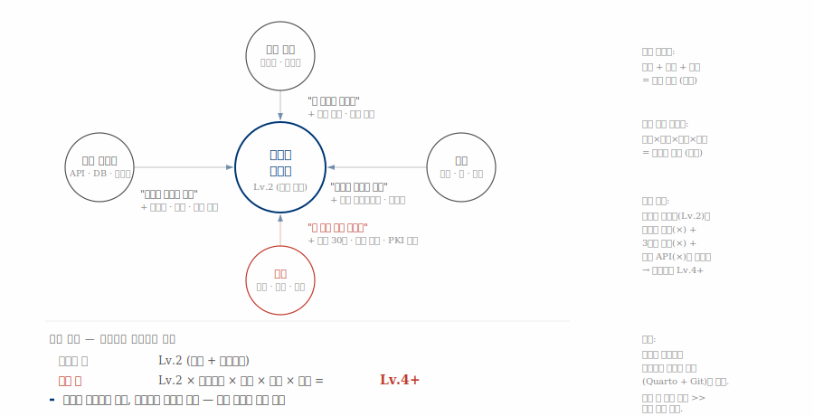{#fig-collision}

**조직 간 충돌**: 조직 내에서 Lv.3으로 해결한 문서가 상급 기관(양식 재제출), 협력 기관(포맷 호환), 규제 기관(XML+PKI)을 만나면 복잡도가 다시 폭발한다.

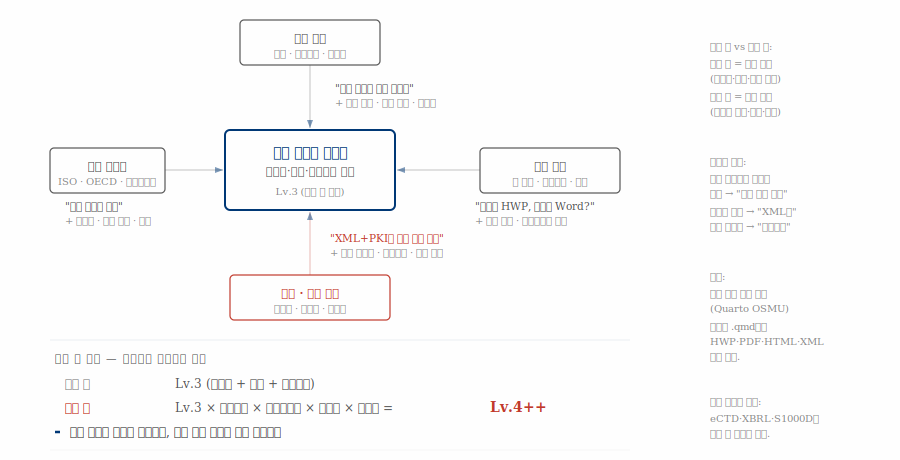{#fig-collision-org}

**글로벌 충돌**: HWPX의 치명적 한계는 해외에서 HWPX를 열 수 있는 소프트웨어가 없다는 것이다.
Lv.4 × 다중 관할권 × 국제 표준 × 다국어 = Lv.∞.
S1000D, eCTD, XBRL 같은 국제 표준이 존재하는 이유가 여기에 있다.

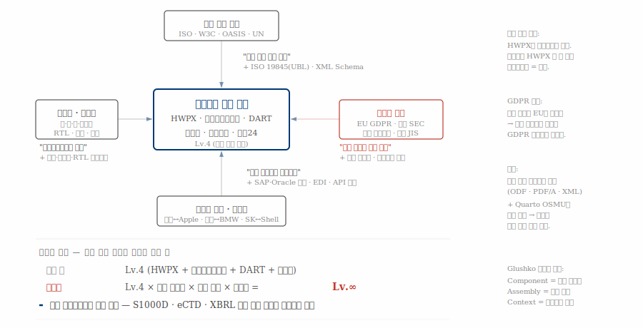{#fig-collision-global}

네 단계를 한눈에 조망하면 패턴이 보인다.
개인(Lv.2) → 조직 내(×서식·승인 = Lv.4+) → 조직 간(×포맷·스키마 = Lv.4++) → 글로벌(×관할권·표준 = Lv.∞).
각 경계를 넘을 때마다 복잡도는 덧셈이 아니라 곱셈으로 증가한다.

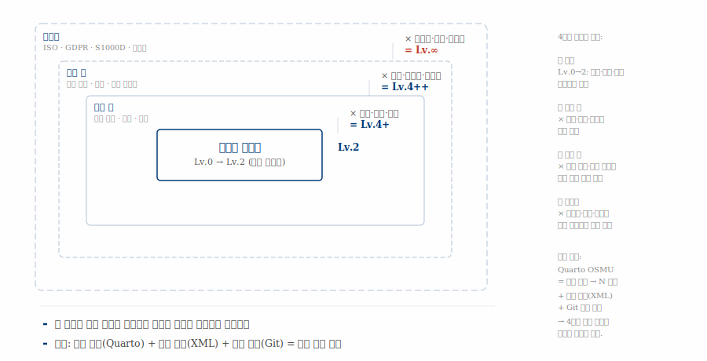{#fig-collision-overview}

공통 해법은 세 가지로 수렴한다 — Quarto OSMU(단일 소스→N 포맷), 국제 표준(XML), Git 버전 관리.
이 세 가지가 4단계 모든 경계를 하나의 도구 체계로 통과할 수 있게 한다.

## 도구-복잡도 매칭 {#sec-complexity-matching}

\index{과잉 투입} \index{과소 투입} \index{복잡도 절벽}

도구와 복잡도의 불일치는 양방향으로 비용을 발생시킨다.

**과잉 투입**: "설정이 너무 복잡해", "팀원이 못 써" — Lv.1 문서에 Lv.3 도구를 쓰는 경우다. 도구를 낮춰야 한다.

**과소 투입**: "매번 수작업이야", "재현이 안 돼" — Lv.3 문서에 Lv.1 도구를 쓰는 경우다. 도구를 올려야 한다.

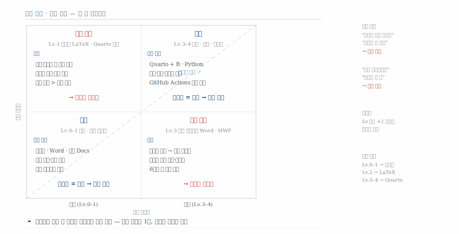{#fig-mismatch}

Word는 기본 보고서에는 최선이지만, 논문·분석 레포트 단계부터 비용이 지수적으로 급등한다.
Quarto는 진입 장벽이 Word보다 높지만, 복잡도가 올라갈수록 가장 완만한 비용 곡선을 유지한다.

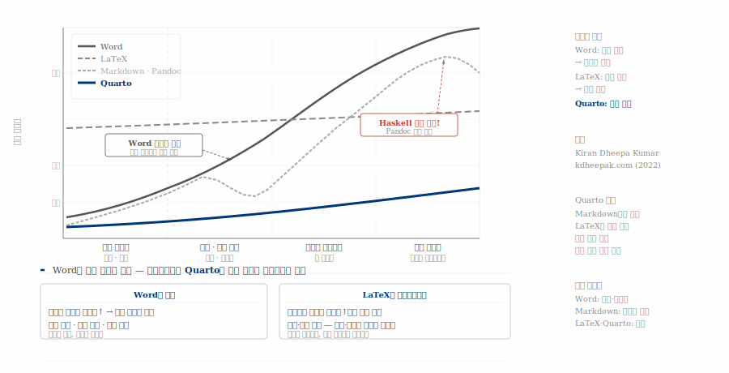{#fig-cliff}

## AI 시대의 문서 복잡도 {#sec-complexity-ai}

\index{AI 복잡성 패러독스} \index{도구 장벽}

AI가 문서 작성 환경을 근본적으로 바꾸고 있지만, 바꾸는 것과 바꾸지 못하는 것의 구분이 중요하다.

AI가 낮추는 것은 **도구 장벽**이다.
코딩 장벽은 Copilot 활용으로 30% 감소하고, 서식 지정은 LaTeX/Typst 자동 생성으로 80% 감소하며, 다국어 번역은 90%, 초안 작성은 50% 감소한다.
김대리가 1월에 AI + Quarto로 시작했다면, 도구 전환 없이 6월까지 수용 가능했을 것이다.

AI가 못 낮추는 것은 **지배 차원**이다.
"이 문서가 Lv 몇인가?"를 판단하려면 맥락, 목적, 독자에 대한 이해가 필요하다.
규제 준수는 법적 책임을 수반하고, 환각 검증은 문서당 3~10시간의 추가 작업을 요구한다.

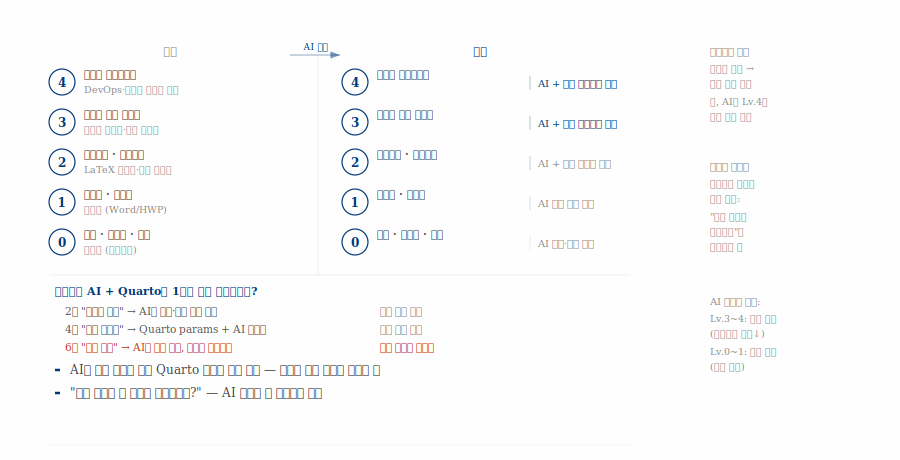{#fig-ai-shift}

여기서 **AI 복잡성 패러독스**가 등장한다.
AI는 생성은 쉽게 하지만 검증은 오히려 어렵게 만든다.
10분 만에 50쪽 보고서를 생성할 수 있지만, 그 보고서의 사실관계를 검증하는 데는 기존보다 더 많은 시간이 소요된다.
앞에서 다룬 "지배 차원" 개념이 여기서 결정적인 역할을 한다 — AI는 도구 장벽은 낮추지만 지배 차원은 건드리지 못한다.

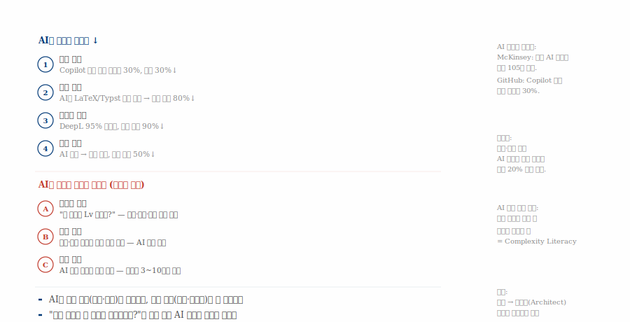{#fig-paradox}

## 복잡도 문해력 — 오늘부터 시작하는 세 가지 {#sec-complexity-literacy}

\index{복잡도 문해력} \index{지배 차원}

문서를 쓰기 전에 세 가지 질문을 던진다.

**첫째, 지배 차원을 먼저 파악한다.**
다음 문서를 쓰기 전에 "이 문서를 지배하는 차원이 무엇인가?"를 묻는다.
독자인가, 규제인가, 재현성인가, 자동화인가 — 지배 차원이 도구를 결정한다.

**둘째, 처음부터 상위 도구로 시작한다.**
진입 비용은 1회(4시간)이고 수작업 비용은 매월(20시간)이다.
김대리의 교훈은 명확하다 — 래칫은 역회전하지 않는다.

**셋째, AI는 도구 장벽을 낮추지만 판단은 인간의 몫이다.**
규제, 관할권, 검증은 AI가 대신할 수 없다.
"어떤 차원이 이 문서를 지배하는가?"를 아는 것이 AI 시대의 복잡도 문해력이다.
