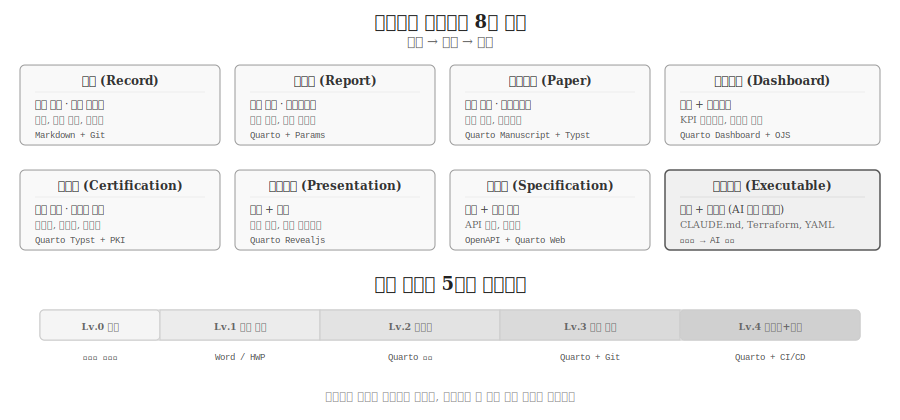

# 문서의 종류 {#sec-documents}

\index{문서 유형} \index{문서 복잡도} \index{Quarto 포맷}

글쓰기의 최종 산출물은 문서다.
메모에서 논문까지, 슬라이드에서 대시보드까지, 이력서에서 API 사양서까지 — 과학기술 저작물은 목적, 독자, 수명, 복잡도에 따라 다양한 형태를 취한다.
AI 시대에 접어들면서 "사람이 읽는 문서"에 더해 "기계가 실행하는 문서"(CLAUDE.md, Terraform, GitHub Actions YAML)라는 새로운 유형이 등장했다.
문서의 종류를 체계적으로 이해하면, 적절한 도구를 선택하고 효율적인 워크플로우를 설계할 수 있다.

## 8대 문서 유형 {#sec-doc-types}

\index{기록} \index{보고서} \index{학술논문} \index{대시보드} \index{발표자료} \index{사양서}

과학기술 글쓰기에서 만들어내는 문서는 **목적**에 따라 여덟 가지로 분류된다.
각 유형은 고유한 목적을 갖고, 목적에 맞는 포맷과 도구가 대응한다.

| 유형 | 목적 | 대표 포맷 | 도구 |
|------|------|-----------|------|
| 기록(Record) | 지식 보존 | Markdown + Git | 메모, 연구 노트, 회의록 |
| 보고서(Report) | 반복 전달 | Quarto + Params | 주간 보고, 분석 리포트 |
| 학술논문(Paper) | 학술 출판 | Quarto + Typst/LaTeX | 저널 논문, 학위논문 |
| 대시보드(Dashboard) | 분석 + 상호작용 | Quarto + Observable JS | KPI 모니터링, 탐색적 분석 |
| 증명서(Certification) | 법적 증빙 | Quarto Typst + PKI | 수료증, 성적표, 인증서 |
| 발표자료(Presentation) | 설득 + 교육 | Quarto Revealjs | 학회 발표, 강의 슬라이드 |
| 사양서(Specification) | 계약 + 실행 | OpenAPI + Quarto | API 문서, 매뉴얼 |
| 실행문서(Executable) | 지시 + 자동화 | CLAUDE.md, YAML | AI 컨텍스트, CI/CD 파이프라인 |

: 과학기술 저작물의 8대 유형 {#tbl-doc-types .striped}

{#fig-doc-types}

### 전통적 7대 유형 {#sec-doc-traditional}

**기록(Record)**은 모든 문서의 기초다.
연구 노트, 회의록, 기술 메모는 Markdown + Git으로 충분하며, 복잡한 도구가 오히려 방해가 된다.
기록의 핵심 가치는 **검색 가능성**과 **버전 추적**이다.

**보고서(Report)**는 반복적으로 다양한 독자에게 전달되는 문서다.
주간 보고서, 월간 분석 리포트처럼 구조는 동일하되 데이터만 바뀌는 문서는 Quarto의 매개변수(params) 기능으로 자동화할 수 있다.
하나의 템플릿에 매개변수만 바꿔 N개 문서를 생성하는 패턴은 40년 전 Mail Merge(1983)에서 시작되어 Quarto params로 이어진다[@Glushko2005].

**학술논문(Paper)**은 재현가능성과 저널 포맷 준수가 핵심이다.
Nature 2016년 조사에서 연구자 70%가 재현에 실패한 위기[@Baker2016]가 Quarto Manuscript 프로젝트의 동력이 되었다.
Quarto 1.4부터 Manuscript는 정식 프로젝트 유형으로, `.qmd` 소스에서 LaTeX/Word/HTML을 동시에 생성하고 독자에게 계산 노트북까지 공개할 수 있다.

**대시보드(Dashboard)**는 정적 PDF로는 불가능한 상호작용 분석을 제공한다.
Quarto Dashboard는 Python, R, Julia, Observable JS로 인터랙티브 시각화를 지원하며, Shiny나 별도 서버 없이도 정적 HTML 대시보드를 배포할 수 있다.

**증명서(Certification)**는 법적 효력을 갖는 증빙 문서다.
수료증, 성적표, 인증서는 위변조 방지(PKI 전자서명)와 일관된 레이아웃이 요구된다.
Quarto + Typst 조합으로 수작업 Word 대비 96배 속도 향상(100분 → 5분)을 달성한 사례가 보고되었다.

**발표자료(Presentation)**는 설득과 교육을 목적으로 한다.
Quarto Revealjs는 웹 기반 슬라이드로, 코드 실행 결과를 실시간으로 보여주고, 발표자 노트, 타이머, 청중 인터랙션을 지원한다.
PowerPoint 내보내기(`.pptx`)도 가능하여 기존 워크플로우와 호환된다.

**사양서(Specification)**는 시스템 간 계약 문서다.
OpenAPI(구 Swagger) 명세에서 API 레퍼런스 문서를 자동 생성하는 것이 대표적이다.
사양서의 핵심은 입력 명세, 출력 명세, 에러 처리, 인증/버전 관리라는 네 가지 질문에 답하는 것이다.

### AI 시대 신유형: 실행문서 {#sec-doc-executable}

\index{실행문서} \index{CLAUDE.md}

2024년 이후 등장한 **실행문서(Executable Document)**는 사람이 읽는 동시에 기계가 실행하는 문서다.
`CLAUDE.md`는 AI 에이전트를 위한 컨텍스트 파일로, 프로젝트의 구조·규칙·워크플로우를 자연어로 기술하면 AI가 지시를 해석하고 실행한다.
Terraform의 `.tf` 파일(인프라 정의), GitHub Actions의 `.yml` 파일(CI/CD 파이프라인)도 실행문서의 일종이다.

실행문서는 글루시코의 문서 유형 스펙트럼[@Glushko2005]에서 서사(Narrative)와 트랜잭션(Transactional)이 수렴한 결과다.
사람이 읽을 수 있는 자연어(서사)로 기계가 자동 실행하는 명령(트랜잭션)을 기술한다.
커누스의 문학적 프로그래밍(1984)[@knuth84]이 "코드 속에 문서를 넣는" 방식이었다면, 실행문서는 "문서 자체가 코드인" 방식이다.

## 문서 생태계 지도 {#sec-doc-ecology}

\index{문서 생태계}

문서 유형은 두 축으로 배치할 수 있다.

**독자 × 수명 축**: 개인적/일시적 문서(메모, 초안)에서 공개적/영구적 문서(교과서, API 문서)까지.
메모는 작성자만 읽고 빠르게 폐기되지만, API 문서는 수천 명의 개발자가 수년간 참조한다.

**구조 × 상호작용 축**: 비구조적/정적 문서(자유 형식 메모)에서 구조적/실시간 문서(스마트 계약, 실시간 대시보드)까지.
구조화 수준이 높을수록 자동화 가능성이 커지고, 상호작용 수준이 높을수록 웹 기반 포맷이 필수가 된다.

Quarto는 **사람→사람**(Human→Human) 문서의 핵심 도구로 8대 유형 중 7개를 직접 지원한다.
**기계→사람**(Machine→Human) 문서(ChatGPT 응답, AI 생성 보고서)의 출력 포맷으로도 기능하며, **사람→기계**(Human→Machine) 문서(CLAUDE.md)는 Quarto 바깥에서 작동하지만 동일한 Markdown 문법을 공유한다.

## 문서의 복잡도 {#sec-doc-complexity}

\index{복잡도 스펙트럼}

모든 문서는 시간이 지남에 따라 복잡해진다.
독자가 늘고, 재현성이 요구되고, 출력 포맷이 추가되고, 규제가 강화되고, 반복 자동화가 필요해지고, 팀 협업이 확대된다.
복잡도는 래칫(ratchet)처럼 한 방향으로만 증가하며, 줄어드는 경우는 거의 없다.

### 5단계 복잡도 스펙트럼 {#sec-complexity-spectrum}

| 단계 | 특징 | 적합한 도구 |
|------|------|-------------|
| Lv.0 메모 | 작성자만 읽음, 구조 불필요 | 메모 앱, 텍스트 편집기 |
| Lv.1 단순 문서 | 단일 저자, 단일 포맷 | Word, HWP, Google Docs |
| Lv.2 재현성 요구 | 코드+데이터+결과 통합 | Quarto 시작점 |
| Lv.3 다중 출력 | 여러 포맷 + 팀 편집 | Quarto + Git |
| Lv.4 자동화+규제 | 파이프라인 + 다조직 + 법규 | Quarto + CI/CD + 스키마 |

: 문서 복잡도 5단계 스펙트럼 {#tbl-complexity .striped}

핵심 원칙은 **복잡도가 성장할 가능성이 있다면, 처음부터 한 단계 높은 도구로 시작하는 것**이다.
Word로 시작한 보고서를 나중에 Quarto로 마이그레이션하는 비용은, 처음부터 Quarto로 작성하는 비용보다 항상 크다.
한 번의 초기 투자가 매월 반복되는 수작업을 제거한다.

### 6대 복잡도 압력원 {#sec-complexity-pressures}

1. **독자 확장**: 나만 읽던 문서를 팀이 읽고, 조직이 읽고, 외부가 읽는다
2. **재현성 요구**: "결과가 맞는가?"라는 질문에 답해야 한다
3. **다중 출력**: HTML로 공유하고, PDF로 인쇄하고, Word로 제출해야 한다
4. **규제 추가**: 접근성, 개인정보, 보안 규정이 누적된다
5. **반복 자동화**: 매주 같은 보고서를 수작업으로 반복할 수 없다
6. **팀 협업**: 여러 사람이 동시에 편집하고, 리뷰하고, 승인해야 한다

복잡도의 증가는 개인 수준에서는 **가산적**(additive)이지만, 조직 수준에서는 **곱셈적**(multiplicative)이 된다.
포맷 × 승인 × 규정 × 통합이 교차하면 복잡도가 폭발적으로 증가한다.

### AI 시대의 복잡도 역설 {#sec-complexity-paradox}

AI는 일부 복잡도를 극적으로 낮춘다 — 코딩(30% 절감), 포맷팅(80%), 번역(90%), 초안 작성(50%).
그러나 AI가 낮출 수 **없는** 복잡도가 있다 — 규제 준수, 관할권 판단, 환각(hallucination) 검증.
결과적으로 **생성은 쉬워지고, 검증은 어려워지는** 역설이 발생한다.
문서의 품질은 생성 능력이 아니라 검증 역량에 의해 결정되는 시대가 되었다.

## Quarto 출력 포맷 전체 지도 {#sec-quarto-formats}

\index{Quarto} \index{Typst} \index{Revealjs} \index{Pandoc}

Quarto는 단일 `.qmd` 소스에서 12가지 이상의 출력 포맷을 생성한다.
핵심 변환 엔진인 Pandoc이 40개 이상의 포맷을 지원하며, Quarto는 그 위에 코드 실행, 교차참조, 학술 인용, 인터랙티브 위젯을 추가한다.

### 문서 포맷 {#sec-formats-document}

| 포맷 | 엔진 | 용도 | 특징 |
|------|------|------|------|
| HTML | Pandoc | 웹 공유 | 인터랙티브, 검색, 반응형 |
| PDF (LaTeX) | TinyTeX | 인쇄, 학술 제출 | 조판 품질, 수식 |
| PDF (Typst) | Typst | 현대적 PDF | LaTeX보다 10배 빠른 컴파일 |
| Word (DOCX) | Pandoc | 비개발자 협업 | 트랙 변경, 댓글 |
| ePub | Pandoc | 전자책 | 리플로우, 모바일 최적화 |

: Quarto 문서 포맷 {#tbl-doc-formats .striped}

### 프로젝트 포맷 {#sec-formats-project}

| 포맷 | 용도 | 특징 |
|------|------|------|
| Book | 다중 챕터 출판물 | HTML + PDF + ePub 동시 |
| Website | 다중 페이지 사이트 | 네비게이션, 검색, 블로그 |
| Manuscript | 학술 논문 프로젝트 | 저널 포맷 + 계산 노트북 공개 |
| Blog | 시간순 콘텐츠 | RSS, 카테고리, 태그 |

: Quarto 프로젝트 포맷 {#tbl-project-formats .striped}

### 특수 포맷 {#sec-formats-special}

| 포맷 | 용도 | 특징 |
|------|------|------|
| Revealjs | 웹 슬라이드 | 코드 실행, 발표자 노트, 타이머 |
| PowerPoint | 기존 워크플로우 | .pptx 내보내기 |
| Dashboard | 인터랙티브 분석 | Observable JS, Shiny |
| Email | 자동 발송 | Posit Connect 연동 |

: Quarto 특수 포맷 {#tbl-special-formats .striped}

Typst는 2023년 등장한 오픈소스 조판 시스템으로, LaTeX의 강력함과 Markdown의 단순함을 결합했다.
Rust로 구현되어 LaTeX 대비 10배 이상 빠른 컴파일 속도를 보이며, Quarto 1.9.18부터 Typst Book이 정식 지원된다.
LaTeX 30년 학습 곡선의 장벽 없이 고품질 PDF를 생성할 수 있어, 학술 출판의 진입 장벽을 극적으로 낮추고 있다.

## 복잡도에 따른 도구 선택 {#sec-tool-selection}

\index{도구 선택}

문서 복잡도와 도구 선택의 관계는 명확한 패턴을 따른다.

| 복잡도 | 저자 수 | 출력 포맷 | 재현성 | 권장 도구 |
|--------|---------|-----------|--------|-----------|
| Lv.0-1 | 1명 | 1개 | 불필요 | Word, HWP, Google Docs |
| Lv.2 | 1-2명 | 1-2개 | 필요 | Quarto (단일 문서) |
| Lv.3 | 팀 | 3개+ | 필수 | Quarto + Git + CI/CD |
| Lv.4 | 다조직 | 5개+ | 감사 대상 | Quarto + Docker + 스키마 |

: 복잡도별 도구 선택 가이드 {#tbl-tool-selection .striped}

Word에서 시작한 문서가 10페이지일 때는 반응이 빠르지만, 100페이지에서는 스크롤조차 느려진다.
20개 챕터에 걸쳐 일관된 포맷을 유지하려면 수시간의 수작업 조정이 필요하다.
LaTeX는 500페이지 학위논문도 5페이지 논문과 동일한 속도로 컴파일하지만, 학습 곡선이 가파르다.

Quarto는 Markdown의 단순함으로 시작해 복잡도가 증가할 때 Git(버전 관리), CI/CD(자동화), Docker(환경 고정), Typst/LaTeX(조판 품질)를 점진적으로 추가하는 **성장형 도구**다.
처음에는 Word만큼 쉽고, 필요할 때 LaTeX만큼 강력해진다.

## 문서 정의 언어의 6대 계보 {#sec-ddl-families}

\index{DDL} \index{마크업 언어} \index{조판 언어}

현대 문서 시스템은 여섯 가지 문서 정의 언어(DDL, Document Definition Language) 계보의 조합으로 구성된다.

1. **조판(Typesetting)**: TeX(1978) → LaTeX → Typst(2023). 수식과 인쇄 품질의 계보.
2. **마크업(Markup)**: SGML(1986) → HTML(1991) → Markdown(2004). 구조와 의미의 계보.
3. **드로잉(Drawing)**: PostScript → SVG → Mermaid(2019). 코드로 다이어그램을 생성하는 계보.
4. **스타일링(Styling)**: CSS(1996) → SCSS → Tailwind. 내용과 표현을 분리하는 계보.
5. **데이터(Data)**: INI → XML → YAML → JSON. 인간이 읽을 수 있는 데이터 포맷의 계보.
6. **문학적 프로그래밍(Literate Programming)**: WEB(1984) → Sweave → Jupyter → Quarto(2022). 코드+산문+결과를 통합하는 계보.

Quarto는 6대 계보를 **단일 `.qmd` 파일에서 통합한 최초의 도구**다.
YAML(데이터)로 메타데이터를 선언하고, Markdown(마크업)으로 본문을 작성하고, LaTeX/Typst(조판)로 수식을 표현하고, Mermaid(드로잉)로 다이어그램을 그리고, CSS/SCSS(스타일링)로 시각 디자인을 적용하고, 코드 블록(문학적 프로그래밍)으로 계산 결과를 삽입한다.
60년간 독립적으로 진화해온 여섯 계보가 하나의 문서에서 수렴한다.
