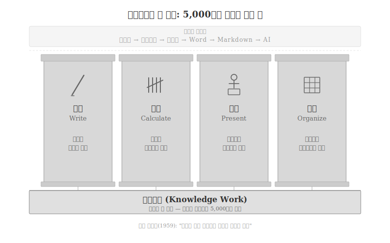
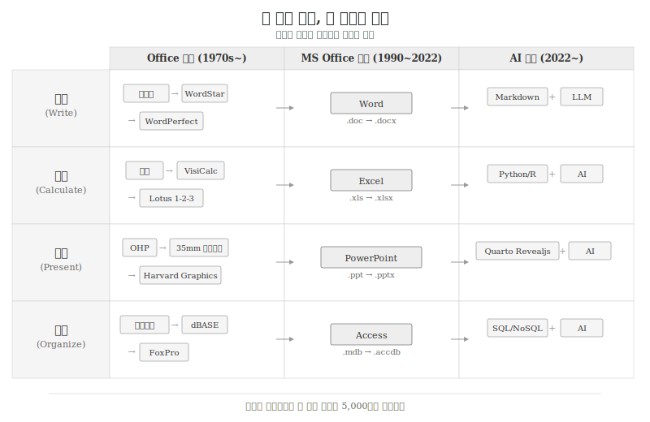
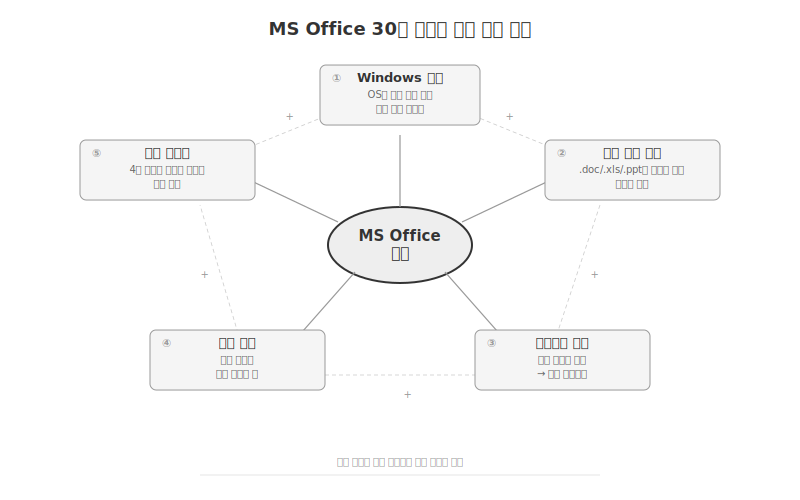

---
execute:
  eval: false
---

# Office 이전의 세계 {#sec-office}

\index{지식노동} \index{Knowledge Work} \index{피터 드러커}
\index{Microsoft Office}

## 지식노동이란 무엇인가 {#sec-knowledge-work}

1959년 피터 드러커(Peter Drucker)는 **지식노동
(Knowledge Work)**이라는 개념을 처음 제시���다.
육체가 아닌 **지식으로 가치를 만드는 노동**—분석하고,
판단하고, 소통하고, 기록하는 행위를 뜻한다.
농부가 밭을 갈고 공장 노동자가 부품을 조립하는 것이
육체노동이라면, 연구자가 논문을 쓰고 회계사가 재무제표를
분석하고 관리자가 보고서를 발표하는 것이 지식노동이다.

드러커의 통찰은 단순했다. 20세기 후반 경제의 중심이
**물건 만들기**에서 **���식 만들기**로 이동하고 있으며,
지식노동자의 생산성이 곧 조직과 국가의 경쟁력이 된다는
것이었다. 그리고 그 생산성은 **도구**에 의해 결정된다.

지식노동을 분해하면, 도구가 아무리 바뀌어도 사라지지
않는 **네 가지 기본 ���위**가 드러난다.

{#fig-knowledge-work}

**작성(Write)**은 생각을 기호로 변환하는 행위다.
수메르 서기관이 점토판에 쐐기문자를 새긴 것(기원전
3500년)부터 개발자가 Markdown으로 기술 문서를 작성하는
것까지, 5,500년간 본질은 동일하다.

**계산(Calculate)**은 수량을 처리하고 분석하는 행위다.
주판을 튕기는 것, 장부에 복식부기를 기입하는 것, Excel에
수식을 입력하는 것, Python으로 데이터를 분석하는 것—모두
"숫��를 다루는" 같은 행위다.

**발표(Present)**는 청중에게 전달하고 설득하는 행위다.
아고라에서 연설하는 것, 칠판에 수식을 쓰는 것, OHP로
투명 필름을 비추는 것, PowerPoint 슬라이드를 넘기는
것은 형태만 다를 뿐 목적이 같다.

**정리(Organize)**는 데이터를 구조화하고 검색 가능���게
만드는 행위다. 도서관의 카드 목록, 롤로덱스의 고객 카드,
dBASE의 레코드, SQL의 테이블은 모두 "찾을 수 있게
정리하는" 같은 문제를 푼다.

| 기본 행위 | 본질 | 고대 도구 | 현대 도구 |
|-----------|------|-----------|-----------|
| 작성(Write) | 생각을 기호로 변환 | 점토판, 파피루스 | Word, Markdown |
| 계산(Calculate) | 수량을 처리·분석 | 주판, 장부 | Excel, Python |
| 발표(Present) | 청중에게 전달·설득 | 연설, 칠판 | PowerPoint, Revealjs |
| 정리(Organize) | 데이터를 구조화·검색 | 색인 카드, 서류함 | Access, SQL |

: 지식노동의 네 가지 기본 행위 — 도구는 변해도 행위는 불변 {#tbl-office-four}

이 네 가지가 **불변**이라는 인식이 중요하다.
Microsoft Office는 이 네 가지를 Word, Excel, PowerPoint,
Access로 매핑하여 30년을 지배했다. 그러나 Office는
하늘에서 뚝 떨어진 것이 아니다. 이전에도 각 행위에 대응하는
도구가 있었고, AI 시대에도 같은 네 가지를 새로운 방식으로
풀고 있다.

{#fig-office-four-problems}

## Office 이전: 각 문제의 해법 {#sec-office-before}

### 작성: 타자기에서 워드프로세서로

\index{타자기} \index{WordStar} \index{WordPerfect}
\index{WYSIWYG}

1868년 크리스토퍼 숄스(Christopher Sholes)가 발명한
타자기는 150년 넘게 "작성" 문제의 표준 도구였다.
1961년 IBM Selectric은 교체 가능한 골프공 형태의
타자구(typeball)로 글꼴 변경을 가능하게 했다.

1970년대 후반, 마이크로컴퓨터의 등장과 함께
전자 워드프로세서가 탄생했다.

- **Electric Pencil**(1976): 최초의 마이크로컴퓨터용
  워드프로세서. Michael Shrayer가 MITS Altair용으로 개발.
- **WordStar**(1978): CP/M 운영체제의 킬러 앱.
  Ctrl 키 조합의 편집 명령이 특징이었다.
  아서 C. 클라크, 조지 R.R. 마틴 등 유명 작가가 사용.
- **WordPerfect**(1979): DOS 시대의 지배자.
  "Reveal Codes" 기능으로 서식 코드를 직접 볼 수 있었다.
  법률, 정부 문서 분야에서 1990년대까지 표준이었다.

1981년 제록스 스타(Xerox Star)가 WYSIWYG(What You See Is
What You Get) 개념을 상용화하고, 1984년 애플 매킨토시가
이를 대중화했다. "보이는 대로 인쇄된다"는 직관은
비전문가도 문서를 작성할 수 있게 했지만,
**구조와 표현의 혼합**이라는 근본 한계를 남겼다.

한국에서는 1989년 서울대 이찬진 교수 연구실에서 탄생한
**한/글(HWP)**이 독자적 경로를 걸었다.
한글 조합형/완성형 입력을 지원한 최초의 본격적
한글 워드프로세서로, 정부 표준으로 채택되어 소프트웨어
주권을 지켰다. 그러나 `.hwp` 포맷 종속, 단일 출력 형식,
AI 접근 불가라는 한계가 누적되었다.

### 계산: 장부에서 스프레드시트로

\index{VisiCalc} \index{Lotus 1-2-3} \index{스프레드시트}

수천 년간 "계산" 문제의 도구는 **장부(ledger)**였다.
복식부기(1494년 루카 파치올리)는 장부의 구조를 혁신했지만,
모든 계산은 사람의 손과 머리에 의존했다.

1979년, 댄 브리클린(Dan Bricklin)과 밥 프랭크스턴(Bob
Frankston)이 Apple II용 **VisiCalc**을 출시했다.
하버드 비즈니스 스쿨 학생이었던 브리클린은 교수가 칠판의
표를 수정할 때마다 전체를 다시 계산하는 모습을 보고
"자동 재계산 표"라는 아이디어를 떠올렸다.

VisiCalc은 Apple II의 **킬러 앱**이 되었다.
개인용 컴퓨터를 "장난감"에서 "비즈니스 도구"로 격상시킨
결정적 소프트웨어였다. 사업가들이 VisiCalc을 사용하기
위해 Apple II를 구매했다.

- **VisiCalc**(1979): Apple II. 최초의 스프레드시트.
  "What-if 분석"을 대중화.
- **Lotus 1-2-3**(1983): IBM PC의 킬러 앱.
  VisiCalc을 대체하며 IBM PC를 비즈니스 표준으로 확립.
  스프레드시트 + 차트 + 데이터베이스 기능 통합.
- **Multiplan**(1982): Microsoft의 첫 스프레드시트.
  Lotus에 밀려 실패했지만, Excel의 전신이 되었다.

### 발표: OHP에서 프레젠테이션 소프트웨어로

\index{OHP} \index{35mm 슬라이드} \index{Harvard Graphics}

"발표" 문제의 가장 오래된 해법은 **칠판**이다.
19세기 초 도입된 칠판은 200년이 지난 지금도 대학 강의실에
남아 있다.

20세기에 두 가지 기술이 발표를 변혁했다.

**OHP(Overhead Projector)**는 투명 필름(transparency)에
글과 그림을 그려 벽면에 투사하는 장치다. 1960~90년대
기업 발표의 표준이었다. 발표자가 필름 위에 직접 글을
쓰거나, 복사기로 인쇄한 자료를 사용했다.

**35mm 슬라이드 프로젝터**는 고급 발표에 사용되었다.
1961년 코닥 카루셀(Kodak Carousel)은 최대 80장의
슬라이드를 자동 전환하는 혁신적 장치였다. 전문 디자이너가
슬라이드를 제작하고, 사진 현상소에서 인화해야 했다.

1986년 등장한 **Harvard Graphics**는 최초의 본격적
프레젠테이션 소프트웨어였다. 차트, 그래프, 텍스트 슬라이드를
컴퓨터에서 직접 제작할 수 있었다. 1987년 포레씽커
(Forethought)가 개발한 **Presenter**(이후 PowerPoint로
개명)를 Microsoft가 1,400만 달러에 인수하면서 발표
도구의 역사가 바뀌었다.

### 정리: 색인 카드에서 데이터베이스로

\index{색인 카드} \index{dBASE} \index{FoxPro}

"정리" 문제의 전통적 도구는 **색인 카드(index card)**와
**롤로덱스(Rolodex)**였다. 도서관의 카드 목록, 의사의
환자 기록, 영업사원의 고객 카드—모두 종이 카드를
알파벳순으로 정리하는 방식이었다.

1979년 애슈턴-테이트(Ashton-Tate)의 **dBASE**는
마이크로컴퓨터용 관계형 데이터베이스의 시작이었다.
명령줄 인터페이스로 데이터를 입력, 조회, 정렬할 수
있었다. 이후 dBASE III(1984), dBASE IV(1988)로 발전하며
비즈니스 데이터 관리의 표준이 되었다.

- **dBASE**(1979): 최초의 PC용 DBMS. `.dbf` 포맷은
  사실상 표준이 되어 다른 소프트웨어에서도 지원.
- **Paradox**(1985, Borland): GUI 기반 쿼리.
  dBASE보다 직관적인 인터페이스.
- **FoxPro**(1989): dBASE 호환이면서 더 빠른 성능.
  Microsoft가 1992년 인수하여 Visual FoxPro로 발전.

## MS Office: 30년 독점의 구조 {#sec-office-dominance}

\index{번들링} \index{네트워크 효과} \index{파일 포맷 종속}

1990년 Microsoft Office 1.0이 출시되었다.
Word, Excel, PowerPoint를 하나의 패키지로 묶은 것이
핵심 전략이었다. Access는 1992년 Office Professional에
포함되었다.

{#fig-office-dominance}

### 다섯 가지 독점 요인

**1. Windows 번들링**: Windows 운영체제에 Office가 사전
설치되거나 할인 번들로 제공되었다. 별도 구매 없이 컴퓨터를
켜면 바로 사용할 수 있었다. 1995년 Windows 95와 함께
Office 95가 출시되면서 PC = Windows = Office 등식이
확립되었다.

**2. 파일 포맷 종속**: `.doc`, `.xls`, `.ppt`가 사실상의
산업 표준이 되었다. 다른 소프트웨어가 이 포맷을 완벽히
지원하지 못하면 "깨짐" 현상이 발생했고, 이는 대안 선택을
억제했다. 2007년 OOXML(`.docx`, `.xlsx`, `.pptx`) 도입 후에도
상황은 근본적으로 변하지 않았다.

**3. 네트워크 효과**: "모든 동료가 Word를 사용하므로 나도
Word를 써야 한다." 파일 호환성이 도구 선택을 결정하는
구조에서 사용자가 늘수록 전환 비용이 높아지는 양의 피드백
루프가 작동했다.

**4. 학습 비용(전환 비용)**: WordPerfect의 Reveal Codes,
Lotus의 슬래시 명령 체계를 익힌 사용자가 Word의 리본
인터페이스로 전환하는 데는 수주일의 재학습이 필요했다.
한번 전환한 사용자는 다시 돌아가지 않았다.

**5. 통합 제품군**: Word에서 Excel 차트를 삽입하고,
PowerPoint에서 Word 표를 가져오고, Access 데이터를 Excel로
내보내는 상호 연동이 매끄러웠다. 네 가지 문제를 하나의
생태계 안에서 해결할 수 있다는 점이 개별 최적 도구의
합보다 강력했다.

다섯 요인은 상호 강화하는 양의 피드백 고리를 형성했다.
번들링 → 사용자 증가 → 네트워크 효과 → 포맷 표준화 →
전환 비용 증가 → 더 많은 사용자. 이 구조가 30년간
대안의 성장을 억제했다.

### 한국의 예외: HWP

\index{한/글} \index{HWP}

한국은 MS Office 독점의 유일한 예외 지역이었다.
1989년 탄생한 **한/글(HWP)**은 조합형 한글 입력을 지원한
최초의 본격 한글 워드프로세서로, 정부 표준으로 채택되어
공공 부문에서 Word를 대체했다.

HWP가 생존한 요인은 Office 독점 요인의 한국판이었다—
정부 의무 사용(번들링), `.hwp` 포맷 표준(종속),
공무원 전원 사용(네트워크 효과). 그러나 2021년 HWPX(개방형
포맷) 전환이 시작되면서, `.hwp` 종속에서 벗어나는 과정이
진행 중이다.

## Office 이후: AI 시대의 해법 {#sec-office-after}

\index{Quarto} \index{Markdown} \index{AI 코드 생성}

2022년 이후, 네 가지 문제의 해법이 다시 전환되고 있다.

| 문제 | Office 해법 | AI 시대 해법 | 핵심 전환 |
|------|-------------|-------------|-----------|
| 작성 | Word | Markdown + LLM | WYSIWYG → 구조+AI |
| 계산 | Excel | Python/R + AI | 셀 수식 → 코드+AI |
| 발표 | PowerPoint | Quarto Revealjs | 슬라이드 편집 → 코드→슬라이드 |
| 정리 | Access | SQL/DataFrame + AI | GUI 쿼리 → 코드+AI |

: Office에서 AI 시대로의 전환 {#tbl-office-to-ai}

공통 패턴은 **"GUI 조작에서 코드+AI로"**다.
Word에서 글꼴을 마우스로 바꾸는 대신 Markdown으로 구조를
선언하고 AI가 초안을 생성한다. Excel에서 셀 수식을
입력하는 대신 Python 코드로 분석하고 AI가 시각화를
제안한다.

Quarto는 이 전환의 수렴점이다.
`.qmd` 파일 하나에서 보고서(Word 대체), 대시보드(Excel
대체), 슬라이드(PowerPoint 대체)를 동시에 생성한다.
데이터 분석 코드가 문서 안에 포함되므로 Access의
역할까지 흡수한다.

Office의 독점 구조가 해체되는 이유도 명확하다.

- **번들링 해체**: 웹 브라우저가 플랫폼이 되면서 OS 종속이
  약화. Google Docs, Notion이 브라우저에서 동작.
- **포맷 해방**: Markdown은 플레인 텍스트. 특정 소프트웨어에
  종속되지 않는다. Git으로 버전 관리가 가능하다.
- **AI가 변환기**: LLM이 Markdown ↔ Word ↔ HTML ↔ PDF를
  자유롭게 변환하면서 포맷 종속의 의미가 퇴색.
- **코드가 통합**: Python/R 코드 하나가 분석, 시각화, 문서화를
  동시에 수행하면서 4개 도구의 경계가 사라진다.

::: {.content-visible when-format="pdf"}
\faLightbulb\ 생각해볼 점
:::

::: {.content-visible when-format="html"}
## 생각해볼 점 {.unnumbered}
:::

지식 노동의 네 가지 문제—작성, 계산, 발표, 정리—는
도구가 아무리 바뀌어도 사라지지 않는다. 점토판, 타자기,
워드프로세서, MS Office, AI 에이전트는 모두 같은 문제에
대한 각 시대의 해법이다.

MS Office가 30년간 독점한 것은 네 가지 문제를 하나의
패키지로 통합하고, Windows 번들링, 파일 포맷 종속, 네트워크
효과, 학습 비용, 제품군 통합이라는 다섯 가지 요인이 상호
강화하는 구조를 만들었기 때문이다.

AI 시대에 이 구조가 해체되고 있다. Markdown + 코드 + AI라는
새로운 조합이 네 가지 문제를 다시 풀기 시작했고,
Quarto는 이 수렴의 현재 시점이다.

그러나 역사가 보여주듯, 기술 전환은 "더 나은 도구"만으로
일어나지 않는다. VisiCalc이 Apple II를 팔았고, Lotus가 IBM PC를
팔았듯, 킬러 앱이 플랫폼을 견인한다. AI 시대의 킬러 앱이
무엇이 될지—그것이 현재 진행 중인 질문이다.

\index{킬러 앱}
\index{문서 도구 진화}

## 프로젝트 {.unnumbered}

\index{프로젝트}

1. 자신의 업무에서 사용하는 문서 도구를 네 가지 문제(작성,
계산, 발표, 정리)로 분류해보라. 각 문제에 몇 개의 도구를
사용하고 있는가?

2. Word로 작성한 보고서를 Markdown + Quarto로 재작성해보라.
어떤 과정이 더 쉬웠고, 어떤 과정이 더 어려웠는가?

3. VisiCalc(1979)과 ChatGPT(2022)를 "킬러 앱" 관점에서
비교하라. 각각 어떤 플랫폼의 가치를 높였으며, 어떤 사용자
행동을 변화시켰는가?

4. 한/글(HWP)이 한국에서 생존한 요인을 MS Office의 다섯 가지
독점 요인과 대조하여 분석하라. 어떤 요인이 유사하고
어떤 요인이 다른가?
