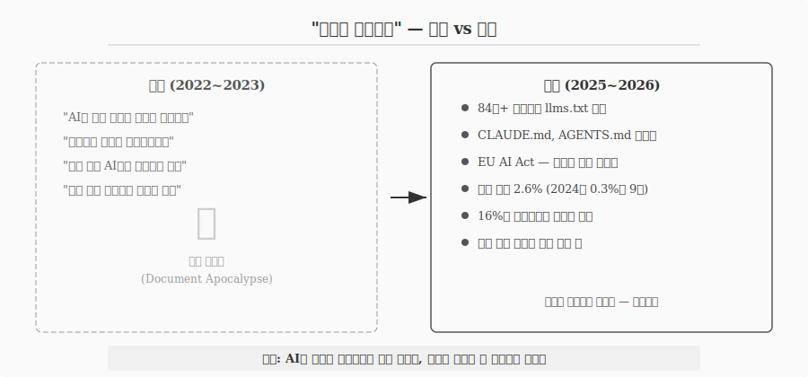
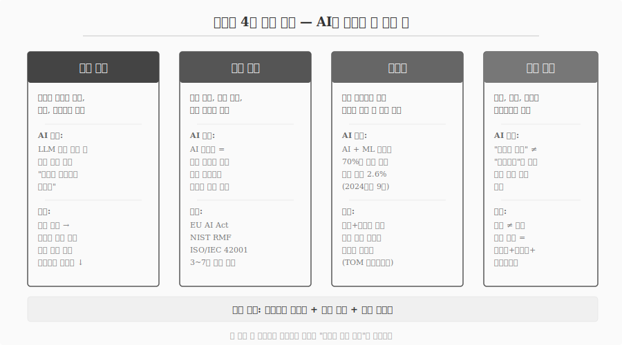
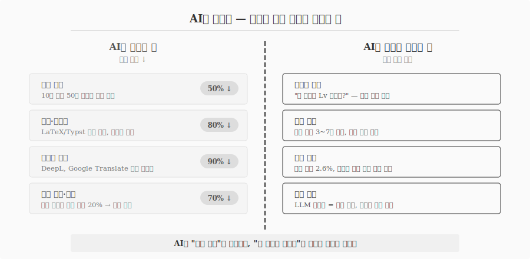
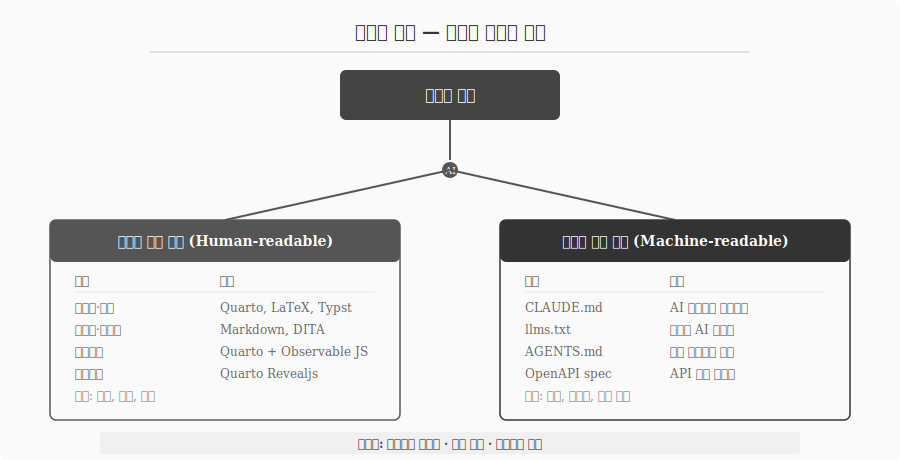
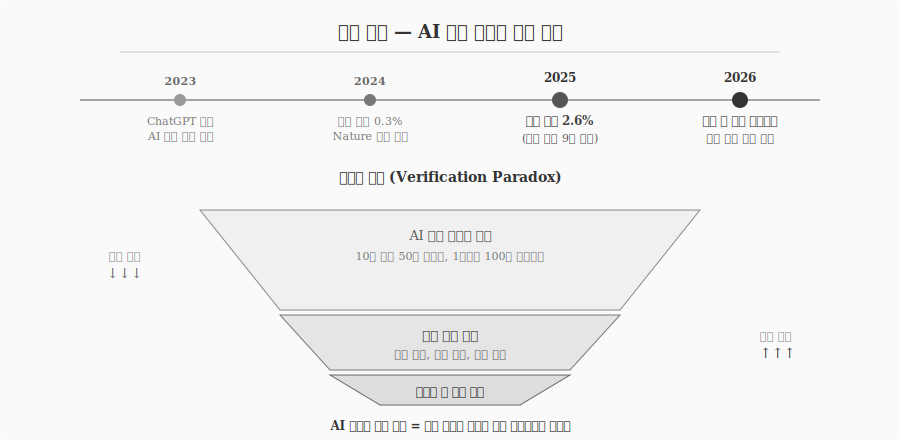

# AI 시대, 문서는 여전히 필요한가 {#sec-why-document}

\index{문서 필요성} \index{문서 종말론} \index{검증 위기} \index{조직 기억}

2022년 11월 ChatGPT가 등장한 이후, "문서가 사라진다"는 예언이 확산되었다.
AI가 모든 정보를 실시간으로 생성하므로 구조화된 문서는 불필요해진다는 주장이다.
검색 대신 AI에게 물어보면 되고, 기술 문서 작성자는 사라질 직업이라는 전망도 나왔다.

3년이 지난 2026년, 현실은 정반대로 전개되었다.
84만 개 이상의 웹사이트가 AI가 읽을 수 있는 문서 표준(llms.txt)을 도입했고, CLAUDE.md와 AGENTS.md라는 새로운 문서 유형이 표준화되었으며, EU AI Act는 AI 시스템의 문서화를 법적 의무로 규정했다.
문서는 사라지지 않았다 — AI가 문서를 더 필요로 하게 만들었다.

{#fig-prophecy}

## 문서의 4대 본질 기능 {#sec-why-four-pillars}

\index{지식 보존} \index{법적 증빙} \index{재현성} \index{책임 소재}

문서가 왜 존재하는지를 이해하려면 본질 기능을 분리해야 한다.
문서에는 네 가지 기능이 있으며, 어느 것도 AI로 대체할 수 없다.

### 지식 보존 — 조직의 기억은 문서에 산다 {#sec-why-knowledge}

\index{기업 기억 상실}

조직 기억(institutional memory)은 집합적 사실, 개념, 경험, 지식의 총체다.
도구와 기법의 적응, 문제 해결 경험, 의사결정의 맥락이 모두 여기에 포함된다.
새로운 구성원에게 이 기억을 전달하지 못하면, 조직은 이미 해결한 문제를 다시 풀게 된다.

기업 기억 상실(corporate amnesia)은 조직이 시간이 지나면서 가치 있는 지식, 경험, 통찰을 잃어버리는 현상이다.
직원 이직, 부실한 문서화, 단절된 시스템이 원인이며, 결과는 치명적이다 — 생산성 저하, 일관성 없는 의사결정, 온보딩 비용 증가, 혁신 역량 저하.

LLM은 이 문제를 해결하지 못한다.
세션이 종료되면 모든 맥락이 소실된다.
"채팅 창을 닫는 순간, AI 입장에서 당신은 존재한 적이 없다."
RAG(Retrieval-Augmented Generation)는 문서 단편을 검색할 수 있지만, 단편 사이의 관계를 이해하지 못한다.
구조화된 인덱스와 명시적 범주, 백링크, 요약이 있는 **컴파일된 지식**만이 조직 기억으로 기능한다.

### 법적 증빙 — "정책이 있다"는 증거가 아니다 {#sec-why-legal}

\index{감사 추적} \index{EU AI Act} \index{NIST RMF}

감사 추적(audit trail)은 문서, 시스템, 워크플로우에서 무엇이 일어났는지를 시간순으로 기록한 것이다.
누가 열람했는지, 누가 편집했는지, 누가 승인했는지, 언제 서명했는지 — 거버넌스, 규제 준수, 책임 소재, 분쟁 해결의 핵심 통제 수단이다.

감사 추적은 시스템이 자동으로 생성해야 하며, 사용자가 편집하거나 삭제할 수 없어야 한다.
AI가 생성한 텍스트는 이 요건을 충족하지 못한다 — AI 생성물은 법적 증거력이 없다.

EU AI Act, NIST RMF, ISO/IEC 42001은 모두 AI 시스템의 설계, 테스트, 성능 모니터링에 대한 **문서화된 증거**를 요구한다.
미국 주법 대부분은 AI 규제 준수 문서를 3~7년간 보존하도록 규정한다.
주 검찰총장이 정기 기업 조사 시 AI 규제 준수 문서를 요청하는 사례가 증가하고 있으며, 체계적인 기록은 선의의 준수 노력을 입증하고 처벌 노출을 줄인다.

거버넌스 감사에서 핵심 원칙은 "**증거는 주장이 아니다**"이다.
"접근이 통제되고 있다"는 정책 문서는 증거가 아니다.
어떤 사용자가, 어떤 데이터 자산에, 어떤 권한으로, 어떤 시점에 접근했는지를 기록한 감사 로그만이 증거다.

### 재현성 — 과학의 기반은 검증 가능한 문서다 {#sec-why-reproducibility}

\index{재현성 위기} \index{환각 인용}

AI가 연구 현장에 도입되면서 재현 불가능한 연구의 비율이 70%까지 증가했다.
AI와 ML 분야에서 재현성 위기는 과학적 무결성을 유지하기 위한 명확한 검증 방법론의 시급한 필요성을 부각시킨다.

환각 인용(hallucinated citation)은 더 직접적인 위협이다.
2025년 학술 논문의 2.6%가 최소 하나의 환각 인용을 포함했으며, 이는 2024년 0.3%의 9배에 달한다.
저널 논문, 서적, 학회 발표를 포함하여 수만 건의 2025년 출판물에 AI가 생성한 허위 참고문헌이 포함된 것으로 추정된다.

전문가들은 불투명한 탐지 시스템보다 **재현 가능한 출처 추적(reproducible provenance)** — 정보 출처를 검증하기 위한 투명하고 표준화된 인프라 — 을 선호한다.
투명성 방법론(Transparency of Methods, TOM) 프레임워크가 이 방향의 대표적 접근법이다.

### 책임 소재 — 누가 결정했는가를 기록하는 유일한 방법 {#sec-why-accountability}

고위험 의사결정 — 금전, 의료 데이터, 프로덕션 코드에 영향을 미치는 결정 — 에는 인간의 이중 승인(dual approval)이 필수다.
AI 에이전트가 자율적으로 행동하는 시대에, 어떤 에이전트가 어떤 결정을 내렸고 어떤 인간이 승인했는지를 기록하는 것은 문서만이 수행할 수 있는 기능이다.

AI 거버넌스 감사 문서화는 기술적 출처 추적(provenance)과 거버넌스 기록(승인, 면제, 인증)을 연결하는 시간순, 변조 불가능, 맥락이 풍부한 원장(ledger)이다.
조직은 무엇이 변경되었는지, 언제 변경되었는지, 누가 승인했는지를 사후에 재구성할 수 있어야 한다.

{#fig-four-pillars}

## AI가 바꾸는 것과 바꾸지 못하는 것 {#sec-why-ai-boundary}

\index{도구 장벽} \index{지배 차원}

AI가 문서 작성에 미치는 영향을 정확하게 이해하려면 "바꾸는 것"과 "바꾸지 못하는 것"을 분리해야 한다.

AI가 낮추는 것은 **도구 장벽**이다.

| 영역 | 변화 | 효과 |
|------|------|------|
| 초안 생성 | 10분 만에 50쪽 보고서 | 생성 비용 50% ↓ |
| 서식·포맷팅 | LaTeX/Typst 자동 생성 | 서식 비용 80% ↓ |
| 다국어 번역 | DeepL 수준 급상승 | 번역 비용 90% ↓ |
| 정보 검색 | 지식 노동자 탐색 시간 대폭 단축 | 탐색 비용 70% ↓ |

: AI가 낮추는 도구 장벽 {#tbl-ai-reduces .striped}

AI가 건드리지 못하는 것은 **지배 차원**이다.
복잡도 판단("이 문서가 필요한가?"), 법적 책임(3~7년 보존 의무, 인간 승인), 사실 검증(환각 탐지), 조직 기억(영속적 저장)은 AI의 경계 밖에 있다.

{#fig-ai-boundary}

조직의 16%만이 워크플로우를 충분히 문서화했다는 조사 결과는 역설적이다.
AI 도입의 최대 장벽이 "AI가 읽을 문서가 없다"는 것이다.
AI의 가치는 정보 품질이 허용하는 만큼만 확장된다(AI value scales only as far as information quality allows).
문서가 불명확하면 AI 출력도 부정확하다.

## 문서의 분화 — 사람용과 기계용 {#sec-why-bifurcation}

\index{llms.txt} \index{CLAUDE.md} \index{AGENTS.md}

문서는 사라지는 것이 아니라 두 갈래로 분화하고 있다.

**사람이 읽는 문서**(Human-readable)는 보고서, 논문, 매뉴얼, 대시보드, 발표자료다.
목적은 설득, 전달, 기록이며, Quarto, LaTeX, Typst가 도구다.

**기계가 읽는 문서**(Machine-readable)는 2024년 이후 폭발적으로 성장한 새로운 문서 유형이다.

- **llms.txt**: Jeremy Howard(FastAI)가 2024년 9월 제안한 표준. 도메인 루트에 위치하며 AI 크롤러에게 사이트의 어떤 부분이 LLM 수집용인지 알려준다. robots.txt의 AI 버전. 2025년 말 기준 84만+ 사이트 도입.
- **CLAUDE.md**: 프로젝트 루트에 위치하며 Claude Code가 매 세션 시작 시 읽는 파일. 코딩 표준, 아키텍처 결정, 리뷰 체크리스트를 설정한다.
- **AGENTS.md**: 2025년 중반 Sourcegraph, OpenAI, Google, Cursor 등이 공동 제안하고 Linux Foundation 산하 Agentic AI Foundation이 관리. "하나의 파일, 모든 에이전트"가 원칙이며, Claude Code, Cursor, GitHub Copilot, Gemini CLI, Windsurf 등이 지원한다.

두 갈래의 공통점은 세 가지다 — 둘 다 **구조화된 텍스트**이고, 둘 다 **버전 관리**가 필요하며, 둘 다 **정확성**이 생명이다.

{#fig-bifurcation}

## 검증 위기 — AI 시대 문서의 새로운 역할 {#sec-why-verification}

\index{검증 위기} \index{인식론적 단절} \index{재현 가능한 출처 추적}

AI 생성 콘텐츠의 폭증은 "정보 출처를 어떻게 검증하는가"라는 근본적 질문을 제기한다.

"허구적 정보의 산업화(disinformation as an industry)"가 진행되면서, 자동화되고 개인화된 합성 콘텐츠가 대규모로 생산되고 있다.
이는 민주적 숙의, 과학적 담론, 사회적 결속의 기반인 공유된 사실적 토대를 잠식하는 현상 — **인식론적 단절(epistemic fragmentation)** — 을 초래한다.

10분 만에 50쪽 보고서를 생성할 수 있지만, 그 보고서의 사실관계를 검증하는 데는 기존보다 더 많은 시간이 소요된다.
생성 비용은 급락하고 검증 비용은 급등하는 **검증의 역설(verification paradox)**이다.

{#fig-verification}

학술 출판 시스템의 근본적 문제 — 속도, 비용, 재현성 — 에 대해 파편화된 AI 도구들이 증상만 완화할 뿐 핵심 문제를 해결하지 못하고 있다는 비판도 제기된다.
해법은 AI 생성물을 무조건 배제하는 것이 아니라, 검증 가능한 문서 체계를 구축하는 것이다.

## 문서는 왜 살아남는가 {#sec-why-conclusion}

세 문장으로 요약할 수 있다.

**AI는 문서를 죽이는 것이 아니라 문서에 더 의존하게 만든다.**
AI 시스템의 출력 품질은 입력 문서의 품질에 정비례한다.
llms.txt, CLAUDE.md, AGENTS.md의 폭발적 성장이 이를 증명한다.

**문서의 4대 기능(지식 보존, 법적 증빙, 재현성, 책임 소재)은 AI의 경계 밖에 있다.**
LLM의 세션 한정 메모리, AI 생성물의 법적 증거력 부재, 환각 인용의 급증, 자율 에이전트의 책임 추적 필요성은 구조화된 문서를 더 긴급하게 요구한다.

**문서는 소멸하는 것이 아니라 분화한다.**
사람이 읽는 문서와 기계가 읽는 문서, 두 갈래 모두 구조화된 텍스트이며, 버전 관리와 정확성이 생명이다.
AI 시대의 문서 역량은 "얼마나 빨리 쓰는가"가 아니라 "얼마나 검증 가능한가"에서 결정된다.
