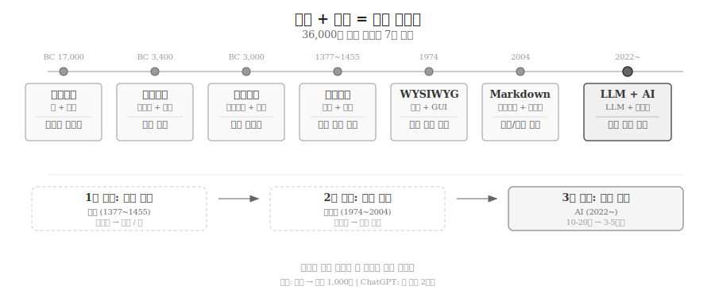
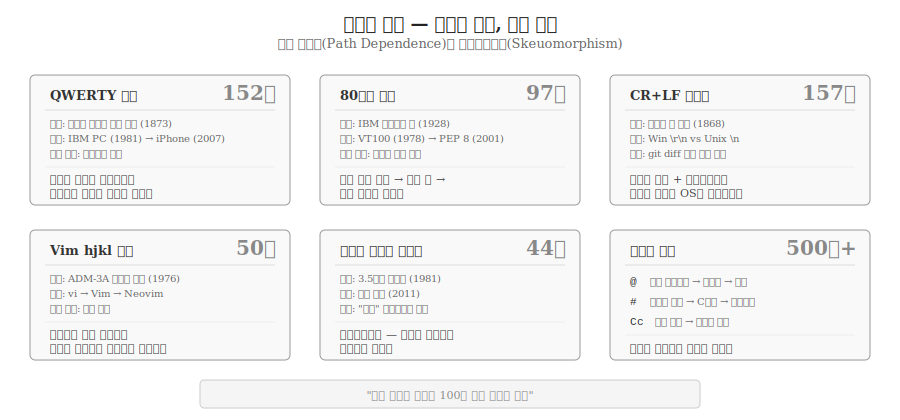
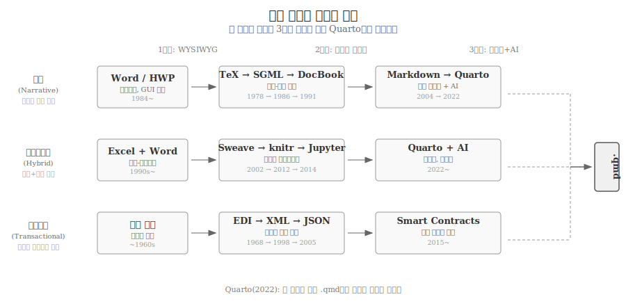
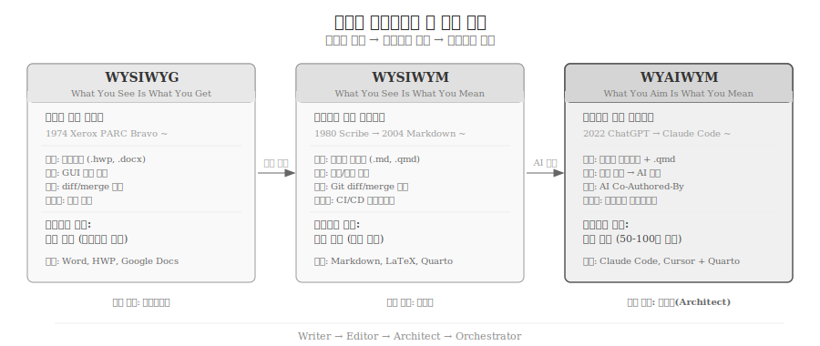
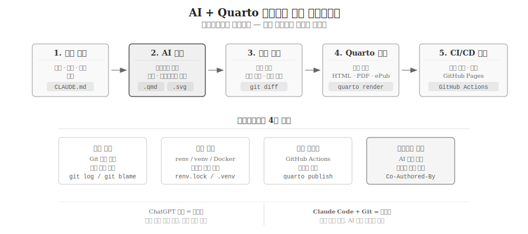

# 도구가 사고를 바꾸는 글쓰기 {#sec-writing}

\index{글쓰기} \index{문서 엔지니어링} \index{경로 의존성} \index{WYSIWYG} \index{WYAIWYM}

인류 문명의 역사는 기록 도구의 역사다.
점토판에 쐐기문자를 새기던 수메르인, 파피루스에 상형문자를 그리던 이집트인, 금속활자로 지식을 복제하던 고려인은 모두 동일한 목표를 추구했다 — 기억을 외부화하고, 지식을 축적하며, 시공간을 초월하여 소통하는 것이다.
도구가 바뀔 때마다 사고의 방식도 함께 바뀌었다.
구술 문화에서 문자 문화로의 전환은 추상적 사고를 가능하게 했고[@Ong1982], 인쇄 혁명은 지식의 민주화를 이끌었으며[@Eisenstein1979], 디지털 전환은 기록의 속도와 규모를 근본적으로 변화시켰다.
2022년 ChatGPT의 등장으로 시작된 AI 글쓰기 시대는 기록 역사의 다섯 번째 대전환이다.

## 기록은 왜 시작되었는가 {#sec-writing-why}

\index{동굴벽화} \index{설형문자} \index{상형문자}

기록의 가장 원초적인 동기는 **기억의 외부화**다.
인간의 작업 기억(working memory)은 7±2개 항목을 동시에 처리하는 데 한계가 있다.
기록은 이 한계를 돌파하는 첫 번째 인지 도구였다.

라스코 동굴벽화(기원전 17,000년경)와 알타미라 동굴벽화(기원전 15,000년경)는 현존하는 가장 오래된 시각적 기록이다.
사냥 장면과 동물 형상을 벽에 남긴 행위는 단순한 장식이 아니라, 추상적 사고와 상징적 소통 능력을 보여주는 증거다.
전두엽 피질의 확장과 밀접하게 연결된 표상적 이미지 제작 능력은 인간 고유의 인지적 도약을 의미한다.

수메르 설형문자(기원전 3,400년경)는 그림에서 기호로의 전환점이다.
초기에는 곡물 수량과 가축 수를 기록하는 실용적 목적에서 출발했으나, 점차 추상적 개념까지 표현하는 완전한 문자 체계로 발전했다.
이집트 상형문자는 파피루스라는 새로운 매체와 결합하여 행정 문서 시스템의 원형을 만들었다.
페니키아 알파벳(기원전 1,050년경)은 자음만으로 구성된 22개 글자로 문자의 진입 장벽을 극적으로 낮추었고, 그리스인이 모음을 추가하면서 완전한 알파벳 체계가 완성되었다.

매체와 문자의 결합은 곧 문서 시스템을 정의한다.
점토판+설형문자, 파피루스+상형문자, 양피지+알파벳, 종이+금속활자, 화면+WYSIWYG, 브라우저+마크다운, LLM+자연어 — 각 조합은 기록의 속도, 비용, 접근성을 근본적으로 바꾸었다.

{#fig-medium-evolution}

## 종이와 인쇄 혁명 {#sec-writing-print}

\index{금속활자} \index{구텐베르크} \index{직지심체요절}

채륜(蔡倫)이 서기 105년 개량한 종이 제조법은 점토판과 파피루스의 무게·비용 한계를 극복했다.
종이는 중국(105)에서 사마르칸트(751), 바그다드, 이집트를 거쳐 유럽(12세기)에 도달하기까지 1,000년이 걸렸다.
매체의 전파 속도가 곧 문명의 전파 속도였다.

인쇄 혁명은 **복제 비용**을 붕괴시켰다.
고려의 직지심체요절(1377)은 구텐베르크(1455)보다 78년 앞선 세계 최초의 금속활자 인쇄물이다.
구텐베르크의 42행 성경은 1부당 제작 시간을 수개월에서 수일로 단축했고, 이후 50년 만에 유럽의 인쇄물 수가 800만 권을 넘었다.
에이젠슈타인(Eisenstein)이 지적했듯, 인쇄 기술은 단순히 복사 속도를 높인 것이 아니라 지식의 표준화, 누적적 발전, 비판적 검토를 가능하게 한 "변화의 에이전트"였다[@Eisenstein1979].

산업화 시대에는 증기 인쇄기(1811), 석판 인쇄(1837), 라이노타이프(1886), 옵셋 인쇄(1904)로 이어지는 기계화가 진행되었다.
1970년대 전자 식자(phototypesetting)의 등장은 활자라는 물리적 매체를 빛으로 대체했다.

## 타자기에서 디지털 텍스트로 {#sec-writing-digital}

\index{타자기} \index{천공카드} \index{ASCII} \index{유니코드}

1873년 숄스-글리든(Sholes & Glidden) 타자기는 손글씨를 기계적 타격으로 대체한 첫 상용 제품이다.
QWERTY 배열은 활자봉 충돌을 줄이기 위한 물리적 제약에서 탄생했으나, 152년이 지난 지금도 모든 키보드의 표준이다.

1928년 IBM이 80칼럼 천공카드를 표준화한 결정은 예상치 못한 파급력을 발휘했다.
미국 지폐 크기에 맞춘 카드 폭이 VT100 터미널(1978)의 80열 표준으로 이어지고, PEP 8(2001)의 코드 라인 길이 권장값으로 남아 있다.
97년간 지속된 이 규칙은 천공카드를 본 적 없는 개발자도 따르는 "디지털 화석"이다.

문자 인코딩의 진화는 디지털 텍스트의 보편성을 결정지었다.
ASCII(1963)는 128개 문자로 영어만 표현했고, 각 나라는 자국 문자를 위한 독자적 인코딩을 개발했다.
한글은 조합형과 완성형의 오랜 논쟁을 거쳤다.
유니코드(Unicode)가 전 세계 문자를 단일 체계로 통합했고, UTF-8이 웹의 사실상 표준이 되면서 다국어 디지털 텍스트가 비로소 가능해졌다.

## 디지털 화석 — 경로 의존성의 유산 {#sec-writing-fossils}

\index{경로 의존성} \index{QWERTY} \index{스큐어모피즘}

기술이 바뀌어도 이름과 습관은 남는다.
폴 데이비드(Paul David)가 QWERTY 배열을 통해 분석한 경로 의존성(path dependence)은[@David1985], 초기 조건의 우연한 선택이 자기 강화(self-reinforcing) 메커니즘을 통해 고착되는 현상을 설명한다.
W. 브라이언 아서(W. Brian Arthur)는 수확 체증(increasing returns)이 경로 의존을 유지하는 핵심 동력임을 이론적으로 정립했다[@Arthur1994].

디지털 세계에는 물리적 장치가 사라진 뒤에도 살아남은 유산이 가득하다.

- **QWERTY (1873~)**: 활자봉 충돌 방지라는 원래 목적은 사라졌으나, 네트워크 효과로 152년째 표준이다. Dvorak, Colemak 등 더 효율적인 대안이 존재하지만, "모두가 QWERTY를 배우니까 QWERTY가 표준이고, 표준이니까 모두가 배우는" 자기 강화 순환을 깨는 것은 사실상 불가능하다.
- **hjkl (1976~)**: ADM-3A 터미널에는 별도의 화살표 키가 없었고, h, j, k, l 키 위에 방향 화살표가 인쇄되어 있었다. Bill Joy가 이 터미널로 vi 편집기를 개발했고, 50년이 지난 지금 모든 컴퓨터에 방향키가 있는데도 Vim 사용자는 hjkl을 고수한다.
- **CR+LF (1868~)**: 타자기에서 줄을 바꾸려면 캐리지 복귀(Carriage Return)와 줄 넘김(Line Feed)이라는 두 가지 물리적 동작이 필요했다. 157년이 지난 지금, Windows는 `\r\n`, Unix는 `\n`을 사용하며 운영체제를 분열시킨다.
- **플로피 디스크 아이콘**: 최대 용량 1.44MB, 2011년 생산 중단. 물리적 플로피 디스크를 모르는 세대가 하루에 수십 번 "저장" 아이콘으로 누른다.
- **되감기(Rewind)**: 릴 테이프(1950년대)에서 VHS(1976)까지, 물리적으로 테이프를 감아야 했다. 스트리밍 시대에 감을 테이프는 없지만 ◀◀ 버튼과 "돌려봐"라는 표현은 건재하다.

스큐어모피즘(skeuomorphism)은 경로 의존성의 시각적 표현이다.
원래 사물의 형태를 디지털 인터페이스에 그대로 가져오는 설계 방식으로, 데스크톱 메타포(1973, Xerox PARC)의 파일·폴더·휴지통이 대표적이다.
Apple은 2013년 iOS 7에서 플랫 디자인으로 전환했으나, 2024년 Vision Pro에서 스큐어모피즘이 다시 부활했다.

기호도 화석이 된다.
**@** 기호는 1536년 이탈리아 상인의 가격 단위에서 출발해 1971년 이메일 주소, 2006년 소셜미디어 멘션으로 변신했다.
**#** 기호는 14세기 파운드 무게 단위에서 1972년 C언어 전처리기, 2007년 Twitter 해시태그로 진화했다.
**Cc/Bcc**는 1806년 먹지(Carbon Paper) 복사 관행이 디지털 이메일에 그대로 남은 사례다.

> "오늘 만드는 선택이 100년 뒤의 화석이 된다."

{#fig-digital-fossils}

## 문서 엔지니어링 {#sec-writing-doc-eng}

\index{문서 엔지니어링} \index{Component Model} \index{Assembly Model} \index{Context Model}

소프트웨어 엔지니어링(Software Engineering)이 소프트웨어를 체계적으로 분석·설계·구현하는 공학이듯, **문서 엔지니어링(Document Engineering)**은 문서를 동일한 엄밀함으로 다루는 공학이다[@Glushko2005].
글루시코와 맥그래스(Glushko & McGrath)는 문서가 조직 간 인터페이스 — API가 시스템 간 인터페이스인 것과 같은 역할 — 를 수행한다고 정의했다.

### 문서 유형 스펙트럼 {#sec-writing-spectrum}

\index{서사 문서} \index{트랜잭션 문서} \index{하이브리드 문서}

문서는 세 유형으로 분류된다.

- **서사(Narrative) 문서**: 소설, 논문, 매뉴얼처럼 사람이 읽고 해석하는 문서. 표현(presentation)의 비중이 높다.
- **트랜잭션(Transactional) 문서**: 주문서, 송장, EDI처럼 기계가 자동 처리하는 문서. 구조(structure)의 비중이 높다.
- **하이브리드(Hybrid) 문서**: 카탈로그, 보고서+데이터처럼 사람과 기계가 모두 처리하는 문서. 서사와 트랜잭션의 특성이 공존한다.

세 유형은 각각 독자적으로 진화해왔다.

**서사 문서**는 troff(1970년대) → TeX(1978) → SGML(1986) → HWP(1989) → Markdown(2004) → Quarto(2022)의 경로를 거쳤다.
커누스(Knuth)는 출판사의 식자 오류에 분노하여 TeX를 개발했고, 그루버(Gruber)는 HTML의 가독성 위기에 대응하여 Markdown을 만들었다.
모든 전환은 기존 도구의 한계가 축적되어 임계점을 넘을 때 발생했다.

**하이브리드 문서**는 Knuth의 문학적 프로그래밍(1984)[@knuth84] → Sweave(2002) → knitr(2012) → Jupyter(2014) → Quarto(2022)로 진화했다.
"프로그램은 인간을 위해 쓰여야 한다"는 커누스의 비전은 40년 뒤 Quarto에서 실현되었다.
Jupyter는 2014년 출시 후 2021년 GitHub에서 1,000만 노트북을 돌파했다.

**트랜잭션 문서**는 EDI(1968) → X12(1979) → XML(1998) → REST/JSON(2005) → 전자세금계산서(2011) → 스마트 계약(2015)으로 발전했다.
XML에서 JSON으로의 전환은 30~50% 경량화와 2~3배 빠른 파싱이라는 단순성의 승리였다.

세 유형은 동일한 3단계 경로를 따른다: **WYSIWYG → 도메인 마크업 → 텍스트+AI**.
Quarto(2022)는 세 유형이 단일 `.qmd` 파일에서 만나는 최초의 수렴점이다.

{#fig-doc-convergence}

### Component·Assembly·Context 모델 {#sec-writing-cac}

글루시코의 핵심 프레임워크는 세 모델로 구성된다.

**Component Model**은 문서를 구성하는 원자적(atomic) 단위와 집합적(aggregate) 단위를 정의한다.
이름, 날짜, 금액 같은 원자 컴포넌트와 주문항목, 배송정보 같은 집합 컴포넌트로 나뉜다.

**Assembly Model**은 컴포넌트를 계층적 문서로 조립하는 방식을 정의한다.
XML/JSON 트리 구조와 직접 대응하며, 단일 소스에서 다중 출력을 가능하게 한다.

**Context Model**은 동일한 컴포넌트가 다른 문서에서 다른 의미를 갖는 맥락을 정의한다.
"금액"이라는 컴포넌트는 주문서, 송장, 영수증에서 각각 다른 법적 효력을 갖는다.

글루시코가 2005년 XML로 구상한 세 모델은 Quarto에서 Markdown으로 구현된다.
Component는 Quarto의 shortcode(재사용 가능한 원자 콘텐츠), Assembly는 include(모듈 조립), Context는 params(매개변수 문서 생성)에 대응한다[@Glushko2005].
원칙은 20년이 지나도 유효하다 — 바뀐 것은 구현 기술(XML → Markdown)뿐이다.

### 8단계 모델링 방법론 {#sec-writing-methodology}

문서 엔지니어링은 체계적인 방법론을 제공한다.

- **분석 단계(Phase 1-4)**: 기존 문서와 프로세스에서 패턴·컴포넌트를 귀납적으로 추출한다.
- **설계 단계(Phase 5-6)**: 추출된 컴포넌트로 새 문서 모델을 연역적으로 설계한다.
- **구현 단계(Phase 7-8)**: 스키마를 작성하고, 파이프라인을 배포하며, 유지보수한다.

재사용 매트릭스에서는 추상화 수준(Component → Document → Domain)과 범위(Document Pattern → Process → Enterprise)의 교차 지점에서 재사용의 경제적 가치가 기하급수적으로 증가한다.
HP의 콘텐츠 재사용 사례[@Haramundanis2007]는 단일 XML 소스에서 Help, Web, PDF 다중 출력을 자동화한 문서 엔지니어링 실전 사례였다.
HP가 2007년 복잡한 XML 도구체인으로 달성한 것을 Quarto는 2022년 Markdown 기반으로 극적으로 낮은 진입장벽과 함께 구현한다.

## WYSIWYG에서 WYAIWYM으로 {#sec-writing-paradigm}

\index{Docs as Code} \index{X as Code} \index{Quarto} \index{Markdown}

글쓰기 도구의 패러다임은 세 차례의 전환을 거쳤다.

### 첫 번째 전환: WYSIWYG (1974~) {#sec-writing-wysiwyg}

1974년 Xerox PARC의 Bravo 편집기에서 시작된 WYSIWYG(What You See Is What You Get)는 50년간 문서 작성의 지배적 패러다임이었다.
화면에 보이는 그대로 인쇄되는 직관적 경험은 문서 작성의 민주화를 이끌었다.
1984년 Apple Macintosh, 1989년 한글과컴퓨터의 HWP, 1990년대 Microsoft Word가 이 패러다임을 대중화했다.

WYSIWYG의 핵심 한계는 바이너리 포맷(`.hwp`, `.docx`)에 있다.
`diff`, `merge`, `review`가 불가능하고, 복잡도가 높아질수록 협업과 자동화의 병목이 된다.
행정안전부·한국행정연구원의 2025년 조사에 따르면 공무원 73,796명 중 48%가 불필요한 문서 작성을 업무 비효율 1위로 지목했으며, 하루 평균 76분을 문서 작성에 소모한다[@MABI2025].

### 두 번째 전환: WYSIWYM과 Docs as Code {#sec-writing-wysiwym}

WYSIWYM(What You See Is What You Mean)은 의미와 표현을 분리하는 패러다임이다.
1980년 Brian Reid의 Scribe가 최초로 구조-표현 분리를 제시했고, SGML과 HTML의 사상적 기반이 되었다.
Markdown(2004)은 HTML의 가독성 위기에 대응하여 경량 마크업 언어로 탄생했다.

**Docs as Code**는 문서를 소프트웨어처럼 다루는 방법론이다.
플레인 텍스트로 작성하고, Git으로 버전 관리하며, CI/CD로 자동 배포한다.
DocBook(1991)이 기술 문서 표준 마크업으로 400+개 시맨틱 요소를 정의한 선구자라면, Quarto(2022)는 Markdown의 단순함으로 동일한 원칙을 구현한 현대적 해법이다.

**X as Code** 패러다임은 문서를 넘어 모든 전문 저작 분야로 확산된다.
글루시코의 4대 원칙 — 플레인 텍스트 소스, 의미/표현 분리, 버전 관리, 자동화 파이프라인 — 은 기술 문서(Sphinx), 인프라(Terraform), 다이어그램(Mermaid), 음악(LilyPond), 데이터(dbt) 등 모든 구조화된 산출물에 동일하게 적용된다.
분야가 달라도 해법은 수렴한다: 플레인 텍스트 + Git + CI/CD + AI.

### 세 번째 전환: WYAIWYM (2022~) {#sec-writing-wyaiwym}

WYAIWYM(What You Aim Is What You Mean)은 AI 시대의 새로운 패러다임이다.
저자가 **의도(aim)**를 자연어로 명확히 기술하면, AI가 문서를 생성한다.
프롬프트가 새로운 형태의 "소스 코드"가 되고, 저자의 역할은 작가(Writer)에서 설계자(Architect)로 전환된다.

커누스의 WEB(1984)은 하나의 소스에서 TANGLE(코드 추출)과 WEAVE(문서 추출)를 수행하는 시스템이었다.
40년 뒤, AI 프롬프트(특히 `CLAUDE.md` 같은 컨텍스트 파일)는 지시(AI 실행 명령) + 문서화(인간이 읽는 의도) + 실행 명세(도구 호출)를 하나로 통합한다.
프롬프트 자체가 서사(사람이 읽음) + 하이브리드(코드+산문) + 트랜잭션(AI가 자동 실행)의 수렴점이 되었다.

세 패러다임의 전환은 글쓰기의 세 가지 비용 붕괴에 대응한다.
인쇄 혁명이 **복제 비용**을, 디지털 전환이 **편집 비용**을, AI 혁명이 **생성 비용**을 붕괴시켰다.

{#fig-paradigm-shift}

## AI 글쓰기의 5단계 스펙트럼 {#sec-writing-spectrum-ai}

\index{AI 글쓰기} \index{LLM}

2017년 트랜스포머(Transformer) 논문[@vaswani2017attention]으로 시작된 LLM 혁명은 문서 저작의 방식을 근본적으로 바꾸고 있다.
2022년 11월 ChatGPT가 2개월 만에 1억 사용자를 달성한 것은 결정적 전환점이었다.
문맥 창(context window)은 2018년 2K 토큰에서 2024년 200K 토큰으로 100배 확장되어, 장문 문서 생성이 가능해졌다.

AI 문서 저작은 다섯 단계 스펙트럼으로 분류된다.

| 단계 | 시기 | 특징 | AI 비중 |
|------|------|------|---------|
| Lv.0 수동 | ~2020 | Word/HWP 수작업, 맞춤법 검사기 수준 | 0% |
| Lv.1 AI 보조 | 2020-2022 | Grammarly 교정, 자동완성 제안 | 10-20% |
| Lv.2 AI 협업 | 2023-2024 | ChatGPT 초안 생성, Copilot 코드 지원 | 40-60% |
| Lv.3 AI 주도 | 2025 | 구조화 문서 생성, 멀티포맷 자동 변환 | 70-85% |
| Lv.4 AI 자율 | 2026~ | 에이전트 기반 파이프라인 완전 자동화 | 90-95% |

: AI 문서 저작 5단계 스펙트럼 {#tbl-ai-spectrum .striped}

전통적 문서 작성은 자료조사(2-5일) → 개요(1-2일) → 초안(3-7일) → 편집(2-3일) → 포맷(1-2일)으로 **10-20일**이 소요되었다.
AI 협업 워크플로우는 프롬프트 설계(30분) → AI 초안(5분) → 인간 검토(2-4시간) → AI 교정(10분) → 자동 렌더링(2분)으로 **3-5시간**에 완료된다.
약 50-100배의 가속이다.

인간의 역할은 Writer → Editor → Architect → Orchestrator로 진화한다.
AI가 타이핑·번역·포맷팅을 대체하는 반면, 도메인 전문성·윤리적 판단·창의적 방향·독자와의 공감은 인간의 몫으로 남는다.

## 인간 중심 공동저작의 원칙 {#sec-writing-human-centered}

\index{인간 중심 글쓰기} \index{공동저작} \index{인간 주체성 척도}

AI 글쓰기 도구가 보편화되면서 핵심 질문이 부상했다 — AI를 활용하면서도 저자의 주체성(agency)과 소유감(ownership)을 어떻게 보존할 것인가?

109편의 HCI 논문을 체계적으로 리뷰하고 15명의 다양한 분야 저자를 인터뷰한 ACM 연구[@CoWritingAI2025]는 AI 글쓰기 지원의 네 가지 설계 전략을 도출했다.

| 설계 전략 | 글쓰기 인지 과정 | 설명 |
|-----------|-----------------|------|
| 구조적 안내 | 계획(Planning) | 개요, 구조, 논증 흐름 제안 |
| 탐색 유도 | 번역(Translating) | 표현 대안, 어휘 확장, 스타일 변형 |
| 능동적 공동저작 | 검토(Reviewing) | 초안 생성, 확장, 요약, 재구성 |
| 비판적 피드백 | 모니터링(Monitoring) | 일관성 검사, 논리 오류 지적, 독자 시뮬레이션 |

: AI 글쓰기 지원 4대 설계 전략 {#tbl-ai-strategies .striped}

핵심 발견은 저자의 유형에 따라 AI 개입의 적정 수준이 다르다는 점이다.
학술 저자처럼 콘텐츠 중심(content-focused) 저자는 **계획 단계**에서 주도권을 유지하려 하고, 창작 저자처럼 형식 중심(form-focused) 저자는 **번역·검토 단계**에서 통제력을 중시한다.

스탠포드의 **인간 주체성 척도(Human Agency Scale, HAS)**[@HAS2025]는 AI-인간 협업을 5단계로 정량화했다.
H1(AI 전담)에서 H5(인간 필수)까지의 스펙트럼에서, 104개 직업 분석 결과 H3(동등 파트너십)이 47개 직업에서 근로자가 가장 선호하는 수준으로 나타났다.
주목할 점은 근로자의 47.5%가 기술적으로 필요한 것보다 **더 높은 인간 주도권**을 선호한다는 것이다.
16.4%의 업무에서는 근로자 선호 수준이 전문가 평가보다 2단계 이상 높았다.

2026년 미국 출판·저널리즘 업계에서는 AI 콘텐츠에 대한 투명성·신뢰성·품질 우려가 커지면서 인간 저작 콘텐츠에 대한 재평가가 진행 중이다.
가장 성공적인 팀은 AI의 속도와 인간의 창의성, AI의 리서치 능력과 인간의 판단력, AI의 최적화와 인간의 스토리텔링을 결합하는 명확한 역할 분담 워크플로우를 구축하고 있다.

## 재현가능 문서 파이프라인 {#sec-writing-reproducible}

\index{재현가능 연구} \index{재현성 위기}

재현가능 연구(Reproducible Research)의 위기는 과학 저작 방식의 근본적 변화를 촉구한다.
Nature 2016년 조사에서 연구자 1,500명 중 70%가 타인의 연구를 재현하는 데 실패했고, 50%는 자신의 연구조차 재현하지 못했다[@Baker2016].
2024년 75,000건 메타분석에서는 7건 중 1건의 데이터 조작이 의심되었고, 2025년 노스웨스턴 대학교 연구는 부정 논문의 증가율이 정상 논문 증가율을 초과한다고 보고했다.
사회과학 분야에서는 연구 결과의 약 절반이 재현 불가능하다[@OpenScienceCollaboration2015].

Jupyter 노트북은 코드+산문+결과를 하나의 문서에 통합하여 재현성 문제에 대응했다.
그러나 88.4%의 노트북이 재실행 시 에러를 발생시킨다는 연구 결과[@Pimentel2019]는 역설적 진보를 보여준다 — 11.6%만 성공이 "진보"인 이유는, 이전에는 검증 자체가 불가능했기 때문이다.
나쁜 코드가 숨을 곳이 없어졌다는 투명성이 핵심이다.

### AI + Quarto 파이프라인 {#sec-writing-pipeline}

\index{Quarto 파이프라인} \index{CI/CD}

AI와 Quarto를 결합한 재현가능 문서 파이프라인은 다음과 같이 구성된다.

1. **목표 설정**: 문서의 목적, 독자, 형식을 정의
2. **AI 생성**: 프롬프트 기반으로 `.qmd` 문서, SVG 다이어그램, 코드 블록 생성
3. **인간 검토**: 사실 확인, 논리 검증, 문체 교정
4. **Quarto 렌더**: `quarto render`로 HTML, PDF, ePub 다중 출력
5. **CI/CD 배포**: `git push` → GitHub Actions → 자동 빌드·배포

모든 산출물이 플레인 텍스트(`.qmd`, `.svg`, `.bib`)이므로 Git으로 전체 변경 이력을 추적할 수 있다.
재현가능성의 4대 기둥은 소스 추적(Git), 환경 고정(renv/venv), 빌드 자동화(GitHub Actions), 프롬프트 기록이다.
ChatGPT 대화는 휘발성이지만, Claude Code + Git 조합은 AI 기여를 `Co-Authored-By` 헤더로 명시적으로 기록하여 영구적 추적성을 확보한다.

{#fig-ai-pipeline}

### 미래 전망: 세 지평선 {#sec-writing-future}

AI 문서 저작의 미래는 세 지평선(Three Horizons)으로 전망된다.

- **H1 근미래 (2025-26, 확실성 90%+)**: AI 공동저작이 표준화되고, 프롬프트 리터러시가 필수 교육 과정에 편입되며, 실시간 다국어 변환이 보편화된다.
- **H2 중기 (2027-28, 확실성 60-80%)**: AI 네이티브 문서 포맷이 등장하고, 독자별로 자동 적응하는 적응형 문서가 확산되며, 음성→문서 직접 변환이 가능해진다.
- **H3 장기 (2029-30+, 확실성 30-50%)**: 자율 문서 에이전트가 의도 기반으로 모든 형태의 산출물을 생성하고, 조직 지식이 자동 문서화된다.

Docs as Code의 진화도 가속된다.
2026년 현재, AI 코딩 도구에 의한 소프트웨어 배포 속도가 문서 유지보수 속도를 초과하는 구조적 문제가 대두되었다.
해법은 저작(authoring)에서 큐레이션(curation)으로의 역할 전환이다 — 이슈 트래커, 요구사항, 아키텍처 문서에 이미 존재하는 정보를 독자 맞춤 포맷으로 변환하는 것이 새로운 문서 작성 방식이다.

변하지 않는 네 가지는 **도메인 전문성, 윤리적 판단, 창의적 방향, 독자와의 공감**이다.
도구는 바뀌지만 글쓰기의 본질은 변하지 않는다.
