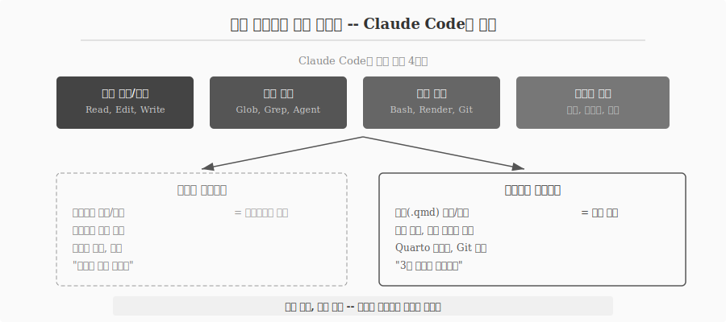
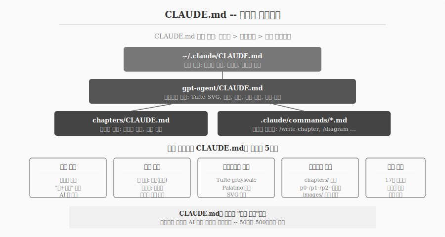
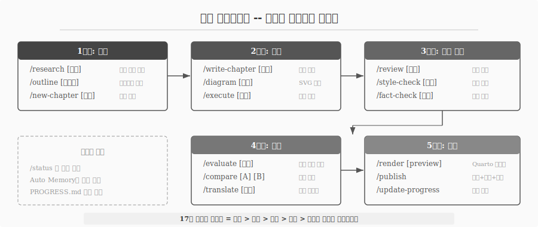
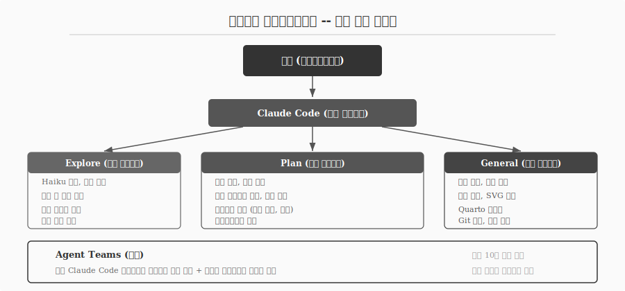
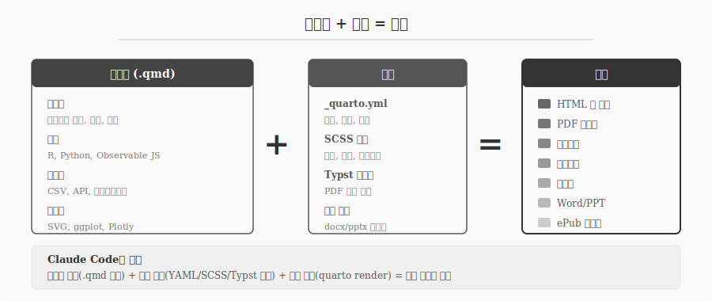
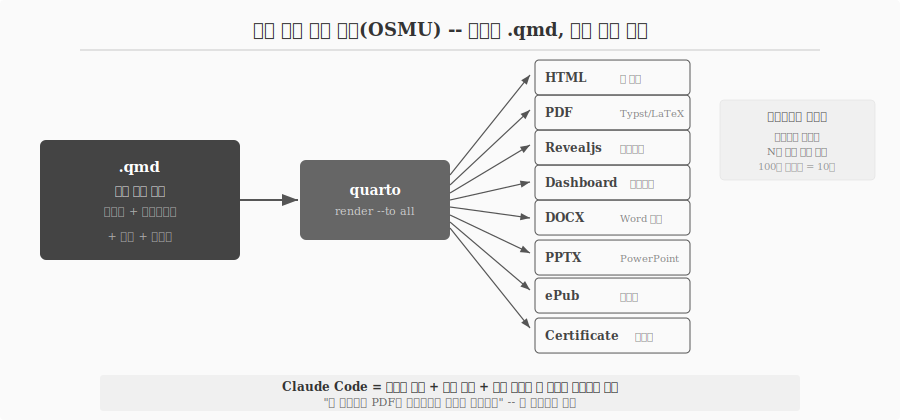
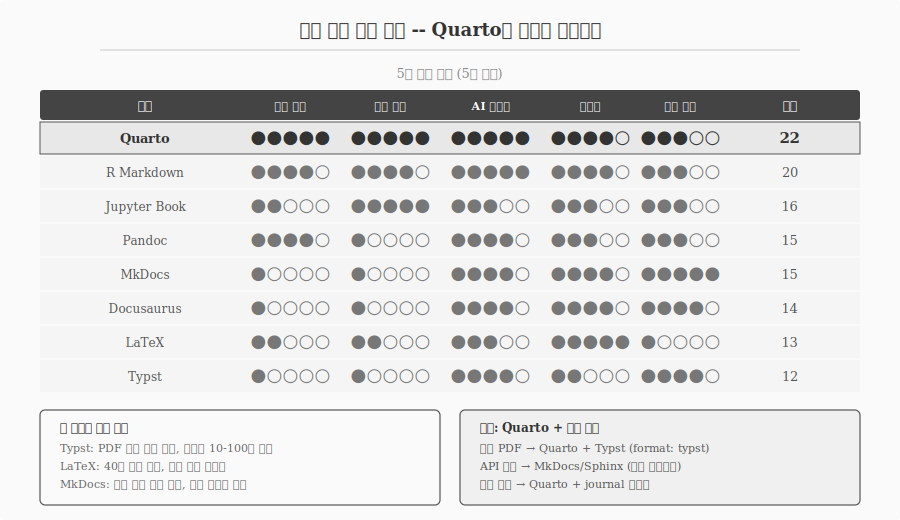
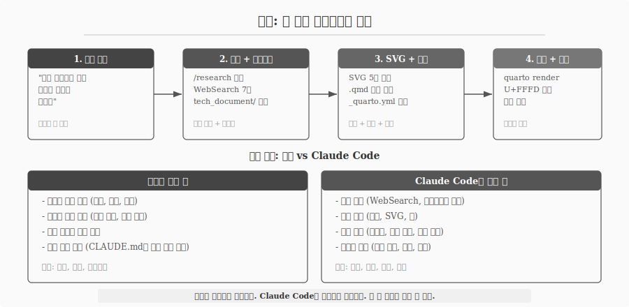

# Claude Code -- 터미널에서 시작하는 글쓰기 {#sec-cc-writing}

\index{Claude Code} \index{CLI} \index{에이전트 저작} \index{CLAUDE.md}

Claude Code는 터미널에 상주하며 코드베이스를 이해하고, 파일을 읽고 쓰고, 명령을 실행하고, 자연어로 소통하는 에이전트 도구다.
"코딩 도구"라는 이름이 붙어 있지만, 핵심 기능 네 가지 -- 파일 읽기/쓰기, 구조 이해, 명령 실행, 자연어 대화 -- 는 글쓰기에도 그대로 적용된다.
소스코드 대신 원고(.qmd)를 읽고, 테스트 대신 Quarto 렌더링을 실행하며, "로그인 버그 고쳐줘" 대신 "3장 도입부 보강해줘"라고 말하면 된다.
같은 도구, 같은 기능이다. 대상만 코드에서 원고로 바뀐다.

{#fig-cc-evolution}

## CLAUDE.md -- 저작의 아키텍처 {#sec-cc-claudemd}

\index{컨텍스트 엔지니어링} \index{문체 규칙}

CLAUDE.md는 프로젝트 루트에 위치하며 Claude Code가 매 세션 시작 시 읽는 설정 파일이다.
2026년 현재 .gitignore만큼 필수적인 프로젝트 인프라로 자리 잡았다.
코딩 프로젝트에서는 코딩 표준, 아키텍처 결정, 리뷰 체크리스트를 정의한다.
저작 프로젝트에서는 문체 규칙, 용어집, 다이어그램 스펙, 챕터 구조를 정의한다.

CLAUDE.md 작성에는 두 가지 원칙이 있다.

**첫째, 짧을수록 좋다.**
루트 CLAUDE.md는 50-100줄 이내로 유지한다.
모든 줄에 대해 "이 줄을 제거하면 Claude가 실수하는가?"를 질문하고, 답이 "아니오"면 제거한다.
상세 내용은 별도 파일로 분리하고 `@path`로 임포트한다.
CLAUDE.md는 매 세션의 컨텍스트에 포함되므로, 불필요한 줄은 모든 세션에서 자원을 낭비한다.

**둘째, 계층 구조를 활용한다.**
글로벌 설정(`~/.claude/CLAUDE.md`)에는 개인 선호(한국어 응답, 간결한 출력)를, 프로젝트 설정(`gpt-agent/CLAUDE.md`)에는 프로젝트 규칙(Tufte SVG, 평서문)을, 하위 디렉토리(`chapters/CLAUDE.md`)에는 챕터별 규칙(이미지 경로, 참조 형식)을 배치한다.
Claude는 가장 가까운 CLAUDE.md부터 계층적으로 로드한다.

저작 프로젝트의 CLAUDE.md에는 다섯 가지가 포함되어야 한다.

| 항목 | 내용 | 목적 |
|------|------|------|
| 문체 규칙 | 평서문, "이+명사" 금지, AI 티 제거 | 일관된 톤 유지 |
| 용어 규칙 | 첫 등장 병기, 재등장 한글만, 브랜드 원어 | 용어 일관성 |
| 다이어그램 스펙 | Tufte grayscale, Palatino 서체, SVG 전용 | 시각적 통일 |
| 프로젝트 구조 | chapters/ 폴더, p0-/p1-/p2- 접두어 | 파일 배치 규칙 |
| 스킬 안내 | 17개 커맨드 목록과 용도 | 작업 흐름 안내 |

: 저작 프로젝트 CLAUDE.md 필수 항목 {#tbl-claudemd-items .striped}

{#fig-cc-claudemd}

컨텍스트 품질이 AI 출력 품질을 결정한다.
CLAUDE.md에 "평서문으로 쓴다"를 명시하지 않으면 Claude는 경어체와 평서문을 혼용한다.
"이+명사 금지"를 명시하지 않으면 "이 메서드는"이 반복된다.
50줄의 정밀한 CLAUDE.md가 500줄의 장황한 CLAUDE.md보다 낫다.

## 슬래시 커맨드 -- 저작 워크플로우 자동화 {#sec-cc-commands}

\index{슬래시 커맨드} \index{저작 파이프라인}

Claude Code의 슬래시 커맨드는 `.claude/commands/` 폴더에 마크다운 파일로 정의된다.
사용자가 `/write-chapter p0-complexity.qmd`처럼 호출하면, 해당 마크다운 파일의 전체 내용이 프롬프트로 확장되어 실행된다.

이 프로젝트에서 실제 운용 중인 17개 슬래시 커맨드는 기획-집필-품질-평가-출판의 완전한 파이프라인을 구성한다.

| 단계 | 커맨드 | 역할 |
|------|--------|------|
| 기획 | `/research` | 최신 자료 웹 조사 |
| 기획 | `/outline` | 챕터 아웃라인 설계 |
| 기획 | `/new-chapter` | 신규 챕터 생성 + 목차 등록 |
| 집필 | `/write-chapter` | 본문 집필 + 진행률 갱신 |
| 집필 | `/diagram` | Tufte grayscale SVG 생성 |
| 집필 | `/execute` | 챕터 내 코드 실행 검증 |
| 품질 | `/review` | 원고 리뷰 |
| 품질 | `/style-check` | 문체 규칙 위반 탐지 |
| 품질 | `/fact-check` | 기술 사실 검증 |
| 평가 | `/evaluate` | 품질 정량 평가 |
| 평가 | `/compare` | 챕터 간 비교 분석 |
| 평가 | `/translate` | 용어 일관성 관리 |
| 출판 | `/render` | Quarto 렌더링 및 검증 |
| 출판 | `/publish` | 빌드 + 커밋 + 배포 |
| 관리 | `/status` | 집필 진행 현황 대시보드 |
| 관리 | `/update-progress` | 진행 기록 갱신 |

: 17개 슬래시 커맨드로 구성된 저작 파이프라인 {#tbl-commands .striped}

{#fig-cc-pipeline}

슬래시 커맨드와 스킬(skill)의 차이를 이해해야 한다.
슬래시 커맨드는 사용자가 직접 `/command`를 입력하여 호출하는 단축 명령이다.
스킬은 맥락 매칭으로 자동 활성화되는 확장이다 -- Claude가 작업 맥락을 분석하여 관련 스킬의 설명이 일치하면 자동으로 로드한다.
"다이어그램을 그려줘"라고 말하면 `/diagram` 커맨드를 호출하지 않아도 diagram 스킬이 자동 활성화되는 식이다.

## 에이전트 오케스트레이션 {#sec-cc-agents}

\index{서브에이전트} \index{Agent Teams} \index{오케스트레이션}

Claude Code는 세 가지 내장 서브에이전트를 제공한다.

**Explore** 에이전트는 Haiku 모델을 사용하며 읽기 전용이다.
코드베이스 탐색에 특화되어 있지만, 저작 프로젝트에서는 챕터 간 참조 확인, 용어 일관성 검사, 기존 내용 탐색에 활용된다.
빠르고 저비용이므로 "이 용어가 다른 챕터에서 어떻게 쓰였는지 확인"하는 작업에 적합하다.

**Plan** 에이전트는 상위 모델을 사용하며 읽기 전용이다.
아키텍처 설계에 특화되어 있지만, 저작에서는 챕터 아웃라인 설계, 구조 검토, 목차 배치 결정에 활용된다.

**General** 에이전트는 상위 모델에 모든 도구를 사용할 수 있다.
실제 파일 생성, SVG 제작, Quarto 렌더링, Git 커밋 등 실행이 필요한 작업을 담당한다.

{#fig-cc-agents}

Agent Teams 기능은 여러 Claude Code 인스턴스를 동시에 실행하여 병렬 저작을 가능하게 한다.
한 팀 리더 세션이 공유 태스크 리스트를 통해 팀원 세션을 조율한다.
최대 10개 에이전트가 동시 실행 가능하며, 팀원은 자체 컨텍스트 윈도우에서 독립적으로 작업한다.

소설 집필에 이 기능을 적용한 사례가 보고되었다 -- 3명의 작가 에이전트가 챕터별로 병렬 집필하고, 4명의 리뷰어 에이전트가 관점별(독자, 편집자, 전문가, 일관성)로 검토하는 구조다.
한 저자는 10년간 방치한 소설을 Agent Teams로 12시간 만에 완성했다.

## 콘텐츠에서 문서로 -- 서식과 변환 {#sec-cc-document}

\index{OSMU} \index{단일 소스 다중 출력} \index{매개변수화 렌더링} \index{Typst}

Claude Code가 .qmd 파일에 텍스트를 쓰는 것은 **콘텐츠 생성**이다.
그 텍스트가 HTML, PDF, 슬라이드, 대시보드, 증명서로 변환되어야 **문서 생성**이다.
콘텐츠와 서식이 합쳐져야 문서가 된다.

$$\text{콘텐츠}(\text{텍스트} + \text{코드} + \text{데이터}) + \text{서식}(\text{템플릿} + \text{스타일}) = \text{문서}$$

Claude Code는 이 등식의 양쪽을 모두 제어한다.
좌변(콘텐츠)에서는 .qmd 원고를 작성하고, SVG 다이어그램을 생성하며, 코드를 실행한다.
우변(서식)에서는 `_quarto.yml` 포맷을 설정하고, SCSS 테마를 편집하며, Typst 템플릿을 조정한다.
등호(변환)에서는 `quarto render` 명령을 실행하고, 오류를 진단하고, 결과물을 검증한다.

{#fig-cc-doc-equation}

### 단일 소스 다중 출력 {#sec-cc-osmu}

Quarto의 핵심 설계 원리는 하나의 .qmd 파일에서 여러 포맷을 동시에 생성하는 것이다.
YAML 프론트매터에 포맷을 나열하고 `quarto render --to all`을 실행하면, 동일한 콘텐츠가 여덟 가지 문서로 변환된다.

| 문서 유형 | Quarto 포맷 | 서식 엔진 | Claude Code 역할 |
|-----------|-------------|-----------|-----------------|
| 웹 문서 | `html` | SCSS 테마 | .qmd + SCSS 커스텀 + 렌더링 |
| PDF 보고서 | `pdf` / `typst` | LaTeX / Typst | .qmd + 템플릿 설정 + 렌더링 |
| 슬라이드 | `revealjs` | Revealjs | .qmd + 테마/전환 + 발표자 노트 |
| 대시보드 | `dashboard` | Observable JS | .qmd + 레이아웃 + 차트 코드 |
| 책 | `book` | HTML/PDF/ePub | 챕터 구조 + 빌드 + 배포 |
| 웹사이트 | `website` | HTML + 네비게이션 | 페이지 구조 + 사이드바 + 배포 |
| 증명서 | `typst` + 커스텀 | Typst 템플릿 | 템플릿 디자인 + 데이터 바인딩 |
| MS Office | `docx` / `pptx` | 참조 문서 | .qmd + 참조 docx/pptx + 렌더링 |

: 하나의 .qmd에서 생성 가능한 8대 문서 유형 {#tbl-doc-formats .striped}

{#fig-cc-osmu}

Typst는 2023년에 등장한 차세대 조판 엔진으로, LaTeX보다 빠르고 문법이 간결하다.
Quarto + Typst 조합에서는 .qmd가 .typ 파일로 변환된 후 PDF로 컴파일된다.
Claude Code용 Typst 전문 스킬(typst-claude-skill)은 9개 템플릿을 내장하고 있어, "이력서를 PDF로 만들어줘"라는 한 문장으로 전문적인 문서를 생성할 수 있다.

### Quarto만이 유일한 선택인가 {#sec-cc-alternatives}

\index{Typst} \index{Pandoc} \index{LaTeX} \index{Jupyter Book}

Quarto가 유일한 문서 생성 엔진은 아니다.
문서 생성 도구는 네 범주로 나뉜다 -- 다중 포맷 출판(Quarto, R Markdown, Jupyter Book), 조판 엔진(Typst, LaTeX), 범용 변환기(Pandoc), 문서 사이트(Docusaurus, MkDocs, Sphinx).
각 도구는 고유한 강점이 있다.

Typst는 PDF 인쇄 품질에서 LaTeX에 필적하면서 컴파일 속도가 10-100배 빠르다.
LaTeX는 40년 역사의 학술 출판 표준으로 가장 넓은 템플릿 생태계를 보유한다.
Pandoc은 60개 이상의 포맷 변환을 지원하며 Quarto의 기반 엔진이기도 하다.
MkDocs는 학습 곡선이 가장 낮아 API 문서 사이트에 적합하다.

그러나 다섯 가지 기준(다중 출력, 코드 통합, AI 에이전트 적합성, 생태계, 학습 곡선)으로 평가하면, Quarto가 총점에서 압도적이다.
"하나의 소스로 모든 문서를"이라는 OSMU 원칙을 충족하는 도구는 Quarto뿐이다.
다른 도구들은 특정 영역에서 Quarto보다 뛰어나지만, 전체를 아우르지 못한다.

{#fig-cc-engine-compare}

실전에서는 Quarto를 중심에 두고 부족한 영역을 보완 도구와 조합한다.
인쇄 품질 PDF가 필요하면 `format: typst`로 Typst를 PDF 엔진으로 사용하고, API 문서 사이트가 필요하면 MkDocs나 Sphinx를 별도 프로젝트로 운영하며, 학술 저널 투고가 필요하면 journal 템플릿을 적용한다.
Claude Code + Quarto 조합이 AI 시대 과학기술 저작의 최적 해인 이유는 명확하다 -- 둘 다 CLI 기반 텍스트 도구이므로, 자연어 한 문장으로 콘텐츠 생성부터 문서 변환까지 전 과정을 제어할 수 있다.

### 매개변수화 렌더링 -- 100장을 10분에 {#sec-cc-parameterized}

매개변수화 렌더링(parameterized rendering)은 하나의 .qmd 템플릿에서 데이터만 바꿔가며 N개 문서를 자동 생성하는 기법이다.

- **월간 보고서**: 월별 데이터 파라미터를 주입하여 12개 PDF 자동 생성
- **수료증**: 수료자 명단 CSV를 읽어 100장 인증서 자동 생성
- **지역별 분석**: 17개 시도 코드를 순회하며 지역별 보고서 자동 생성

Claude Code는 이 반복 렌더링 루프를 R 또는 Python 스크립트로 작성하고 직접 실행할 수 있다.
저자가 "수료자 명단으로 증명서 100장 만들어줘"라고 지시하면, Claude Code는 Typst 템플릿을 설계하고, CSV를 읽는 스크립트를 작성하고, 렌더링을 실행하여 100개 PDF를 생성한다.
콘텐츠 생성, 서식 설정, 변환 실행이 하나의 대화 안에서 완결된다.

## 메모리와 학습 {#sec-cc-memory}

\index{Auto Memory} \index{세션 간 학습}

Claude Code의 Auto Memory 시스템은 세션 간 지식을 자동 축적한다.
Claude가 작업하면서 빌드 명령, 디버깅 통찰, 아키텍처 노트, 코드 스타일 선호, 워크플로우 습관을 스스로 기록한다.
"미래 대화에서 유용한가?"를 기준으로 저장 여부를 판단한다.

저작 프로젝트에서 Auto Memory는 다음을 학습한다.

- **문체 패턴**: 어떤 표현이 수정되었고 어떤 표현이 승인되었는지
- **프로젝트 컨벤션**: 파일 명명 규칙, SVG 스펙, 렌더링 설정
- **피드백 이력**: 저자가 "이렇게 하지 마"라고 말한 것과 "이렇게 해"라고 말한 것
- **작업 맥락**: 현재 진행 중인 챕터, 우선순위, 마일스톤

메모리는 프로젝트별로 `~/.claude/projects/<project>/memory/` 디렉토리에 저장된다.
같은 Git 저장소의 모든 워크트리와 하위 디렉토리가 하나의 메모리 디렉토리를 공유한다.

CLAUDE.md가 "이 프로젝트에서 항상 적용할 규칙"이라면, Auto Memory는 "지난 대화에서 배운 것"이다.
CLAUDE.md는 명시적 지시이고, Auto Memory는 암묵적 학습이다.
둘이 합쳐져서 Claude Code는 세션이 바뀌어도 프로젝트의 맥락을 유지한다.

## 실전: 이 책이 만들어지는 과정 {#sec-cc-this-book}

\index{저작 워크플로우}

이 책 자체가 Claude Code로 집필되고 있다.
실제 워크플로우를 재현하면 다음과 같다.

**1단계: 저자가 지시한다.**
"문서 복잡성에 대한 도입부 챕터를 기술해" -- 자연어 한 문장이 시작이다.
무엇을 쓸지, 어디에 배치할지, 어떤 관점에서 접근할지는 저자가 결정한다.

**2단계: Claude Code가 조사하고 기술문서를 작성한다.**
`/research` 스킬이 활성화되어 WebSearch를 여러 차례 수행한다.
조사 결과는 `tech_document/` 폴더에 마크다운으로 정리된다.
챕터 집필 전에 근거를 확보하고 구조를 설계하는 단계다.

**3단계: SVG를 제작하고 본문을 집필한다.**
기술문서를 기반으로 SVG 다이어그램을 생성하고, .qmd 본문을 작성하며, `_quarto.yml`에 목차를 등록한다.
`/diagram` 스킬이 Tufte grayscale 규격에 맞는 SVG를 생성하고, `/write-chapter` 스킬이 CLAUDE.md의 문체 규칙에 따라 본문을 작성한다.

**4단계: 빌드하고 검증한다.**
`quarto render`로 전체 책을 빌드하고, U+FFFD(깨진 문자) 스캔을 실행하며, 인용 키를 확인한다.
오류가 발견되면 Edit 도구로 수정하고 재빌드한다.

{#fig-cc-this-book}

저자와 Claude Code의 역할은 명확하게 분리된다.

저자는 **판단하고 검증한다** -- 무엇을 쓸지 결정하고, 구조와 흐름을 판단하며, 사실을 검증하고, 품질 기준을 설정한다.
Claude Code는 **생성하고 실행한다** -- 자료를 조사하고, 초안을 생성하며, 렌더링과 문체 검사를 반복하고, 무결성을 검사한다.

이 분업은 [@sec-why-document]장에서 다룬 "AI가 바꾸는 것과 바꾸지 못하는 것"의 실전 적용이다.
AI는 생성 비용을 낮추지만, "쓸 가치가 있는가"의 판단은 여전히 저자의 몫이다.
Claude Code는 이 판단을 실행으로 옮기는 가장 강력한 도구다.
