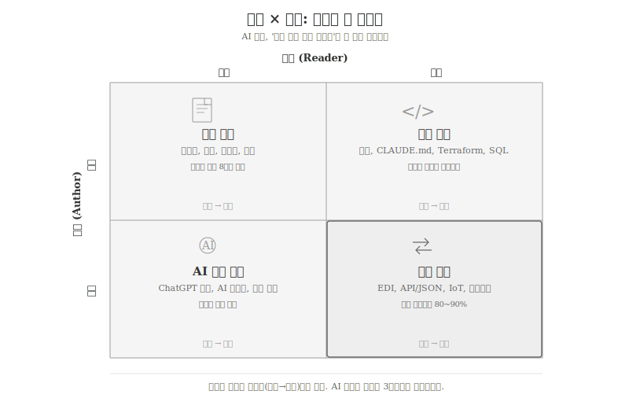
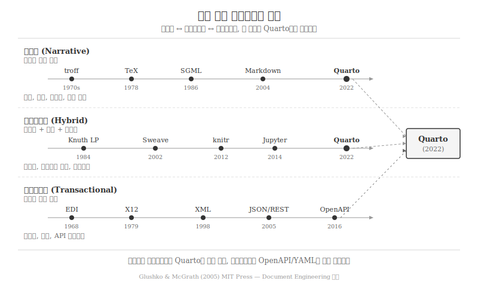

---
execute:
  eval: false
---

# 저자와 독자의 변환 {#sec-communication}

\index{문서 커뮤니케이션} \index{저자} \index{독자}
\index{EDI} \index{기계 생성 문서}

5,000년 전 수메르의 점토판부터 2025년 ChatGPT의 응답까지,
문서의 본질은 **저자가 독자에게 정보를 전달하는 행위**다.
그런데 저자와 독자가 반드시 인간이어야 할까?

전통적 문서는 인간이 쓰고 인간이 읽었다. 편지, 보고서, 논문,
매뉴얼—모두 사람이 작성하고 사람이 해석하는 구조였다.
그러나 1968년 EDI(Electronic Data Interchange)가 등장하면서
**기계가 기계에게 보내는 문서**가 탄생했다. 주문서, 송장,
배송 명세서가 사람의 개입 없이 컴퓨터 간에 자동 교환되었다.

2022년 ChatGPT의 등장은 나머지 두 사분면을 열었다.
**기계가 인간을 위해 문서를 작성**하고(AI 보고서, 자동 뉴스),
**인간이 기계를 위해 문서를 작성**한다(프롬프트, CLAUDE.md,
Terraform). "누가 쓰고 누가 읽는가?"—이 질문이 AI 시대
문서의 첫 번째 좌표가 되었다[@Glushko2005].

## 저자 × 독자: 4분면 프레임워크 {#sec-comm-quadrant}

\index{4분면 프레임워크} \index{문서 유형}

문서를 저자(Author)와 독자(Reader)의 조합으로 분류하면
네 개의 사분면이 나타난다.

{#fig-comm-matrix}

### 인간 → 인간: 전통 문서

\index{서사형 문서} \index{Narrative}

수천 년간 문서의 유일한 형태였다.
저자가 생각을 정리하고, 독자가 해석한다.
소설, 학술 논문, 기술 매뉴얼, 법률 문서, 비즈니스 보고서가
모두 여기에 속한다.

글루시코와 맥그래스(Glushko & McGrath)는 이를
**서사형 문서(Narrative Document)**라 분류했다[@Glushko2005].
표현(Presentation), 구조(Structure), 내용(Content)의 세 요소
중 표현과 내용의 비중이 높고, 인간의 해석이 의미를 완성한다.

이 사분면의 도구 진화는 명확한 궤적을 따른다.
troff(1970s) → TeX(1978) → SGML(1986) → Markdown(2004) →
Quarto(2022). 매번 "구조와 표현의 분리"가 심화되었고,
저자는 내용에 더 집중할 수 있게 되었다.

### 기계 → 인간: AI 생성 문서

\index{AI 생성 문서} \index{LLM 출력}

2022년 이후 급격히 성장한 사분면이다.
ChatGPT, Claude, Gemini가 생성하는 텍스트, GitHub Copilot이
제안하는 코드, AI가 작성하는 뉴스 기사와 보고서가 여기에 속한다.

이 사분면의 **지배적 차원은 검증**이다.
"누가 썼는가?"보다 **"이것이 맞는가?"**가 핵심 질문이다.
Grand View Research에 따르면 AI 콘텐츠 시장은 연 40% 이상
성장하고 있으며, GitHub은 Copilot이 제안하는 코드의 수용률이
30%에 달한다고 보고했다(2023).

실무 워크플로우의 변화는 극적이다.

| 단계 | 전통 방식 | AI 생성 방식 |
|------|-----------|-------------|
| 초안 작성 | 백지에서 6시간 | AI 초안 30분 |
| 검토/수정 | 1시간 | 인간 검증 2~4시간 |
| **총 소요** | **7시간** | **2.5~4.5시간 (60%↓)** |

: 기계→인간 문서의 워크플로우 변화 {#tbl-comm-ai-workflow}

초안 작성 시간은 급감했지만 검증 시간은 오히려 늘어난다.
AI가 생성한 코드의 45%에 보안 취약점이 포함된다는
Veracode(2025) 보고는 검증의 중요성을 강조한다.
인간의 역할이 "작성자"에서 "검증자"로 전환되는 것이
이 사분면의 핵심 특성이다.

### 인간 → 기계: 실행 문서

\index{실행 문서} \index{CLAUDE.md} \index{Terraform}
\index{스마트 계약}

**읽히는 동시에 실행되는 문서**가 AI 시대의 새로운 문서
유형으로 부상했다. 코드는 이미 "인간이 쓰고 기계가 읽는"
문서였지만, AI 에이전트의 등장으로 그 범위가 크게 확장되었다.

CLAUDE.md가 대표적이다. 프로젝트 문서이자 동시에 AI 에이전트의
행동 규칙서다. 인간 개발자가 읽어도 프로젝트 구조를 파악할 수
있고, Claude Code가 읽으면 코딩 규칙을 따른다. 문서와 프로그램의
경계가 사라진다.

실행 문서의 스펙트럼은 넓다.

| 문서 | 인간 가독성 | 기계 실행성 | 용도 |
|------|:-----------:|:-----------:|------|
| CLAUDE.md | ★★★★★ | ★★★☆☆ | AI 에이전트 규칙 |
| Terraform | ★★★★☆ | ★★★★★ | 인프라 정의 |
| OpenAPI 스펙 | ★★★☆☆ | ★★★★★ | API 문서+코드 생성 |
| GitHub Actions | ★★★☆☆ | ★★★★★ | CI/CD 파이프라인 |
| 스마트 계약 | ★★☆☆☆ | ★★★★★ | 자동 실행 계약 |

: 실행 문서 스펙트럼 {#tbl-comm-executable}

도널드 커누스(Donald Knuth)가 1984년 제안한 문학적
프로그래밍(Literate Programming)의 TANGLE/WEAVE 패러다임—
하나의 소스에서 인간용 문서(WEAVE)와 기계용 코드(TANGLE)를
동시에 추출한다—이 40년 만에 완전히 실현된 것이다.

메타프로그래밍(@sec-metaprogramming)의 관점에서 보면,
실행 문서는 **자연어를 메타언어로 사용하는 이종
메타프로그래밍**의 실천적 형태다. CLAUDE.md의 규칙이
생성될 코드의 특성을 제어하는 것은 컴파일러 플래그가
컴파일 결과를 제어하는 것과 본질이 같다.

### 기계 → 기계: 자동 교환

\index{기계간 통신} \index{API} \index{IoT}
\index{블록체인}

전체 데이터 교환의 **80~90%**는 인간이 한 번도 보지 않는
"보이지 않는 문서"다. EDI로 시작된 기계 간 문서 교환은
API, IoT, 블록체인으로 확장되어 현대 디지털 인프라의
근간을 이룬다.

| 채널 | 규모 | 비고 |
|------|------|------|
| API 호출 | 연 1.7조 건 | REST, gRPC, GraphQL |
| IoT 기기 | 170억+ 대 | MQTT, CoAP 프로토콜 |
| 블록체인 트랜잭션 | 일 15억 건 | 스마트 계약 자동 실행 |
| DNS 쿼리 | 초당 1.88억 건 | 인터넷 기본 인프라 |

: 기계→기계 문서 교환 규모 {#tbl-comm-m2m-scale}

한국의 **전자세금계산서**는 4분면을 모두 관통하는 사례다.
사업자(인간)가 발행 → 시스템(기계)이 전송 → 국세청
시스템(기계)이 검증 → 세무 담당자(인간)가 결과를 확인한다.
XML+PKI(공개키 기반 인프라)로 구성된 전자세금계산서는
2011년 의무화되었고, 2023년 매출 1억 이상 모든 사업자로
확대되었다.

EDI(1968)에서 시작된 기계 간 문서 교환의 다음 단계는
**AI 에이전트 간 통신**이다. Claude Code의 도구 호출(tool
calling)이 이미 이 형태를 취하고 있다. AI 에이전트가
다른 AI 에이전트에게 JSON 형식의 요청을 보내고 응답을
받는 구조는 EDI의 직계 후손이다.

## 문서 유형 스펙트럼 {#sec-comm-spectrum}

\index{문서 스펙트럼} \index{Glushko}

글루시코와 맥그래스의 문서 공학(Document Engineering) 프레임워크는
문서를 서사형(Narrative) ↔ 트랜잭션형(Transactional)의
연속체(spectrum)로 파악한다[@Glushko2005]. 하이브리드(Hybrid)
문서는 양쪽 특성을 모두 갖는다.

{#fig-comm-spectrum}

**서사형 문서**는 인간이 읽고 해석한다.
표현과 내용이 핵심이며, 구조는 저자의 논리를 따른다.
소설, 논문, 매뉴얼이 대표적이다.

**트랜잭션형 문서**는 기계가 자동 처리한다.
구조가 핵심이며, 스키마에 맞지 않으면 거부된다.
EDI 메시지, API 페이로드, 전자세금계산서가 여기에 속한다.

**하이브리드 문서**는 텍스트, 코드, 데이터가 공존한다.
Jupyter 노트북, Quarto 문서, 재현가능 논문이 대표적이다.
커누스의 문학적 프로그래밍(1984)에서 시작되어 Sweave(2002),
knitr(2012), Jupyter(2014)를 거쳐 Quarto(2022)에서 세 유형이
수렴했다.

세 유형은 동일한 3단계 진화 경로를 따랐다.

1. **WYSIWYG 단계**: 보이는 대로 편집 (HWP, Word, Excel)
2. **도메인 마크업 단계**: 구조와 표현의 분리 (TeX, XML, Markdown)
3. **텍스트+AI 단계**: AI가 생성하고 검증하는 문서 (Quarto+LLM)

교차 영향도 중요하다. SGML(서사형)이 XML(트랜잭션형)의
직계 조상이 되었고, 트랜잭션형의 스키마 사고(스키마→인스턴스)가
하이브리드에 유입되어 매개변수 문서(parameterized document)를
낳았다.

## 4분면과 AI 코딩 {#sec-comm-ai-coding}

\index{AI 코딩} \index{컨텍스트 공학}

4분면 프레임워크는 AI 코딩의 일상적 워크플로우를 설명하는
유용한 렌즈를 제공한다.

### 코딩 세션의 4분면 순환

AI 에이전트와 함께 코딩하는 개발자의 하루는 4분면을
끊임없이 순환한다.

1. **인간→기계**: 개발자가 프롬프트를 작성하고, CLAUDE.md에
   규칙을 정의한다. "사용자 인증 API를 FastAPI로 구현해줘"라는
   자연어 지시가 실행 문서가 된다.

2. **기계→인간**: AI가 코드를 생성하고 설명을 덧붙인다.
   개발자는 생성된 코드를 읽고 검증한다.

3. **기계→기계**: AI가 테스트를 실행하고, 린터를 돌리고,
   빌드 파이프라인을 트리거한다. JSON 형식의 도구 호출이
   오간다.

4. **인간→인간**: 개발자가 코드 리뷰를 요청하고, PR 설명을
   작성하고, 문서를 업데이트한다.

### 문서 판단력: AI가 대신할 수 없는 것

AI가 초안을 작성해주더라도, **"어떤 종류의 문서를 만들
것인가"**는 인간이 결정해야 한다. 목적(why), 독자(who:
인간인가 기계인가), 복잡도(how much)를 판단하여 도구를
선택하는 능력—이것이 AI 시대의 **문서 판단력(Document
Literacy)**이다.

"4분면 중 어디에 속하는 문서인가?"라는 질문을 던지는 것이
그 시작이다.

- README.md → 인간→인간 (개발자가 읽는 안내서)
- CLAUDE.md → 인간→기계 (AI 에이전트가 실행하는 규칙서)
- ChatGPT 응답 → 기계→인간 (인간이 검증할 초안)
- API 명세 → 인간→기계 + 기계→기계 (양면 문서)
- 전자세금계산서 → 4분면 전체를 관통

::: {.content-visible when-format="pdf"}
\faLightbulb\ 생각해볼 점
:::

::: {.content-visible when-format="html"}
## 생각해볼 점 {.unnumbered}
:::

문서를 "누가 쓰고 누가 읽는가"로 분류하면 네 개의
사분면이 나타난다. 인간→인간(전통 문서), 기계→인간(AI 생성),
인간→기계(실행 문서), 기계→기계(자동 교환).

전통적으로 문서는 좌상단(인간→인간)에만 존재했다.
EDI(1968)가 우하단(기계→기계)을 열었고, ChatGPT(2022)가
나머지 두 사분면을 활성화했다. 현재 전체 데이터 교환의
80~90%는 기계→기계이며, AI 콘텐츠 시장은 연 40% 이상
성장하고 있다.

AI 코딩에서 이 프레임워크는 실전적 의미를 갖는다.
CLAUDE.md는 인간→기계 사분면의 핵심 문서이고, AI 생성 코드는
기계→인간 사분면에서 검증을 기다리는 초안이다.
프롬프트 작성은 "인간→기계 문서 작성" 능력이며,
코드 리뷰는 "기계→인간 문서 검증" 능력이다.

"어떤 사분면의 문서를 만들 것인가?"—이 질문에 답할 수 있는
문서 판단력이 AI 시대 프로그래머의 기초 역량이 된다.

\index{문서 커뮤니케이션}
\index{문서 판단력}

## 프로젝트 {.unnumbered}

\index{프로젝트}

1. 자신의 일상 업무에서 생산하는 문서를 4분면으로 분류해보라.
인간→인간, 기계→인간, 인간→기계, 기계→기계 각 사분면에
해당하는 문서를 최소 2개씩 나열하라.

2. CLAUDE.md 또는 `.cursorrules` 파일을 "인간→기계 문서"로
바라보고, AI 에이전트의 코드 생성 결과에 미치는 영향을
실험하라. 규칙의 유무에 따른 차이를 비교하라.

3. 전자세금계산서의 처리 흐름을 4분면 관점에서 분석하라.
어느 단계에서 인간→기계, 기계→기계, 기계→인간 전환이
일어나는가?

4. AI가 생성한 코드(기계→인간)를 검증하는 나만의 체크리스트를
만들어보라. 보안, 성능, 가독성, 정확성 각 차원에서 무엇을
확인해야 하는가?
