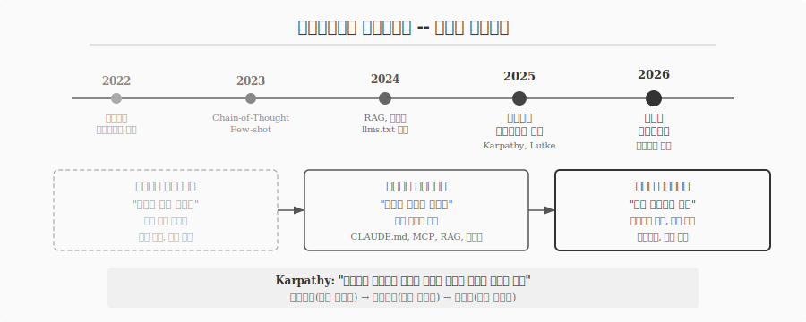
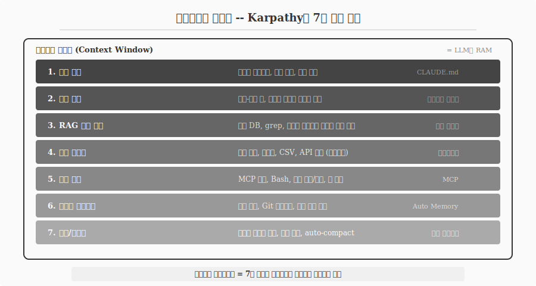
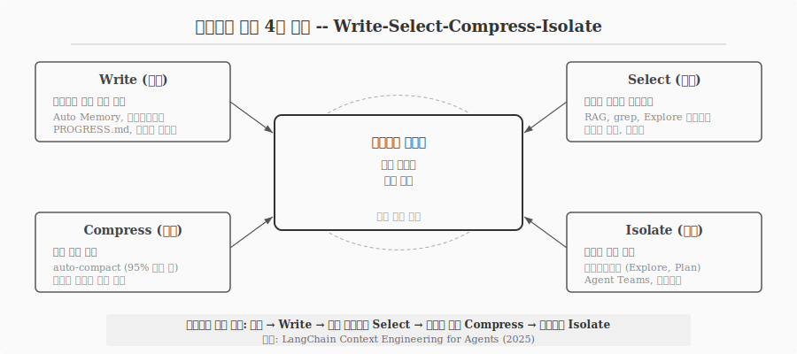
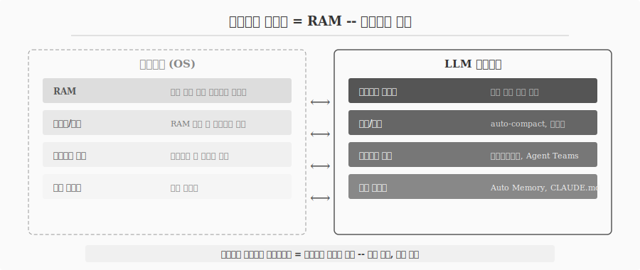

---
execute:
  eval: false
---

# 프롬프트에서 컨텍스트로 {#sec-context}

\index{프롬프트 엔지니어링} \index{컨텍스트 엔지니어링} \index{하네스 엔지니어링}

2025년 6월, Andrej Karpathy가 X(구 Twitter)에서 한 문장을 남겼다 -- "context engineering이라는 용어가 prompt engineering보다 정확하다."
같은 시기 Shopify CEO Tobi Lutke는 "AI를 위한 완전한 각본을 쓰는 것"이라 표현했다.
"프롬프트 엔지니어링"이라는 용어가 ChatGPT에 던지는 짧은 질문 정도로 인식되면서, 산업 수준 LLM 애플리케이션의 복잡성을 담기 어려워졌기 때문이다.

프롬프트 엔지니어링은 "어떻게 물을 것인가"에 집중한다.
컨텍스트 엔지니어링은 "무엇을 제공할 것인가"에 집중한다.
단일 질의 최적화에서 정보 생태계 설계로 관점이 이동한 것이다.

## 진화의 타임라인 {#sec-context-timeline}

\index{Chain-of-Thought} \index{Few-shot} \index{RAG}

프롬프트에서 컨텍스트로의 전환은 하룻밤에 일어나지 않았다.
4년에 걸친 점진적 진화다.

| 시기 | 단계 | 핵심 기술 |
|------|------|-----------|
| 2022 | 프롬프트 엔지니어링 등장 | 역할 지정, 지시 최적화 |
| 2023 | 고급 프롬프트 기법 | Chain-of-Thought, Few-shot |
| 2024 | 메모리와 검색 도입 | RAG, llms.txt, 대화 이력 관리 |
| 2025 중반 | 컨텍스트 엔지니어링 명명 | MCP, CLAUDE.md, AGENTS.md |
| 2026 | 하네스 엔지니어링 | 에이전트 루프, 도구 체인, 가드레일 |

: 프롬프트에서 컨텍스트로 -- 4년간의 진화 {#tbl-context-timeline .striped}

2022년 "프롬프트 엔지니어"라는 직함이 등장했을 때, 핵심 기술은 역할 지정("당신은 시니어 파이썬 개발자입니다")과 지시 최적화("코드만 작성하고 설명은 생략해주세요")였다.
2023년에는 Chain-of-Thought(단계별 사고)와 Few-shot(예시 제공)이 프롬프트 품질을 한 단계 끌어올렸다.
2024년에는 RAG(검색 증강 생성)와 대화 이력 관리가 도입되면서, 단일 프롬프트를 넘어 "정보를 어떻게 제공할 것인가"로 관심이 확대되었다.

2025년 중반, AI 코딩 에이전트(Claude Code, Cursor, GitHub Copilot)가 실전 개발에 투입되면서 전환점이 왔다.
에이전트는 단순 프롬프트가 아니라 코드베이스, Git 히스토리, 도구 정의, 팀 표준, 대화 이력 전체를 "컨텍스트"로 사용한다.
Karpathy는 이를 "다음 단계를 위해 컨텍스트 윈도우를 적절한 정보로 채우는 정교한 기술과 과학"이라 정의했다.

{#fig-context-evolution}

2026년에는 한 단계 더 나아가 **하네스 엔지니어링(Harness Engineering)**이 논의되고 있다.
프롬프트(지시 최적화) + 컨텍스트(정보 생태계) + 하네스(에이전트 루프, 도구 체인, 가드레일 등 실행 인프라)의 3단계 프레임워크다.

## 컨텍스트의 해부학 {#sec-context-anatomy}

\index{컨텍스트 윈도우} \index{Full Context Stack}

Karpathy는 컨텍스트를 7가지 구성 요소로 분해했다.

1. **작업 설명(Task descriptions)**: 시스템 프롬프트, 역할 지정, 제약 조건
2. **퓨샷 예시(Few-shot examples)**: 입력-출력 쌍, 원하는 행동의 구체적 시연
3. **RAG 검색 결과(Retrieved knowledge)**: 벡터 DB, grep, 시맨틱 검색으로 가져온 관련 문서
4. **관련 데이터(Related data)**: 코드 파일, 이미지, CSV, API 응답 (멀티모달 포함)
5. **도구(Tools)**: MCP 서버, Bash, 파일 읽기/쓰기, 웹 검색
6. **상태와 히스토리(State and history)**: 대화 이력, Git 히스토리, 작업 진행 상태
7. **압축/컴팩팅(Compacting)**: 오래된 메시지 요약, 토큰 절약

이 7가지가 합쳐져 **컨텍스트 윈도우**를 구성한다.
컨텍스트 윈도우는 LLM이 한 번에 처리할 수 있는 정보의 총량이며, 토큰 한계가 존재한다.
Claude의 경우 200K 토큰, 최신 모델은 1M 토큰까지 확장되었지만, 윈도우가 커져도 "적절한 정보로 채우는" 문제는 동일하다.

{#fig-context-anatomy}

실전에서는 이 7개 계층 위에 코드베이스 컨텍스트(파일 구조, 함수 시그니처), Git 히스토리(최근 변경사항), 의존성 정보(패키지, 라이브러리), 팀 표준(코딩 컨벤션)이 추가되어 **Full Context Stack** 8개 계층을 형성한다.

## 컨텍스트 관리 4대 전략 {#sec-context-strategies}

\index{Write} \index{Select} \index{Compress} \index{Isolate}

LangChain은 컨텍스트 관리를 네 가지 전략으로 체계화했다.

### Write -- 컨텍스트 밖에 저장 {#sec-context-write}

컨텍스트 윈도우 외부에 정보를 기록한다.
Auto Memory가 세션 간 학습을 저장하고, 스크래치패드가 중간 결과를 보관하며, PROGRESS.md가 작업 이력을 추적한다.
"지금 당장 필요하지 않지만 나중에 필요할 정보"를 영속적으로 보존하는 전략이다.

### Select -- 필요한 정보만 가져오기 {#sec-context-select}

컨텍스트 윈도우에 모든 정보를 넣는 것은 비효율적이다.
RAG가 벡터 데이터베이스에서 관련 문서를 검색하고, grep이 코드베이스에서 키워드를 찾으며, Explore 에이전트가 프로젝트 구조를 탐색한다.
"대량 컨텍스트 덤프"를 회피하고 관련 조각만 선별하는 것이 핵심이다.
도구가 너무 많으면 도구 선택에 RAG를 적용하면 정확도가 3배 향상된다는 연구 결과도 있다.

### Compress -- 토큰 소비 감소 {#sec-context-compress}

Claude Code는 컨텍스트의 95%에 도달하면 auto-compact를 실행하여 오래된 메시지를 자동 요약한다.
최근 컨텍스트는 보존하면서 오래된 정보를 압축하는 요약 미들웨어(Summarization Middleware) 패턴이 대표적이다.
대화가 길어지면 더 큰 컨텍스트 윈도우를 가진 모델로 동적 전환하는 방법도 사용된다.

### Isolate -- 복잡한 작업 분리 {#sec-context-isolate}

멀티에이전트 아키텍처로 컨텍스트를 분리한다.
Claude Code의 서브에이전트(Explore, Plan, General)는 각각 독립된 컨텍스트 윈도우에서 작업한다.
메인 에이전트의 윈도우를 오염시키지 않으면서 병렬로 탐색, 설계, 실행을 수행한다.
Agent Teams는 이를 확장하여 최대 10개 에이전트가 동시 작업하면서 공유 태스크 리스트로 협업한다.

{#fig-context-wsci}

## 프로젝트 메모리 파일 -- 지속적 컨텍스트 {#sec-context-memory-files}

\index{CLAUDE.md} \index{AGENTS.md} \index{.cursorrules}

컨텍스트 엔지니어링에서 가장 실용적인 도구는 프로젝트 메모리 파일이다.
에이전트가 매 세션 시작 시 자동으로 읽는 설정 파일로, 지속적 컨텍스트를 제공한다.

| 파일 | 에이전트 | 특징 |
|------|----------|------|
| CLAUDE.md | Claude Code | 프로젝트 루트에 위치, 계층 구조 지원, Auto Memory 연동 |
| AGENTS.md | 범용 (Linux Foundation) | 2025년 중반 표준화, Claude Code/Cursor/Copilot 등 지원 |
| .cursorrules | Cursor | Cursor IDE 전용, 프로젝트 규칙 정의 |

: 프로젝트 메모리 파일 비교 {#tbl-memory-files .striped}

세 파일 모두 에이전트의 컨텍스트 윈도우에 주입되므로, 불필요한 내용은 귀중한 토큰을 낭비한다.
"이 줄을 제거하면 에이전트가 실수하는가?" -- 답이 "아니오"면 제거한다.

LangChain의 메모리 분류에 따르면, 프로젝트 메모리 파일은 **절차적 메모리(Procedural Memory)**에 해당한다 -- 에이전트의 행동을 안내하는 지시사항이다.
Few-shot 예시는 **에피소딕 메모리(Episodic Memory)**이고, RAG로 검색되는 문서는 **의미 메모리(Semantic Memory)**다.

## 컨텍스트 윈도우 = RAM {#sec-context-ram}

\index{컨텍스트 윈도우} \index{auto-compact}

컨텍스트 윈도우를 운영체제의 RAM에 비유하면 관리 원리가 명확해진다.

| 운영체제 | LLM 에이전트 | 공통 원리 |
|----------|-------------|-----------|
| RAM | 컨텍스트 윈도우 | 현재 작업에 필요한 정보 |
| 페이징/스왑 | 요약/압축 | 용량 부족 시 교체 |
| 프로세스 격리 | 에이전트 격리 | 작업 간 간섭 방지 |
| 파일 시스템 | 장기 메모리 | 영구 저장 |

: 운영체제와 LLM 에이전트의 메모리 관리 비유 {#tbl-ram-analogy .striped}

RAM이 부족하면 운영체제는 페이징으로 디스크에 데이터를 내보낸다.
컨텍스트 윈도우가 차면 에이전트는 auto-compact로 오래된 메시지를 요약한다.
운영체제가 프로세스를 격리하여 메모리 간섭을 방지하듯, 에이전트는 서브에이전트를 격리하여 컨텍스트 오염을 방지한다.
파일 시스템이 전원이 꺼져도 데이터를 보존하듯, Auto Memory와 CLAUDE.md는 세션이 종료되어도 학습을 보존한다.

{#fig-context-ram}

효과적인 컨텍스트 엔지니어링은 효과적인 메모리 관리와 같다.
"모든 것을 RAM에 올리는 것"이 아니라 "적절한 정보를 적절한 시점에 적절한 형태로 제공하는 것"이 핵심이다.

## MCP와 도구 컨텍스트 {#sec-context-mcp}

\index{MCP} \index{Model Context Protocol}

MCP(Model Context Protocol)는 AI 에이전트를 외부 데이터 소스와 도구에 연결하는 개방형 표준이다.
Claude Code가 Google Drive의 설계 문서를 읽거나, Jira 티켓을 갱신하거나, 데이터베이스를 조회하거나, 브라우저를 자동화할 수 있는 것은 MCP 덕분이다.

도구 정의 자체가 컨텍스트의 핵심 구성 요소다.
에이전트에게 "Bash 도구가 있다"는 정보는 "셸 명령을 실행할 수 있다"는 능력을 부여한다.
"WebSearch 도구가 있다"는 정보는 "최신 정보를 검색할 수 있다"는 능력을 부여한다.
도구가 많아질수록 선택의 정확도가 떨어지므로, 도구 선택에 RAG를 적용하는 기법이 연구되고 있다.

## 프롬프트 공학의 기초는 여전히 유효하다 {#sec-context-prompt-basics}

\index{Few-shot} \index{역할 지정}

컨텍스트 엔지니어링이 프롬프트 엔지니어링을 대체하는 것은 아니다.
프롬프트 엔지니어링은 컨텍스트 엔지니어링의 한 구성 요소로 포함된다.

효과적인 프롬프트의 4대 요소는 여전히 유효하다.

**역할 지정**: "당신은 시니어 파이썬 개발자입니다"라는 지시가 코드 품질을 높인다.
**맥락 제공**: 문제의 배경, 제약 조건, 기존 코드를 제공할수록 정확한 출력을 얻는다.
**명확한 지시**: 원하는 결과물의 형식, 길이, 스타일을 구체적으로 명시한다.
**예시 제공**: 입력-출력 쌍의 예시(few-shot prompting)가 일관된 결과를 보장한다.

```{python}
#| label: prompt-example
#| eval: false

# 효과적인 프롬프트 예시
prompt = """
당신은 시니어 파이썬 개발자입니다.

다음 요구사항에 맞는 함수를 작성해주세요:
- 함수명: calculate_statistics
- 입력: 숫자 리스트
- 출력: 평균, 중앙값, 표준편차를 담은 딕셔너리
- 빈 리스트 입력 시 적절한 예외 처리 필요
- 타입 힌트 포함
"""
```

차이는 규모다.
프롬프트 엔지니어링이 "하나의 좋은 질문"을 만드는 기술이라면, 컨텍스트 엔지니어링은 "AI가 일할 수 있는 전체 환경"을 설계하는 기술이다.
개별 프롬프트를 잘 쓰는 능력도 중요하지만, 시스템 차원에서 맥락을 설계하는 능력이 더 중요해졌다.
