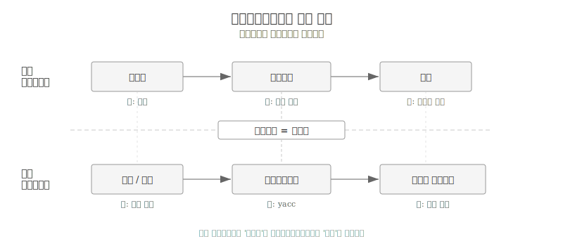
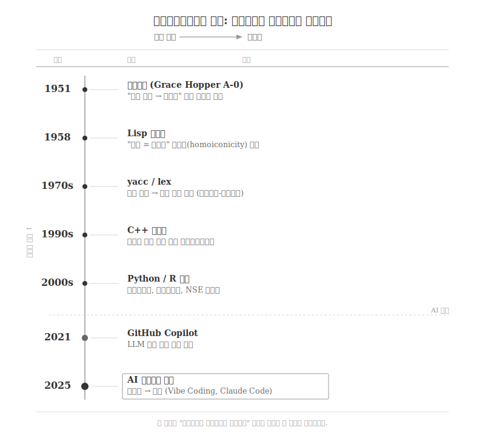
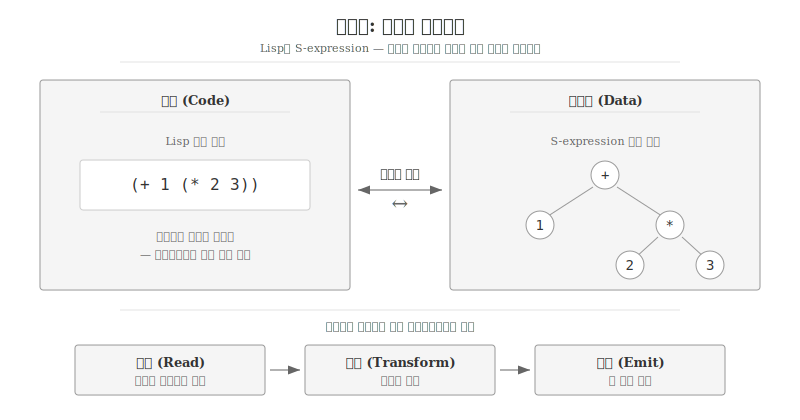
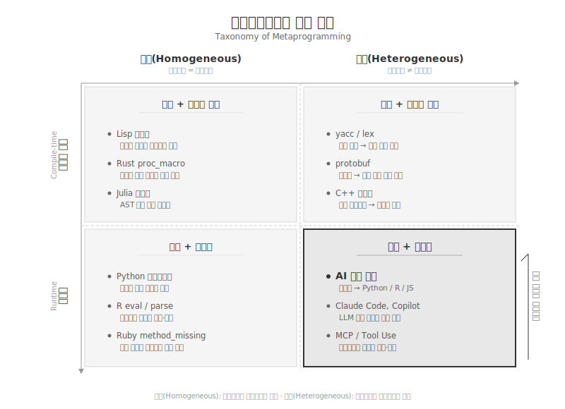
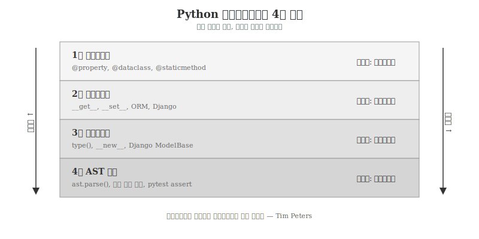
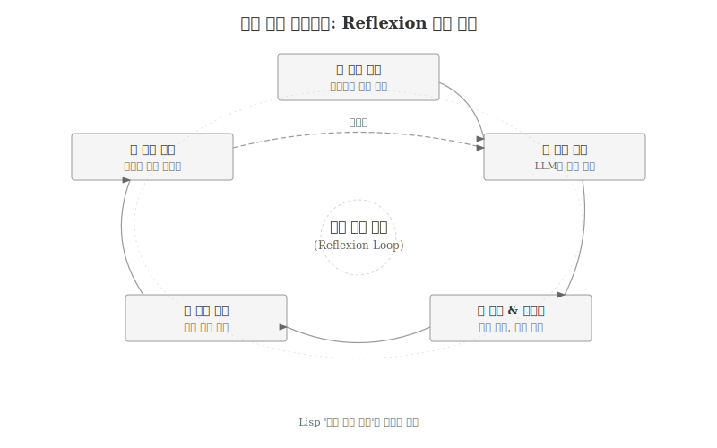
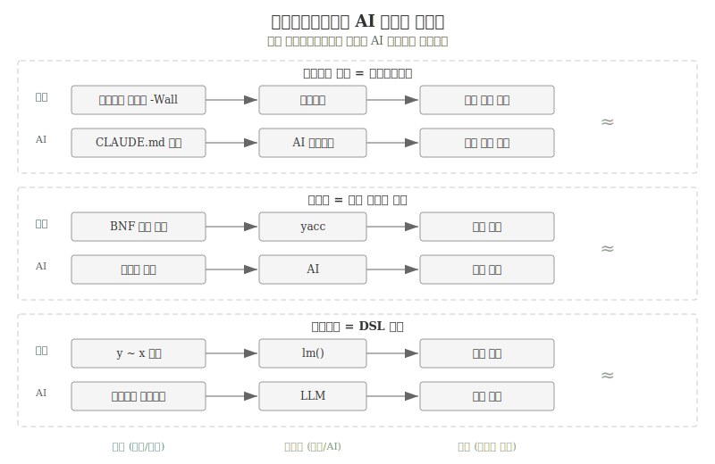

---
execute:
  eval: false
---

# 메타프로그래밍 {#sec-metaprogramming}

\index{메타프로그래밍} \index{Metaprogramming} \index{매크로} \index{반영}
\index{동형성} \index{코드 생성}

프로그래밍의 역사는 **프로그램이 프로그램을 작성하는** 기술의
발전사다. 1951년 그레이스 호퍼(Grace Hopper)가 최초의 컴파일러를
만들었을 때, "수학 표기를 기계어로 자동 번역하는 프로그램"이라는
개념 자체가 혁명이었다. 당시 프로그래머들은 "기계가 프로그램을
작성할 수 있다"는 주장을 믿지 않았다[@Ceruzzi2003].

70년이 지난 2025년, AI 에이전트가 자연어 지시만으로 수백 줄의
코드를 생성한다. Claude Code, GitHub Copilot, Cursor는 프롬프트를
입력받아 Python, R, JavaScript 코드를 만들어낸다.
본질적으로 같은 일이다—**프로그램이 프로그램을 작성한다.**

메타프로그래밍(Metaprogramming)은 다른 프로그램을 데이터로
취급하여 읽고, 생성하고, 분석하고, 변환하는 프로그램을 작성하는
기술이다[@Lilis2019]. 컴파일러, Lisp 매크로, C++ 템플릿,
Python 데코레이터, R의 비표준 평가(NSE)가 모두 메타프로그래밍에
속한다. AI 코드 생성은 자연어를 메타언어로 사용하는 가장 최신
형태의 메타프로그래밍이다.

{#fig-meta-concept}

## 프로그램이 프로그램을 작성하다 {#sec-meta-history}

\index{컴파일러} \index{Grace Hopper} \index{Lisp} \index{yacc}

메타프로그래밍의 역사는 컴퓨터 과학의 역사와 궤를 같이한다.
매 시대마다 "프로그램이 프로그램을 작성하는" 새로운 방식이
등장했고, 추상화 수준은 일관되게 상승했다.

{#fig-meta-evolution}

### 컴파일러: 최초의 메타프로그램 (1951)

\index{A-0 컴파일러}

그레이스 호퍼가 1951년 개발한 A-0 컴파일러는 수학적 표기법을
기계어로 변환하는 프로그램이었다. 당시 "자동 프로그래밍(automatic
programming)"이라 불린 컴파일러의 등장은 근본적인 질문을
제기했다—프로그래머의 역할은 무엇인가?

호퍼 자신의 회고에 따르면, 동료들은 "컴퓨터는 산술만 할 수 있지,
프로그램을 작성할 수는 없다"고 반대했다. 컴파일러가 증명한
것은 정반대였다. 프로그래밍의 상당 부분은 기계적 변환이며,
기계가 더 정확하고 빠르게 수행할 수 있다.

2025년에도 동일한 논쟁이 반복된다. "AI가 진짜 프로그래밍을 할 수
있는가?"라는 질문은 70년 전 "컴파일러가 진짜 프로그래밍을 할 수
있는가?"와 구조적으로 같다.

### Lisp 매크로: 코드는 데이터다 (1958)

\index{Lisp!매크로} \index{동형성}

존 매카시(John McCarthy)가 1958년 설계한 Lisp는 프로그래밍
언어의 역사에서 특별한 위치를 차지한다. **동형성
(homoiconicity)**—코드와 데이터가 동일한 구조(S-expression)를
공유한다는 특성—덕분에 Lisp 프로그램은 자기 자신을 데이터로
조작할 수 있다.

{#fig-meta-homoiconicity}

1963년 티모시 하트(Timothy Hart)가 도입한 Lisp 매크로는 이
동형성을 활용한 최초의 체계적 메타프로그래밍 도구였다.
매크로는 컴파일 시점에 코드를 받아 새로운 코드를 생성하는
함수다.

```lisp
;; Lisp 매크로 예시: when 매크로 정의
(defmacro when (condition &body body)
  `(if ,condition
       (progn ,@body)))

;; 사용: (when (> x 0) (print x)) 는
;; (if (> x 0) (progn (print x))) 로 확장됨
```

`when` 매크로는 코드(`condition`과 `body`)를 입력받아 `if`
표현식이라는 새로운 코드를 출력한다. 프로그램이 프로그램을
작성하는 가장 직접적인 형태다.

R 언어가 통계 컴퓨팅에서 독보적인 위치를 차지하는 이유 중
하나도 Lisp에서 물려받은 메타프로그래밍 능력이다.
`dplyr::filter(df, x > 0)`에서 `x > 0`은 즉시 평가되지 않고
표현식으로 캡처되어 데이터 프레임 맥락에서 평가된다.
Lisp의 "코드는 데이터다" 원칙이 60년 후에도 살아 있는 것이다.

### 컴파일러-컴파일러: 문법에서 파서로 (1970s)

\index{yacc} \index{lex} \index{컴파일러-컴파일러}

yacc(Yet Another Compiler-Compiler)와 lex는 1970년대에 등장한
**이종 메타프로그래밍(heterogeneous metaprogramming)**의
대표 사례다. 문법 명세(BNF 표기)를 입력받아 C 언어로 된
파서 소스코드를 자동 생성한다. 메타언어(문법 명세)와 대상
언어(C 코드)가 다르다는 점에서 Lisp 매크로의 동형 메타프로그래밍과
구별된다.

```
/* yacc 문법 명세 → C 파서 코드 자동 생성 */
expr : expr '+' term   { $$ = $1 + $3; }
     | expr '-' term   { $$ = $1 - $3; }
     | term
     ;
```

2026년 Anthropic이 16개 Claude 에이전트를 병렬 투입하여
10만 줄 규모의 C 컴파일러를 Rust로 구축한 사례[@Anthropic2026CCompiler]는
상징적 의미를 갖는다. 1970년대 컴파일러-컴파일러가 문법에서
파서를 생성했다면, 2026년 AI 에이전트는 자연어 명세에서
컴파일러 전체를 생성했다. 메타프로그래밍의 원환이 완성된 것이다.

### 템플릿과 제네릭: 타입이 코드를 생성하다 (1990s)

\index{C++ 템플릿} \index{제네릭}

C++ 템플릿 메타프로그래밍은 1994년 얼윈 언루(Erwin Unruh)가
컴파일 에러 메시지로 소수를 계산하는 프로그램을 시연하면서
발견되었다[@Veldhuizen2003]. 컴파일러가 템플릿을 인스턴스화하는
과정 자체가 튜링 완전(Turing-complete)하다는 사실은 의도된
설계가 아니라 우연한 발견이었다.

```cpp
// C++ 컴파일 타임 팩토리얼 계산
template<int N>
struct Factorial {
    static const int value = N * Factorial<N-1>::value;
};

template<>
struct Factorial<0> {
    static const int value = 1;
};

// Factorial<5>::value는 컴파일 시점에 120으로 계산됨
```

타입 시스템이 곧 프로그래밍 언어가 된다는 발견은
메타프로그래밍의 범위를 넓혔다. Java의 제네릭, Rust의
`proc_macro`, Haskell의 Template Haskell은 모두 이 계보에
속한다.

### 런타임 메타프로그래밍 주류화 (2000s)

\index{데코레이터} \index{메타클래스} \index{비표준 평가}

2000년대에 이르러 메타프로그래밍은 일상적인 개발 도구가
되었다. Python의 데코레이터와 메타클래스, Ruby의
`method_missing`, R의 비표준 평가(NSE)는 런타임에 코드를
검사하고 변형하는 능력을 제공한다.

```python
# Python 데코레이터: 함수를 감싸는 메타프로그래밍
import time

def timer(func):
    def wrapper(*args, **kwargs):
        start = time.time()
        result = func(*args, **kwargs)
        print(f"{func.__name__}: {time.time()-start:.3f}초")
        return result
    return wrapper

@timer
def train_model(data):
    # 모델 학습 코드
    ...
```

```r
# R 비표준 평가: 표현식을 데이터로 캡처
library(dplyr)

# x > 0은 즉시 평가되지 않고 표현식으로 캡처됨
df |> filter(x > 0, y < 100)

# tidy evaluation: 프로그래밍적 메타프로그래밍
my_filter <- function(data, var, threshold) {
  data |> filter({{ var }} > threshold)
}
```

데코레이터 `@timer`는 `train_model` 함수를 입력받아 시간 측정
기능이 추가된 새로운 함수를 출력한다. R의 `filter(x > 0)`에서
`x > 0`은 R 표현식으로 캡처되어 데이터 프레임의 열 이름으로
해석된다. 두 경우 모두 **코드가 데이터로 취급되어 변환된다**는
메타프로그래밍의 핵심 원리가 작동한다.

### AI 코드 생성: 자연어가 메타언어가 되다 (2020s)

\index{AI 코드 생성} \index{Copilot} \index{Claude Code}
\index{Vibe Coding}

2021년 GitHub Copilot의 출시와 함께 메타프로그래밍의 새로운
장이 열렸다. LLM 기반 코드 생성은 자연어를 메타언어로,
프로그래밍 언어를 대상 언어로 사용하는 이종 메타프로그래밍이다.

전통적 메타프로그래밍과 AI 메타프로그래밍의 본질적 차이는
**결정론 vs. 확률론**에 있다. Lisp 매크로는 동일한 입력에 대해
항상 동일한 코드를 생성한다. AI는 동일한 프롬프트에도 매번
다른 코드를 생성할 수 있다. 규칙 기반 변환에서 통계적 생성으로의
전환이 핵심이다.

안드레이 카파시가 2025년 2월 제안한 "Vibe Coding"은 이 전환의
극단적 표현이다—"코드가 존재한다는 것조차 잊어라."
메타프로그래밍 관점에서 보면, 메타언어가 형식 문법에서
자연어로 완전히 이동한 것이다.

## 메타프로그래밍 분류 체계 {#sec-meta-taxonomy}

\index{동형 메타프로그래밍} \index{이종 메타프로그래밍}

메타프로그래밍은 두 축으로 분류할 수 있다[@Lilis2019].
**메타언어와 대상 언어의 관계**(동형/이종)와 **실행 시점**
(컴파일 타임/런타임)이 그것이다.

{#fig-meta-taxonomy}

### 동형 메타프로그래밍 vs. 이종 메타프로그래밍

**동형 메타프로그래밍(Homogeneous)**에서는 메타언어와 대상
언어가 같다. Lisp 매크로가 대표적이다—Lisp 코드가 Lisp 코드를
생성한다. 코드와 데이터의 경계가 사라지며, 언어 자체를 확장하는
것이 가능해진다. Rust의 `proc_macro`, Julia의 매크로 시스템,
Elixir의 `defmacro`도 동형 메타프로그래밍에 속한다.

**이종 메타프로그래밍(Heterogeneous)**에서는 메타언어와 대상
언어가 다르다. yacc가 문법 명세(BNF)로부터 C 코드를 생성하고,
Protocol Buffers가 스키마 정의에서 Python/Java/Go 코드를
생성하는 것이 이에 해당한다.

AI 코드 생성은 **이종 메타프로그래밍의 극단적 형태**다.
메타언어가 형식 언어가 아닌 자연어이며, 대상 언어는 Python,
R, JavaScript 등 모든 프로그래밍 언어가 될 수 있다.

| 분류 | 메타언어 | 대상 언어 | 사례 |
|------|----------|-----------|------|
| 동형 | Lisp | Lisp | Lisp 매크로 |
| 동형 | Python | Python | 메타클래스, 데코레이터 |
| 동형 | R | R | NSE, tidy evaluation |
| 이종 | BNF 문법 | C | yacc/lex |
| 이종 | 스키마 | 다중 언어 | protobuf, GraphQL |
| 이종 | **자연어** | **다중 언어** | **AI 코드 생성** |

: 메타프로그래밍 분류와 사례 {#tbl-meta-classification}

### 컴파일 타임 vs. 런타임

실행 시점에 따른 구분도 중요하다.

**컴파일 타임 메타프로그래밍**은 코드가 실행되기 전에 변환이
완료된다. C++ 템플릿은 컴파일 시점에 타입별 코드를 생성하고,
Rust의 `proc_macro`는 컴파일 시점에 토큰 스트림을 변환한다.
실행 시 오버헤드가 없다는 장점이 있지만, 디버깅이 어렵다.

**런타임 메타프로그래밍**은 프로그램 실행 중에 코드를 검사하고
변형한다. Python의 `type()`, `getattr()`, `eval()`과
R의 `substitute()`, `eval()`, `parse()`가 대표적이다.
유연하지만 성능 비용과 보안 위험이 따른다.

AI 코드 생성은 이 분류에서 독특한 위치를 차지한다.
코드 생성 자체는 "실행 전"에 일어나지만, 대화형 에이전트
환경에서는 생성-실행-수정이 반복적으로 순환한다.
컴파일 타임도 런타임도 아닌 **"대화 타임(conversation-time)"**
이라는 새로운 범주가 필요할 수 있다.

## Python과 R의 메타프로그래밍 {#sec-meta-python-r}

\index{Python!메타프로그래밍} \index{R!메타프로그래밍}

데이터 과학과 AI 분야의 양대 언어인 Python과 R은 각각 고유한
메타프로그래밍 전통을 가지고 있다. 두 언어의 메타프로그래밍을
이해하면 AI 코드 생성이 어떤 전통 위에 서 있는지 파악할 수 있다.

### Python: 데코레이터에서 AST까지

\index{Python!데코레이터} \index{Python!메타클래스}
\index{Python!AST}

Python의 메타프로그래밍은 네 가지 층위로 구성된다.

{#fig-meta-python-layers}

**1층 데코레이터**: 함수나 클래스를 감싸서 행동을 수정한다.
`@property`, `@staticmethod`, `@dataclass`처럼 표준 라이브러리
곳곳에서 활용된다. 가장 접근성 높은 메타프로그래밍이다.

**2층 디스크립터**: `__get__`, `__set__`, `__delete__` 메서드를
구현하여 속성 접근을 제어한다. ORM(SQLAlchemy), 폼 검증
(Django), 타입 체크(attrs) 등의 기반이다.

**3층 메타클래스**: `type`을 상속받아 클래스 생성 과정을
제어한다. Django의 `ModelBase`, SQLAlchemy의 `DeclarativeMeta`가
메타클래스를 활용하여 선언적 API를 제공한다.

```python
# 메타클래스: 클래스가 생성될 때 자동으로 registry에 등록
class PluginMeta(type):
    registry = {}
    def __new__(mcs, name, bases, namespace):
        cls = super().__new__(mcs, name, bases, namespace)
        if name != 'Plugin':
            mcs.registry[name] = cls
        return cls

class Plugin(metaclass=PluginMeta):
    pass

class CSVLoader(Plugin):    # 자동 등록됨
    pass

class JSONLoader(Plugin):   # 자동 등록됨
    pass

print(PluginMeta.registry)
# {'CSVLoader': <class 'CSVLoader'>,
#  'JSONLoader': <class 'JSONLoader'>}
```

**4층 AST 조작**: `ast` 모듈을 사용하여 Python 소스 코드를
추상 구문 트리(Abstract Syntax Tree)로 파싱하고 변환한다.
pytest의 `assert` 재작성, mypy의 타입 검사, black의 코드
포매팅이 AST 수준에서 동작한다.

```python
import ast

# Python 코드를 AST로 파싱
code = "result = x + y * 2"
tree = ast.parse(code)

# AST를 순회하며 분석
for node in ast.walk(tree):
    if isinstance(node, ast.BinOp):
        print(f"연산: {type(node.op).__name__}")
# 출력: 연산: Add
#       연산: Mult
```

AI 코드 생성 도구도 내부적으로 AST를 활용한다.
생성된 코드의 구문 검증, 자동 포매팅, 보안 취약점 탐지에
AST 분석이 필수적이다.

### R: 비표준 평가와 tidy evaluation

\index{R!비표준 평가} \index{R!tidy evaluation}
\index{R!quosure}

R은 Lisp의 직계 후손(S → R)으로서 언어 수준의 메타프로그래밍
능력을 갖추고 있다. 해들리 위컴(Hadley Wickham)은 R의
메타프로그래밍을 "코드를 데이터로 취급하여 프로그래밍적으로
검사하고 수정하는 것"으로 정의한다[@Wickham2019].

**비표준 평가(Non-Standard Evaluation, NSE)**는 R의 핵심
메타프로그래밍 메커니즘이다. 일반적인 함수 호출에서 인자는
값으로 평가된 후 전달되지만, NSE에서는 표현식 자체가 캡처된다.

```r
# 표준 평가: x의 '값'이 전달됨
x <- 10
print(x)   # 10이 출력됨

# 비표준 평가: 'x > 0'이라는 표현식이 캡처됨
library(dplyr)
df |> filter(x > 0)
# x > 0은 df의 열 x를 기준으로 평가됨
```

`filter(x > 0)`에서 R은 `x > 0`을 즉시 평가하지 않는다.
표현식을 캡처한 뒤, 데이터 프레임 `df`의 맥락에서 열 이름
`x`를 참조하여 평가한다. SQL의 `WHERE x > 0`과 유사하되,
R 코드 안에서 자연스럽게 작동한다.

**tidy evaluation**은 NSE를 체계화한 현대적 프레임워크다.
`rlang` 패키지가 제공하는 세 가지 핵심 메커니즘이 있다.

```r
library(rlang)

# 1. 인용(Quoting): 표현식을 캡처
expr(x + y)
# x + y  (평가되지 않은 표현식)

# 2. 역인용(Unquoting): 캡처된 표현식을 주입
var <- expr(speed)
expr(mean(!!var))
# mean(speed)

# 3. 컬리-컬리(Curly-Curly): 함수 인자 전달
summarize_var <- function(data, var) {
  data |>
    summarize(mean = mean({{ var }}),
              sd = sd({{ var }}))
}
mtcars |> summarize_var(mpg)
```

R의 공식(formula) 문법 `y ~ x1 + x2`도 메타프로그래밍이다.
통계 모델 명세를 코드 안에서 표현하는 도메인 특화 언어(DSL)로,
`lm()`, `glm()` 등 모델링 함수가 공식을 해석하여 설계 행렬을
자동 구성한다. `dbplyr`은 R의 tidy 표현식을 SQL로 변환하는데,
메타프로그래밍의 코드-변환 능력이 언어 간 경계를 넘는 사례다.

## AI 시대의 메타프로그래밍 {#sec-meta-ai-era}

\index{AI 에이전트} \index{Software 3.0}

AI 코드 생성을 메타프로그래밍의 맥락에서 바라보면,
기술적 연속성과 단절 모두가 선명하게 드러난다.

### 연속성: 추상화 사다리

프로그래밍 역사의 모든 주요 진보는 새로운 형태의
메타프로그래밍이었다. 추상화 수준은 일관되게 상승했다.

| 단계 | 메타언어 | 대상 | 추상화 수준 |
|------|----------|------|-------------|
| 기계어 | 없음 | 하드웨어 | 0 |
| 어셈블리 | 니모닉 | 기계어 | 1 |
| 컴파일러 | 고급 언어 | 어셈블리 | 2 |
| 매크로 | 코드 패턴 | 코드 | 3 |
| 코드 생성기 | 스키마/문법 | 소스 코드 | 4 |
| AI 코드 생성 | **자연어** | **모든 언어** | 5 |

: 메타프로그래밍 추상화 사다리 {#tbl-meta-abstraction}

매 단계에서 동일한 패턴이 반복되었다.

1. 새로운 메타프로그래밍 도구가 등장한다.
2. "기계가 프로그래밍을 할 수 있는가?"라는 회의론이 제기된다.
3. 도구가 보편화되면서 프로그래머의 역할이 한 단계 상승한다.
4. 이전 단계의 수동 작업은 "왜 그렇게 했는가?" 수준의 역사가 된다.

컴파일러가 어셈블리 프로그래머의 역할을 대체하지 않고
재정의했듯, AI 코드 생성도 프로그래머를 대체하지 않고
역할을 재정의한다. 코드 작성자에서 의도 명세자, 결과 검증자,
시스템 오케스트레이터로의 전환이다.

### 단절: 결정론에서 확률론으로

전통적 메타프로그래밍은 **결정론적**이다. 동일한 매크로에
동일한 입력을 넣으면 항상 동일한 코드가 나온다. C++ 템플릿의
`Factorial<5>::value`는 반드시 120이다.
yacc에 같은 문법을 넣으면 같은 파서가 생성된다.

{#fig-meta-deterministic}

AI 코드 생성은 **확률론적**이다. "피보나치 수열을 계산하는
함수를 작성하라"는 동일한 프롬프트에 대해 재귀, 반복,
메모이제이션, 행렬 거듭제곱 등 다양한 구현이 나올 수 있다.
temperature 설정에 따라 동일 모델도 매번 다른 코드를 생성한다.

```python
# 같은 프롬프트, 다른 결과—AI 메타프로그래밍의 확률론적 특성

# 결과 A: 재귀 방식
def fibonacci(n):
    if n <= 1:
        return n
    return fibonacci(n-1) + fibonacci(n-2)

# 결과 B: 반복 방식
def fibonacci(n):
    a, b = 0, 1
    for _ in range(n):
        a, b = b, a + b
    return a

# 결과 C: 메모이제이션 방식
from functools import lru_cache

@lru_cache(maxsize=None)
def fibonacci(n):
    if n <= 1:
        return n
    return fibonacci(n-1) + fibonacci(n-2)
```

결정론적 메타프로그래밍에서는 생성된 코드의 정확성을 형식적으로
증명할 수 있었다. 확률론적 메타프로그래밍에서는 **검증**이
필수 단계가 된다. AI 생성 코드를 신뢰하되 검증하라(trust but
verify)는 원칙은 확률론적 메타프로그래밍의 본질적 특성에서
비롯된다.

### 자기 개선 에이전트: 메타-메타프로그래밍

\index{자기 개선 에이전트} \index{Reflexion}

메타프로그래밍의 가장 최신 형태는 **자기 자신을 수정하는
AI 에이전트**다. SICA(Self-Improving Coding Agent, 2025)는
자신의 코드베이스와 프롬프트를 편집하여 성능을 개선한다.
Reflexion 패턴은 AI가 생성한 코드를 실행하고, 오류를 분석하여,
수정된 코드를 다시 생성하는 순환 구조를 갖는다.

{#fig-meta-reflexion}

Lisp에서 시작된 "코드가 자기 자신을 수정한다"는 개념이
LLM 에이전트에서 새로운 차원으로 실현되고 있다.
2025년 arXiv에 발표된 "From Tool Calling to Symbolic Thinking:
LLMs in a Persistent Lisp Metaprogramming Loop"은 LLM을
Lisp REPL에 내장하여 자기 프로그래밍 에이전트를 구현하는
연구로, 60년 된 Lisp의 동형성과 최신 LLM 기술을 직접
연결한다.

## 메타프로그래밍과 AI 코딩의 교차점 {#sec-meta-intersection}

메타프로그래밍을 이해하면 AI 코딩 도구를 더 효과적으로
활용할 수 있다. 핵심 연결점은 세 가지다.

{#fig-meta-ai-intersection}

### 컨텍스트 파일은 메타프로그램이다

CLAUDE.md, `.cursorrules`, `.github/copilot-instructions.md`
같은 컨텍스트 파일은 AI 에이전트의 행동을 제어하는
메타프로그램이다. 프로그래밍 언어가 아닌 자연어로 작성되지만,
기능적으로 매크로 정의나 컴파일러 플래그와 동일한 역할을 한다—
코드 생성 과정을 제어한다.

```markdown
<!-- CLAUDE.md의 규칙은 메타프로그래밍적 지시다 -->
## 코딩 규칙
- 모든 함수에 타입 힌트를 포함할 것
- 테스트는 pytest 프레임워크를 사용할 것
- 데이터베이스 쿼리는 ORM으로만 작성할 것
```

위 규칙은 C++ 컴파일러에 `-Wall -Werror` 플래그를 전달하는
것과 본질이 같다. 코드를 직접 작성하지 않으면서 생성될 코드의
특성을 제어한다.

### 테스트 주도 개발은 실행 가능한 메타 명세다

AI 코딩에서 테스트 코드를 먼저 작성하고 AI에게 구현을
맡기는 패턴(TDD + AI)은 메타프로그래밍의 관점에서 보면
**실행 가능한 명세(executable specification)**를 메타언어로
사용하는 것이다.

```python
# 테스트 코드 = AI를 위한 메타 명세
def test_tokenize():
    assert tokenize("hello world") == ["hello", "world"]
    assert tokenize("  spaces  ") == ["spaces"]
    assert tokenize("") == []
    assert tokenize("hello-world") == ["hello", "world"]
```

테스트 코드가 정의하는 입출력 관계는 yacc의 문법 명세와
구조적으로 유사하다. 형식 명세가 파서를 생성하듯, 테스트
명세가 구현 코드를 생성한다.

### DSL 설계 능력이 AI 활용 능력을 결정한다

메타프로그래밍의 정수는 **도메인 특화 언어(DSL)** 설계에 있다.
R의 formula(`y ~ x`), ggplot2의 문법(`aes(x, y) + geom_point()`),
dplyr의 파이프라인(`filter |> mutate |> summarize`)은 모두
특정 도메인의 문제를 간결하게 표현하는 DSL이다.

AI 코딩에서도 프롬프트를 구조화하는 능력—즉 문제 도메인의
언어를 AI가 이해할 수 있는 형태로 설계하는 능력—이
생산성을 좌우한다. 프롬프트 공학에서 컨텍스트 공학으로의
진화(@sec-context-engineering)는 메타프로그래밍에서 DSL
설계의 진화와 같은 궤적을 따른다.

::: {.content-visible when-format="pdf"}
\faLightbulb\ 생각해볼 점
:::

::: {.content-visible when-format="html"}
## 생각해볼 점 {.unnumbered}
:::

메타프로그래밍은 "프로그램이 프로그램을 작성하는" 기술이다.
1951년 컴파일러에서 시작된 이 전통은 Lisp 매크로(1958),
컴파일러-컴파일러(1970s), C++ 템플릿(1990s),
Python/R 런타임 메타프로그래밍(2000s)을 거쳐
AI 코드 생성(2020s)에 이르렀다.

각 세대마다 메타언어의 추상화 수준이 상승했고, 최종적으로
자연어에 도달했다. 형식 문법에서 자연어로의 전환은 혁명적이지만,
"프로그램이 프로그램을 작성한다"는 본질은 70년 전과 같다.

AI 코딩이 메타프로그래밍의 최신 형태라는 인식은 두 가지
실천적 시사점을 제공한다.

첫째, **검증의 필요성**. 결정론적 매크로와 달리 확률론적
AI 생성은 동일 입력에 다른 결과를 낼 수 있다.
테스트와 코드 리뷰는 선택이 아니라 구조적 필수다.

둘째, **추상화 사고의 가치**. 메타프로그래밍의 역사가
보여주듯, 저수준 작업의 자동화는 고수준 사고의 가치를
높인다. 어셈블리 작성 능력이 아닌 시스템 설계 능력이,
코드 타이핑이 아닌 의도 명세 능력이 프로그래머의 핵심
역량이 된다.

\index{메타프로그래밍}
\index{추상화}

## 프로젝트 {.unnumbered}

\index{프로젝트}

1. Python 데코레이터를 작성하여 함수 호출을 로깅하는
메타프로그램을 구현하라. 함수명, 인자, 반환값, 실행 시간을
기록하는 `@log_call` 데코레이터를 만들어보라.

2. R의 tidy evaluation을 활용하여 사용자 정의 요약 함수를
작성하라. `my_summary(data, group_var, value_var)`처럼
열 이름을 인자로 받아 그룹별 통계를 계산하는 함수를 구현하라.

3. AI 코드 생성 도구(Claude Code, Copilot 등)에 동일한
프롬프트를 3회 입력하여 생성된 코드를 비교하라.
결정론적 메타프로그래밍과 확률론적 메타프로그래밍의
차이를 실증적으로 확인하라.

4. CLAUDE.md 또는 `.cursorrules` 파일을 "메타프로그램"으로
바라보고, 코드 생성 결과에 미치는 영향을 실험하라.
규칙 추가 전후의 생성 코드를 비교하여 컨텍스트 파일의
메타프로그래밍적 효과를 분석하라.
