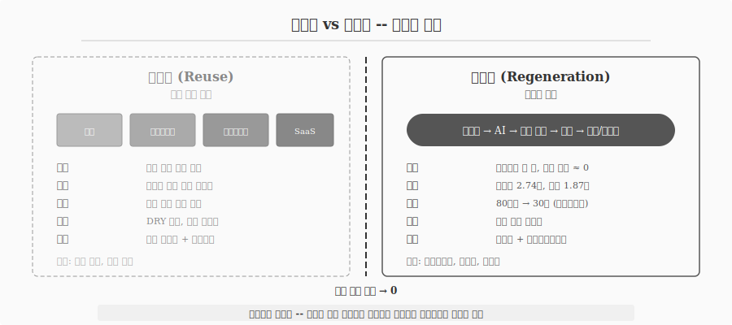
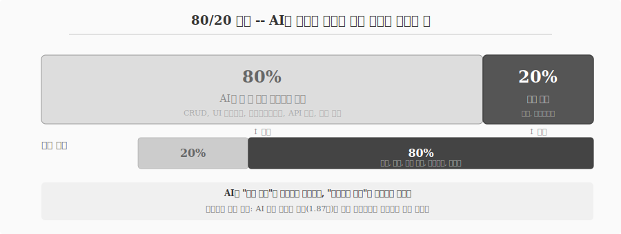

---
execute:
  eval: false
---

# 재사용에서 재생성으로 {#sec-paradigm}

\index{재사용} \index{재생성} \index{Disposable Code} \index{Software 3.0}

코드 작성 비용이 높았던 시대에는 "한 번 작성하고 여러 번 사용하라(Write Once, Use Many)"가 당연한 경제적 선택이었다.
숙련된 개발자가 수 시간에서 수일을 투자해야 제대로 작동하는 코드가 나왔고, 디버깅과 테스트에 더 많은 시간이 들었다.
재사용 명령(Reusability Imperative)은 이 비용을 줄이기 위한 합리적 전략이었다.

## 재사용 명령의 60년 {#sec-paradigm-reuse}

\index{DRY 원칙} \index{디자인 패턴} \index{프레임워크}

재사용을 위해 등장한 해법들은 소프트웨어 공학의 핵심 개념이 되었다.

**디자인 패턴**: GoF(Gang of Four)가 1994년 정리한 23개 패턴은 "검증된 해법의 재사용"이었다[@Gamma1994].
Factory, Observer, Strategy 패턴을 알면 매번 처음부터 설계할 필요가 없었다.

**프레임워크**: Django, React, Spring은 "구조의 재사용"이다.
개발자는 프레임워크가 제공하는 뼈대 위에 비즈니스 로직만 채우면 되었다.

**아키텍처 패턴**: MVC, 마이크로서비스는 "설계 원칙의 재사용"이다.
시스템을 어떻게 구조화할지 매번 고민할 필요 없이, 검증된 청사진을 따르면 되었다.

**SaaS/플랫폼**: Salesforce, AWS, Notion은 "전체 시스템의 재사용"이다.
코드를 작성하지 않고 설정만으로 기능을 사용한다.

DRY(Don't Repeat Yourself) 원칙, 모듈화, 컴포넌트 기반 개발, 라이브러리 생태계 -- 모두 재사용 명령에서 비롯된 것이다.

## 패러다임 전환: 코드 생성 비용이 0에 수렴할 때 {#sec-paradigm-shift}

\index{Disposable Code}

2025년, 상황이 근본적으로 변했다.
AI가 수백 줄의 코드를 수 초 만에 생성한다.
Intuit의 Alex Worden은 이를 **Disposable Code(일회용 코드)** 패러다임이라 명명했다.

재작성 비용이 유지보수 비용보다 낮아진 세계에서, 코드는 "보존할 자산"이 아니라 "필요할 때 생성하고 불필요하면 폐기하는 소모품"이 된다.
Denis Urayev는 이 전환을 **레고 블록에서 점토로**의 비유로 설명한다 -- 재사용 아키텍처는 기존 블록을 조립하는 것이고, 재생성 아키텍처는 점토처럼 유연하게 빚는 것이다.

Y Combinator 2025년 겨울 배치에서 25%의 스타트업이 95% 이상 AI 생성 코드베이스를 보유하고 있다.
2025년 전체 코드의 약 41%가 AI로 생성된 것으로 추정된다.

{#fig-reuse-regen}

### 재생성 가능한 코드의 5대 조건 {#sec-paradigm-regen-conditions}

재생성 패러다임이 작동하려면 다섯 가지 조건이 필요하다.

| 조건 | 설명 | 실전 도구 |
|------|------|-----------|
| 자가 검증 | 에이전트가 인간 개입 없이 정확성을 독립 검증 | CLI 테스트, CI/CD |
| 이식 가능한 환경 | 컨테이너화된 설정으로 신속한 가동/테스트/해체 | Docker, devcontainer |
| 안정적 계약 | 코드가 변경되어도 입출력 인터페이스는 불변 | API 스펙, 타입 시그니처 |
| 선언적 구성 | 모호성을 최소화하는 설정 파일 | pyproject.toml, _quarto.yml |
| 프롬프트 스캐폴딩 | 재사용 가능한 작업 명세 템플릿 | CLAUDE.md, 슬래시 커맨드 |

: 재생성 가능한 코드의 5대 조건 {#tbl-regen-conditions .striped}

## Software 1.0 / 2.0 / 3.0 {#sec-paradigm-software}

\index{Software 1.0} \index{Software 2.0} \index{Software 3.0}

Andrej Karpathy의 분류는 소프트웨어 패러다임의 진화를 명확하게 포착한다.

**Software 1.0**은 인간이 직접 작성하는 전통적 코드다.
C, Python, Java로 작성된 프로그램, 알고리즘, 데이터 구조가 여기에 해당한다.

**Software 2.0**은 신경망이 학습한 가중치로 동작하는 코드다.
개발자가 명시적 규칙을 작성하는 대신, 데이터와 학습 과정이 프로그램을 정의한다.
이미지 인식, 번역, 음성 합성이 Software 2.0의 대표 사례다.

**Software 3.0**은 LLM에 자연어 프롬프트를 통해 생성되는 코드다.
프롬프트가 곧 프로그램이 되는 세계다.
"이메일을 분류하는 함수를 만들어줘"라는 한 문장이 수십 줄의 작동하는 코드를 생성한다.

2026년 현재, Karpathy 본인이 "바이브 코딩은 이미 구식(passe)"이라 선언하고, **에이전틱 엔지니어링(agentic engineering)**으로 진화했다고 평가한다.
단순 프롬프트 대화가 아니라 체계적 오케스트레이션이 필요하다는 인식이 확산되었다.

## 80/20 역설과 침묵하는 기술 부채 {#sec-paradigm-8020}

\index{80/20 역설} \index{기술 부채}

AI 코드 생성에는 역설이 존재한다.
AI가 기능의 80%를 수 분 만에 생성할 수 있지만, 나머지 20%를 정제하는 데 전체 시간의 80%가 소요된다.
보안 패치, 엣지 케이스 처리, 아키텍처 정합성, 테스트 작성 -- 이 20%가 프로덕션 품질을 결정한다.

실증 데이터가 이를 뒷받침한다.
AI 생성 코드는 인간 코드 대비 Type-4 의미적 클론(기능은 같지만 구문이 다른 중복 코드)을 1.87배 더 많이 생성한다.
CodeRabbit의 2025년 분석(470개 오픈소스 PR)에 따르면, AI 공저 코드에 주요 이슈가 1.7배, 보안 취약성이 2.74배 많았다.

**침묵하는 기술 부채(silent technical debt)**가 핵심 위험이다.
AI가 생성한 중복 코드는 표면적으로 정상 작동하므로 리뷰어가 잡아내지 못한다.
구문 오류(-76%)와 로직 버그(-60%)는 오히려 감소했지만, 눈에 보이지 않는 구조적 문제가 축적된다.

{#fig-paradigm-8020}

METR의 2025년 7월 무작위 대조 실험은 더 충격적인 결과를 보여준다.
숙련된 오픈소스 개발자가 AI 도구를 사용했을 때 오히려 **19% 느려졌다**.
개발자들은 체감상 20% 빠르다고 느꼈지만, 실측은 정반대였다.
"쓰는 시간"은 줄었지만 "검증하는 시간"이 늘어난 것이다.

## 하이브리드 전략 -- 이분법을 넘어서 {#sec-paradigm-hybrid}

재사용과 재생성은 이분법이 아니다.
상황에 따라 최적 전략이 달라진다.

| 상황 | 최적 전략 | 이유 |
|------|-----------|------|
| 프로토타입, MVP | 재생성 | 속도 우선, 폐기 가능 |
| 핵심 비즈니스 로직 | 재사용 | 검증된 안정성 필수 |
| 보일러플레이트 코드 | 재생성 | 반복적, 패턴 명확 |
| 안전 필수 시스템 | 재사용 | 인증, 감사 추적 필요 |
| 레거시 현대화 | 재생성 | 기존 코드 재작성이 유지보수보다 저렴 |
| 라이브러리/프레임워크 | 재사용 | 커뮤니티 검증, 장기 유지 |

: 상황별 재사용-재생성 최적 전략 {#tbl-hybrid .striped}

Thoughtworks는 바이브 코딩을 넘어선 **AI 네이티브 엔지니어링의 5대 빌딩블록**을 제시한다 -- Agent(실행), Model(전문화), Methodology(TDD/CI/CD 통합), Spec(사양 중심), Context(조직 지식+가드레일).
재사용이든 재생성이든, "이해 없는 수용"은 위험하다.
과거에 동료 코드를 이해 없이 복사하던 **Cargo Cult 프로그래밍**이, AI 시대에는 AI 출력물을 이해 없이 신뢰하는 **Cargo Cult 2.0**으로 변형되었다.
패러다임이 바뀌어도 검증의 원칙은 불변이다.
