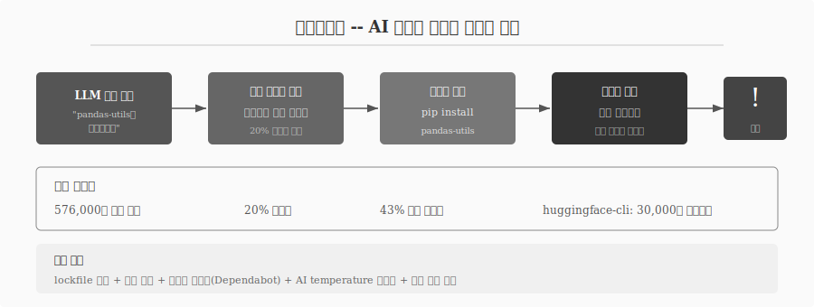
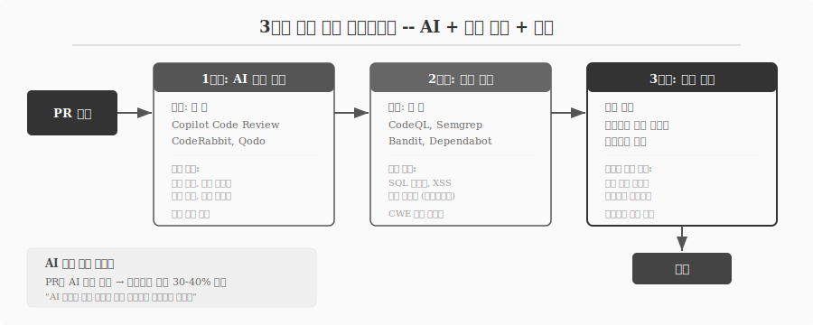

---
execute:
  eval: false
---

# 코드 리뷰와 품질 관리 {#sec-review}

\index{코드 리뷰} \index{품질 관리} \index{보안 감사} \index{슬롭스쿼팅}

AI가 생성한 코드를 무조건 신뢰해서는 안 된다.
AI 생성 코드의 40-45%에 보안 결함이 포함되어 있으며, 모델 크기가 커지고 세대가 바뀌어도 보안 품질은 유의미하게 개선되지 않았다.
더 충격적인 것은 구문 오류(-76%)와 로직 버그(-60%)는 감소했지만, 권한 상승(privilege escalation) 경로가 322% 증가했다는 점이다.
눈에 보이는 오류는 줄었지만, 눈에 보이지 않는 위험은 커졌다.

## AI 코드의 위험 지형 {#sec-review-risks}

AI 생성 코드에서 발견되는 위험은 네 가지 범주로 분류된다.

**보안 취약점**: 입력 검증 누락(CWE-20), SQL 인젝션(CWE-89), OS 명령 주입(CWE-78), 인증 우회(CWE-306), 하드코딩된 자격증명(CWE-798)이 가장 빈번하다.
AI 생성 코드는 인간 코드 대비 취약점이 2.74배 많다.

**아키텍처 드리프트**: 코드가 구문적으로 정확하지만 보안 불변성(security invariant)을 깨뜨리는 미묘한 설계 변경이 발생한다.
정적 분석 도구와 인간 리뷰어를 모두 회피하는 패턴이 증가하고 있다.

**침묵하는 기술 부채**: AI가 기존 함수를 재사용하기보다 기능적으로 동일하지만 구문이 다른 중복 코드(Type-4 의미적 클론)를 1.87배 더 많이 생성한다.
표면적으로 정상 작동하므로 리뷰어가 발견하지 못한다.

**환각된 의존성**: AI가 존재하지 않는 패키지를 추천하는 비율이 20%에 달한다.
이 현상을 **슬롭스쿼팅(Slopsquatting)**이라 부른다.

## 슬롭스쿼팅 -- AI 환각이 만드는 공급망 공격 {#sec-review-slopsquatting}

\index{슬롭스쿼팅} \index{환각 패키지}

576,000개 Python/JavaScript 코드 생성 샘플을 분석한 연구에서 200,000개 이상의 고유한 환각 패키지명이 발견되었다.
오픈소스 모델의 환각률은 21.7%, 상용 모델(GPT-4)도 5.2%였다.
환각된 패키지명의 43%가 반복 쿼리에서도 일관되게 재등장한다.

공격 시나리오는 단순하다.
AI가 "huggingface-cli를 설치하세요"라고 추천하지만, 이 패키지는 존재하지 않는다.
공격자가 동일한 이름으로 PyPI에 악성 패키지를 등록한다.
개발자가 `pip install huggingface-cli`를 실행하면 공급망이 침해된다.
실제로 누군가 이 환각 패키지를 등록했더니 3개월 만에 30,000건 이상 다운로드되었다.

{#fig-slopsquatting}

**방어 전략**:

- lockfile 사용과 해시 고정으로 의존성 무결성 보장
- Dependabot, Snyk 등 의존성 스캐너로 자동 검증
- AI temperature 설정을 낮춰 환각 빈도 감소
- 격리 환경(sandbox)에서 먼저 실행한 후 프로덕션 배포

## 3단계 코드 리뷰 파이프라인 {#sec-review-pipeline}

\index{AI 코드 리뷰} \index{정적 분석} \index{SAST}

AI 시대의 코드 리뷰는 단일 단계가 아니라 3단계 파이프라인으로 구성된다.

### 1단계: AI 자동 리뷰 (수 초) {#sec-review-ai}

PR이 열리는 즉시 AI가 수 초 내에 분석을 완료한다.
GitHub Copilot Code Review는 2025년 4월 출시 이후 6,000만 건의 코드 리뷰를 처리했으며, 12,000개 이상의 조직이 자동 적용하고 있다.

| 도구 | 특징 |
|------|------|
| GitHub Copilot Code Review | PR의 20%+ 담당, Fortune 100의 90% 사용 |
| CodeRabbit | PR 인라인 코멘트, 보안/성능 분류 |
| Qodo (구 CodiumAI) | 멀티-리포 컨텍스트, Gartner 최고 평가 |
| SonarQube | 오픈소스, Python async/FastAPI 규칙 |

: AI 코드 리뷰 도구 (2026) {#tbl-ai-review-tools .striped}

### 2단계: 정적 분석/SAST (수 분) {#sec-review-sast}

AI 리뷰가 놓치는 패턴을 정적 분석 도구가 잡는다.

```bash
# 보안 취약점 탐지
bandit -r your_project/

# 코드 패턴 분석 (환각 API 탐지 포함)
semgrep --config auto your_project/

# 의존성 취약점 검사
pip-audit

# 타입 힌트 검증
mypy your_module.py
```

Dependabot이 의존성 취약점을 자동 감지하고, CodeQL과 Semgrep이 CWE 기반 취약점을 탐지한다.
환각된 의존성을 잡아내는 것도 이 단계의 역할이다.

### 3단계: 인간 리뷰 (비즈니스 로직) {#sec-review-human}

AI와 정적 분석이 걸러내지 못하는 영역은 인간만이 판단할 수 있다.

- **비즈니스 로직 정확성**: 요구사항과 구현이 일치하는가
- **아키텍처 적합성**: 시스템 설계 원칙에 부합하는가
- **설계 의도**: 왜 이런 방식을 선택했는가
- **아키텍처 드리프트**: 보안 불변성이 깨지지 않았는가

{#fig-review-pipeline}

**AI 생성 코드 라벨링**은 효과적인 관행이다.
PR에 AI 생성 코드를 명시적으로 표시하는 팀은 AI 관련 프로덕션 버그를 30-40% 감소시켰다.
"AI 생성 코드를 인간 작성 코드와 동일한 방식으로 리뷰하면 놓치는 것이 생긴다. 가정이 달라졌기 때문이다."

## 품질 메트릭 {#sec-review-metrics}

\index{품질 메트릭} \index{DORA}

코드 리뷰의 효과를 측정하려면 메트릭이 필요하다.

| 메트릭 | 정의 | AI 도구 효과 |
|--------|------|-------------|
| 리뷰 사이클 타임 | PR 생성 ~ 병합 소요 시간 | 40-60% 단축 |
| 결함 발견율 | 리뷰에서 잡힌 이슈 비율 | AI가 구문/스타일 이슈 대폭 증가 |
| 프로덕션 탈출률 | 프로덕션까지 도달한 버그 | 라벨링 시 30-40% 감소 |
| 오탐률 | 잘못된 경고 비율 | 5-15% 적정, 30% 초과 시 무시 시작 |

: 코드 리뷰 품질 메트릭 {#tbl-review-metrics .striped}

오탐률(false positive rate)은 특히 주의가 필요하다.
10% 오탐이 중견 팀 기준 주당 2.5시간의 낭비로 환산된다.
30%를 초과하면 개발자가 모든 경고를 무시하기 시작하여 도구가 역효과를 낸다.

## 생산성 역설 {#sec-review-paradox}

\index{생산성 역설}

DORA 메트릭 기준으로 GitHub Copilot은 코드 리뷰를 15% 가속하고, PR 오픈까지 소요 시간을 9.6일에서 2.4일로 단축했다.
그러나 전체 그림은 다르다.

개발자들은 AI 도구 사용 시 PR을 98% 더 많이 열지만, 코드 리뷰 시간은 91% 길어진다.
개발자 체감은 "20% 빨라졌다"이지만, METR의 무작위 대조 실험에서 실측은 "19% 느려졌다"였다.

복잡성이 **생성에서 리뷰로 이전**된 것이다.
AI는 "쓰는 시간"을 극적으로 줄이지만, "검증하는 시간"을 극적으로 늘린다.
코드 리뷰 역량이 AI 시대 개발자의 핵심 역량으로 부상하는 이유가 여기에 있다.

## 보안 감사 체크리스트 {#sec-review-checklist}

AI 생성 코드를 검토할 때 최소한 다음 항목을 확인한다.

**입력 검증**:

```python
# 위험: 사용자 입력을 직접 SQL에 사용
query = f"SELECT * FROM users WHERE name = '{user_input}'"

# 안전: 파라미터화된 쿼리
cursor.execute("SELECT * FROM users WHERE name = ?", (user_input,))
```

**의존성 검증**: `pip install` 전에 패키지가 실제로 존재하는지, 의도한 패키지가 맞는지 확인한다. lockfile과 해시 고정을 사용한다.

**인증과 인가**: API 엔드포인트에 인증이 있는가, 권한 검사가 누락되지 않았는가, 세션 관리가 안전한가.

**민감 정보**: 비밀번호, API 키가 하드코딩되지 않았는가, 로그에 민감 정보가 기록되지 않는가.

**XSS 방어**:

```python
# 위험: 사용자 입력을 직접 HTML에 삽입
html = f"<div>{user_comment}</div>"

# 안전: 이스케이프 처리
from html import escape
html = f"<div>{escape(user_comment)}</div>"
```

**테스트 검증**: AI 생성 테스트는 happy path만 검증하는 경향이 있다. null 입력, 빈 입력, 최소 1개 에러 조건 테스트를 반드시 추가한다.

"AI는 속도를 제공하고, 인간은 안전을 제공한다" -- 이 원칙이 AI 시대 코드 리뷰의 본질이다.
